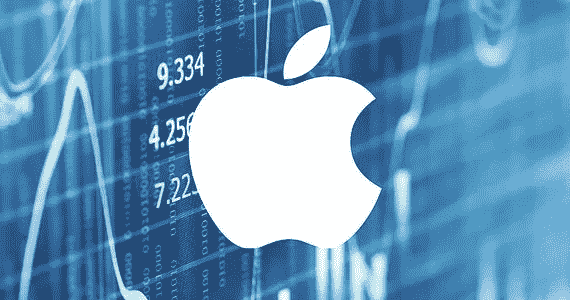
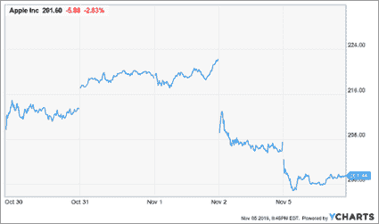
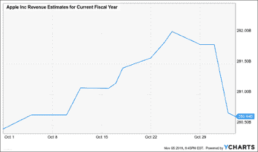
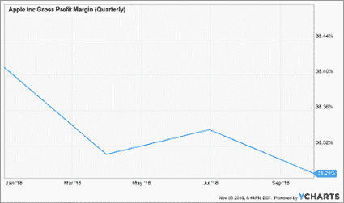

# 苹果公司第三季度收益电话会议的 3 个关键要点

> 原文：<https://medium.datadriveninvestor.com/3-key-takeaways-from-apples-q3-earnings-call-81793983a84d?source=collection_archive---------57----------------------->

*Image via* [*www.vpnsrus.com*](https://www.vpnsrus.com/)

过去几周**充满了令人难以置信的重要季度收益和电话会议回顾。然而，也许最关键的电话会议是由苹果公司(AAPL)召开的，这不仅仅是因为它是最大的上市公司。电话会议透露，该公司将**对他们将按季度发布的财务数据类型**做出一些改变，最明显的是围绕 iPhone。**

**当投资者得知该公司将不再按季度销售 iPhone 时，他们的反应并不好。此外，该公司报告的 2019 财年第一季度收入指引略弱于预期。其结果是，该股在 11 月 2 日下跌了近 7%。**

**以下是我从电话和随后的问答中获得的三个最重要的收获。**

****

# ****不再有单位销售****

**当听到该公司将不再提供季度 iPhone 销量数据的消息时，分析师们似乎感到震惊。卖方分析师花旗集团全球市场公司(Citigroup Global Markets Inc .)的吉姆苏瓦(Jim Suva)和苹果公司(Apple)首席执行官蒂姆库克(Tim Cook)进行了一次交流。苏瓦指出，苹果很可能会拒绝获取 iPhone 的销量数据。他甚至发出警报，称 iPhone 的销量可能会出现负增长。 [**蒂姆·库克回应道**](https://seekingalpha.com/article/4217359-apple-aapl-q4-2018-results-earnings-call-transcript?part=single)::*这有点像你去市场，你把手推车推到收银员面前，他或她问，你那里有多少台？就购物车中物品的总价值而言，里面有多少单位并不重要。***

**Cross Current Research，LLC 的 Shannon Cross 提出了一个问题，即投资者已经习惯于通过将售出的数量乘以平均售价来预测 iPhone 的销量。然而，苹果再次反击，指出过去三年售出的手机数量并没有反映出该业务的潜在实力。苹果还表示，他们的主要竞争对手也不提供季度智能手机销量。**

**从这些交流中获得的关键信息表明**苹果公司致力于为客户提供最好的产品，并提高总收入**。它似乎不太关心 iPhones 的销量。苹果最新的 iPhones 以更高的销售价格进入市场，这反过来有助于推高收入。**

# ****弱指导？****

**该公司指出，作为其收入指引的一部分，它看到了约 20 亿美元的货币相关逆风。它为 2019 财年第一季度带来了 890 亿美元和 930 亿美元的指导，或在中点达到 910 亿美元。分析师此前一直希望该公司能提供 928.8 亿美元的收入指引。然而，如果没有货币逆风，苹果在中点的收入指导将高于 930 亿美元的估计。货币每天都在波动，这意味着今天的逆风可能是明天的顺风。**

**由于美元走强，苹果认为印度、土耳其、巴西和俄罗斯等新兴市场有所疲软。这导致该公司不得不提高这些市场的价格，而增长仍然缓慢。不过，他们也指出，中国市场依然强劲。**

****

# ****新的利润洞察****

**在电话会议中，该公司提到**他们计划不仅按业务部门公布收入，还公布销售成本**，这反过来为投资者提供毛利润。因此，虽然分析师可能正在失去对单位销售的洞察力，但他们正在获得对毛利率的关键洞察力。苹果可能试图让投资者和分析师更加关注服务等利润率较高的业务。这可能是一种潜在的尝试，让投资者重新评估股票的市盈率，相对于其目前的低利润率估值。**

****

**投资者可能需要几周甚至一个季度的时间来消化这个消息:他们不再有宝贵的 iPhone 销量数据可以依赖。随着苹果公司继续转变为一个支持数百万用户的生态系统，这将不可避免地将投资者的注意力从 iPhone 手机的细节转移到更大、更完整的画面上。**

**【www.cadencetranslate.com】最初发表于**。****