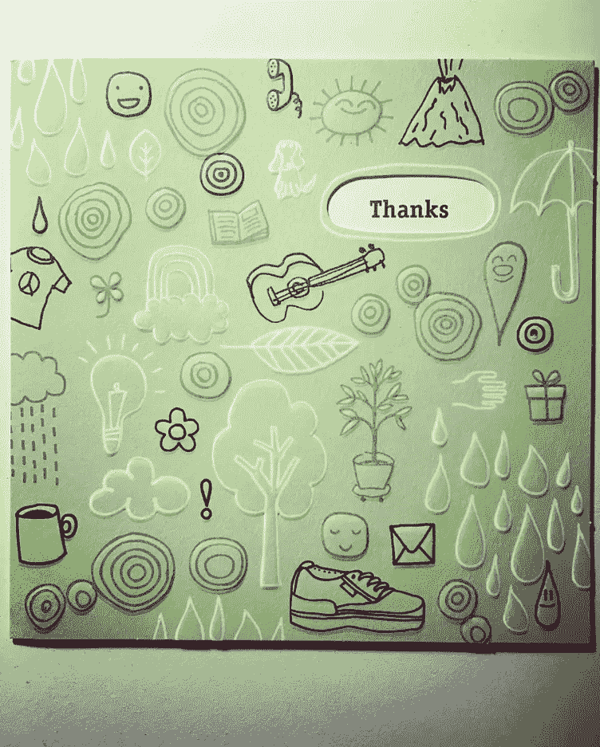
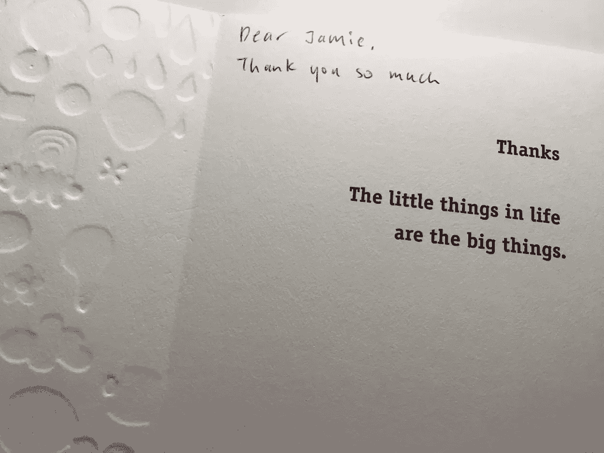
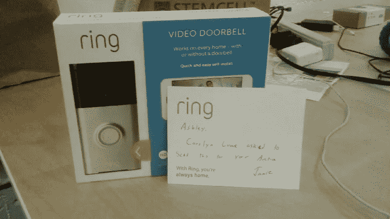
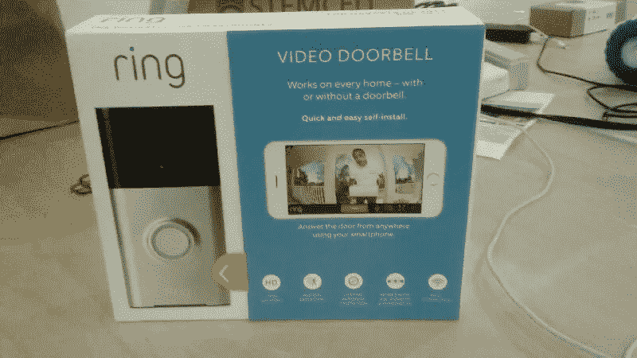

# 关于创业和向前支付的 3 个教训#payitforward

> 原文：<https://medium.datadriveninvestor.com/3-lessons-about-startups-and-paying-it-forward-payitforward-db133bdebcff?source=collection_archive---------1----------------------->

我们都必须从某个地方开始。无论是一个正在学习爬行和行走的孩子，还是搬到一个不同的国家，不得不从头开始，我们都需要一步一步来达到我们想要的地方。

在创业生活中，这没有什么不同。

我们都必须一天一天地建立自己的公司。建立公司需要时间、努力和技能。这也需要他人的情感和身体支持。

## 我们衷心感谢杰米·西米诺夫和 [Ring 的团队。](https://ring.com/)本周我们收到了一份善意的捐赠——一个戒指套件，上面有一张手写的便条，写给我们的创始人 [Ashley Adewuyi](https://www.linkedin.com/in/ashleyadewuyi/) ,这激励我们的团队写了一篇关于创业和回馈的力量的帖子。

**Thank you card for Jamie**

> 杰米，谢谢你的好意。谢谢你让我们停下来记住生活中的小事，变成小事。我们都是相互关联的，都是这个旅程的一部分。感谢你成为激励他人付出更多和成为更多的人的改变。

引用温斯顿·丘吉尔爵士的话，

> **你靠你得到的东西来谋生**。**你给**什么**你就给**一个生命。”

我一直在关注和分享 [Ring 的脸书](https://www.facebook.com/ring/)帖子，观看他们的[客户成功视频](https://ring.com/customer-stories)和他们的[洛杉矶社区视频](https://ring.com/neighborhoods)。我一直在看 Ring 的脸书页面上关于杰米和公司诚信的正面评论。

这让我感到很受鼓舞。

我们在创业世界的竞争环境中努力做到事半功倍。有如此多的移动部件在快速发生，给创业公司带来了很大的压力。通常，它会让我们转向不同的方向。我们感受到了“超越自我”的压力，感觉自己一直处于生存状态。

**我从这次经历中学到的 3 个教训:**

1.  **感恩旅途。**

作为杰弗瑞团队的一员，我们很幸运被一群了不起的人所包围。我们的创始人兼首席执行官[Ashley](https://www.linkedin.com/in/ashleyadewuyi/)去年参加了著名的联邦快递赞助的物流加速器项目。本周末，我们将在三藩市完成与 [HAX](https://hax.co/) 的加速器项目。我们也是明尼苏达州零售加速器项目的一部分。

> 我们很感谢这些组织，最重要的是他们的员工，与我们分享他们的时间和经验，指导我们走过这段创业之旅。
> 
> 感谢你所做的一切，没有你我们不会在这里。

**2。对其他创业公司很感兴趣。**

一路上，我一直在我们的[脸书页面](https://www.facebook.com/jeffriedoorman/?fref=nf)上分享关于 Pixl 何时在 Kickstarter 上上线的帖子，并在 Twitter 上分享关于 Nextdoor 以及他们与 [KQED 的合作关系的帖子。所有这些都有一个共同的目标，那就是通过提升其他创业公司的形象，展示我们对他们事业的支持，让世界变得更美好。](https://twitter.com/KQED/status/845040212753375232)

是的，我们是一家小公司，可能没有大公司的追随者。然而，即使我们有一两个人看到了我们的帖子，这在某种程度上提高了他们的生活质量，这才是真正重要的。

知道我们在这个世界上有所作为是一份遗产，我相信我们很多人都会有同感。

**3。采取小行动，释放期望。**

我们每天都可以做的小事很容易做，也很容易不做。我们每个人都有特殊的天赋，每天都可以使用，我们如何利用这些天赋继续前进呢？如果我们只专注于采取行动而不担心结果会怎样？

对我来说，我喜欢与人交谈，分享我的经历，所以专注于此让我继续前进。

我喜欢达伦·哈代的这句话，复合效果

> “最后积少成多的不是大事；正是成百上千或数百万件小事将平凡与非凡区分开来。”

## 你给世界的礼物是什么？你怎样才能最好地利用你的天赋来改变别人的生活？

## 你能做哪些小动作让别人的生活变得更好？你能从一周中抽出一个小时来帮助需要帮助的人吗？

# **#payitforward**

感谢您的阅读！期待连接！