# 这三个字母可能是贝佐斯成为世界首富的原因

> 原文：<https://medium.datadriveninvestor.com/3-letters-helped-bezos-become-the-worlds-richest-man-10167a6b3ee5?source=collection_archive---------13----------------------->

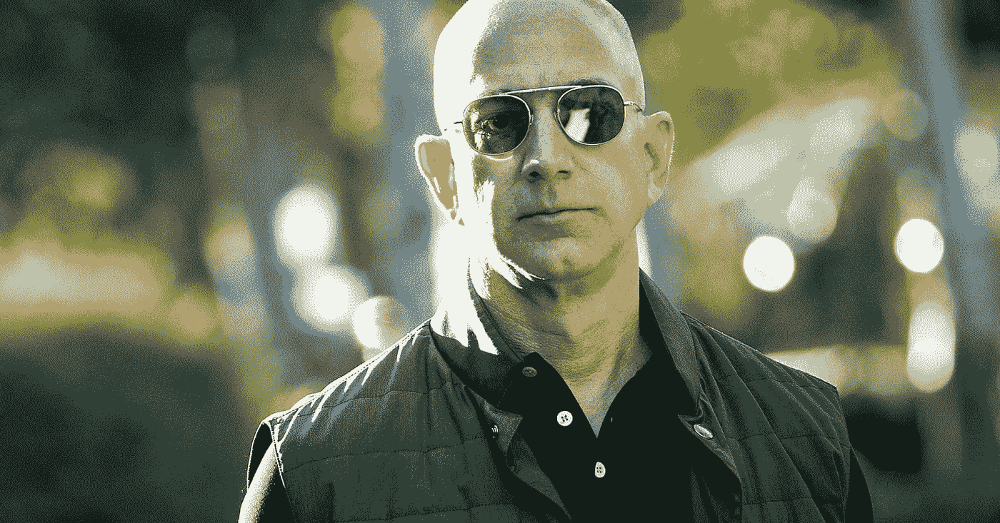

bEzOS — $161 billion and counting

去掉“b”和“z ”,你会得到什么字母？

外星人？

没有。

外星人吗？

再想想。

提示:G.O.O.G.L.E

Amazon.com 可能在谢尔盖·布林(Sergey Brin)和拉里·佩奇(Larry Page)开创世界上最普遍的搜索引擎之前就已经开始了，但如果没有它，这个电子商务巨头可能无法生存。

回到 90 年代末，这家总部位于西雅图的互联网巨头正在大出血。虽然贝佐斯很乐观，但该公司还没有走上每股价值接近 2000 美元的道路。

我应该知道。当我在 2001 年到达时，股价停留在 12 美元左右，在此之前，许多人已经离开了公司。

当时，我记得一些出色而聪明的同事不断利用另一家几年前刚刚成立的公司。他们正在优化我们的网站，以扩大亚马逊在这个搜索引擎上的业务。搜索引擎开始接管互联网。

布林和佩奇帮助交付了“相关的”结果。相反，他们比雅虎和 Alta Vista 等竞争对手提供了“更相关的结果”。消费者正在远离“付费”搜索结果，转向“相关的有机结果”

谷歌成长了，又成长了一些，并开始接管世界。消费者沉迷于“他们想要的”。谷歌不断优化其搜索引擎，以真正提供“最相关的结果”

世界上最大的搜索引擎并不是唯一一个“优化”搜索结果的搜索引擎。

亚马逊、Expedia 和许多其他网站开始使用这三个字母。

如果你还没想明白，让我最后分享给贝佐斯(以及许多其他人的财务成功)的 3 封最重要的信:

**S.E.O.** (搜索引擎优化)

虽然亚马逊是谷歌付费平台的头号消费者，但它也是世界上有机优化的顶级网站之一(针对搜索引擎):

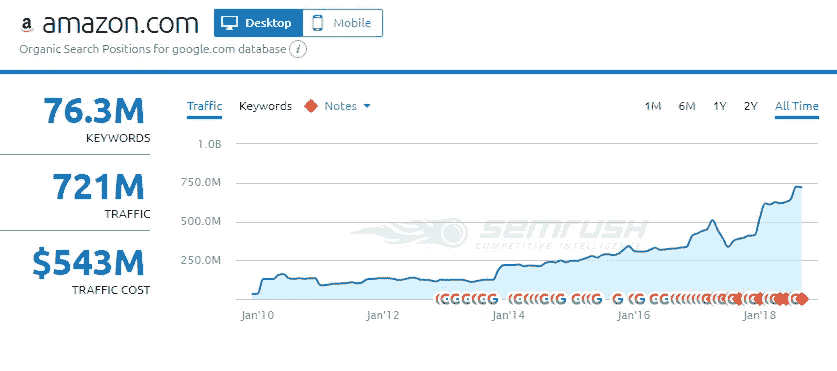

$543 million dollars of free monthly traffic (SEMRush’s estimates)

在谷歌优化最多的两个网站(维基百科和 Alphabet Inc .自己的网站:YouTube)之后，亚马逊比其他网站更好地利用了世界上最大的搜索引擎。

想象一下如果你是房地产经纪人。

想象一下，你在当地的相关搜索中排名第一，加上“房地产经纪人”或“房地产经纪人”坦率地说，你不需要在营销上花一分钱。

一个鲜为人知的企业家，但可能是一个比贝佐斯更成功的商人知道这一点。

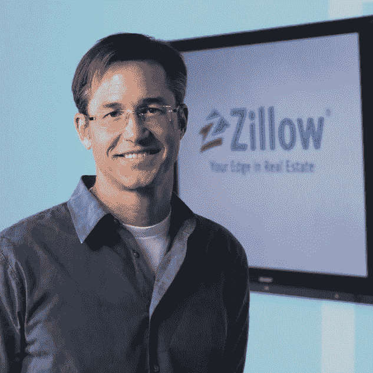

Founder of Expedia, Zillow & Glassdoor

Expedia.com 的创始人里奇·巴顿也进行了类似的实践。他非常重视 SEO，并通过付费的方式让与旅行相关的一切都变得可行。

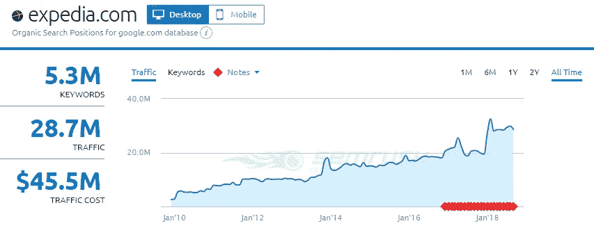

$45 million dollars of free marketing monthly (SEMRush’s estimates)

今天，Expedia 仍然在谷歌上排名前 100 名最有机优化的网站——确切地说是第 83 名(根据 SEMRush 的数据)。唯一排在它前面的其他旅游网站是猫途鹰，坦率地说，猫途鹰曾经是 Expedia 大家庭的一员。当它有机生长时，巴顿和他的团队知道他们需要把它带进家庭。

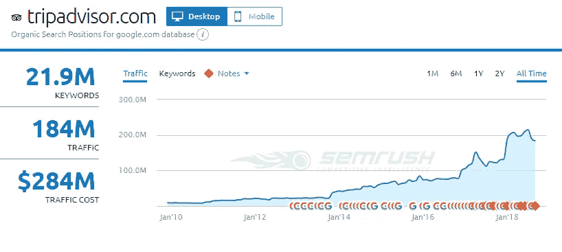

$284 million dollars of free marketing monthly (SEMRush’s estimates)

巴顿仍然知道这三个字母的重要性。他优化了他的房地产巨头 Zillow.com，使其成为搜索引擎排名第 43 的优化站点。

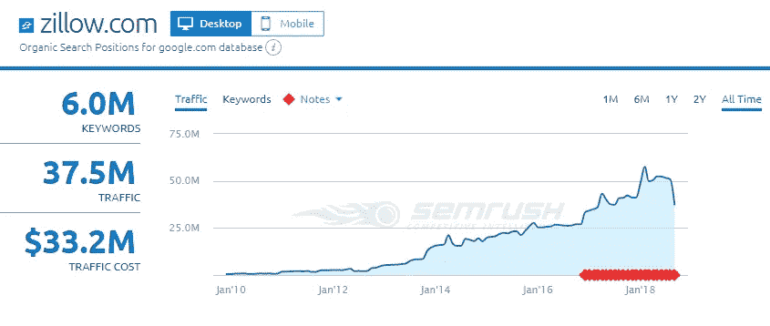

Millions more of free monthly digital marketing

对你们中的一些人来说，SEO 的重要性可能是非常明显的，但正如我在过去 10 多年为许多网站进行搜索引擎优化的实践中所学到的那样，我经常被提醒说，一般人仍然无法欣赏这三个字母——很多时候，那些试图将他们的想法变成下一个 Amazon.com 的企业家。

今天，我在一家公司工作，该公司拥有一个垂直行业中最大的 SEO 团队之一。然而，具有讽刺意味的是，我们并不像亚马逊(或 Expedia 或许多其他在谷歌上排名非常靠前的网站)那样认真对待它。

我们垂直领域的一个竞争对手已经。

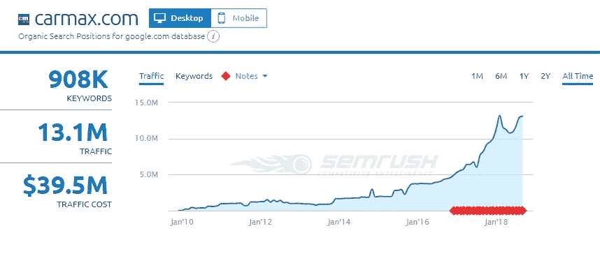

由于他们拥有与贝佐斯或巴顿相似的愿景，他们可能会扩大对顶级汽车集团的领先优势。

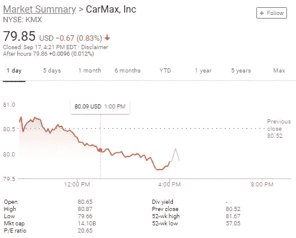

$14.1 billion dollar market cap — 9/17/2018 (more than 300% larger than the #1 auto group)

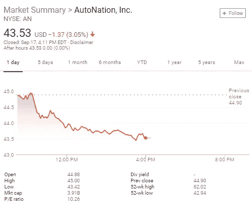

$3.91 billion dollar market cap — 9/17/2018

随着我们继续观察贝佐斯的净资产增长，我会继续想，如果没有免费的每月营销，亚马逊会发展到现在这样大吗？贝佐斯会成为当今最富有的人吗？

杰夫的麦地那邻居可能也会问这个问题。比尔·盖茨曾经站在贝佐斯的立场上，但是他最著名的公司没能理解这三个字母。

虽然 SEO 并不是贝佐斯或巴顿用来扩大垄断的唯一策略，但许多其他形式的数字营销(例如联盟营销)支持着有机的努力，继续为这些巨头每月提供免费营销。

现在，你能说 S.E.O 吗？

***关于搜索营销力量的其他有趣事实*** :

*[“Facebook”是过去 8 年多以来谷歌上搜索次数最多的词汇](https://seattleorganicseo.com/2014-top-google-searches-most-popular-keywords-on-the-internet/)

*Apple.com 的搜索引擎优化为他们带来了以下收获:

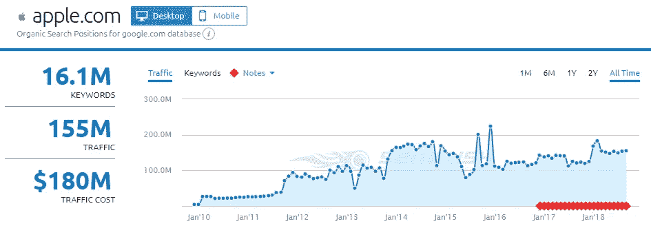

*尽管微软仍在苦苦挣扎，但它仍然有机地获得了以下优势:

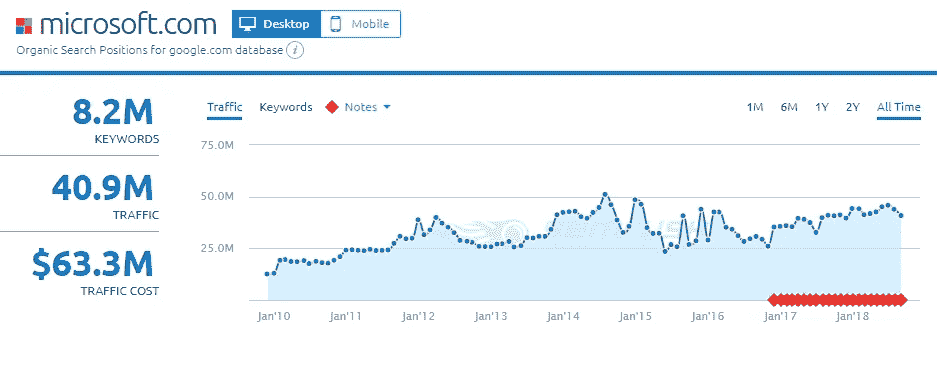

*在[全球最有价值的五大公司](http://fortune.com/2018/02/15/amazon-microsoft-third-most-valuable-company/)中，只有中国的腾讯不那么依赖谷歌，但谁知道他们通过百度优化了多少？他们严重依赖微信，但同样，还有其他形式的数字优化也非常重要——这是这篇文章的要点。