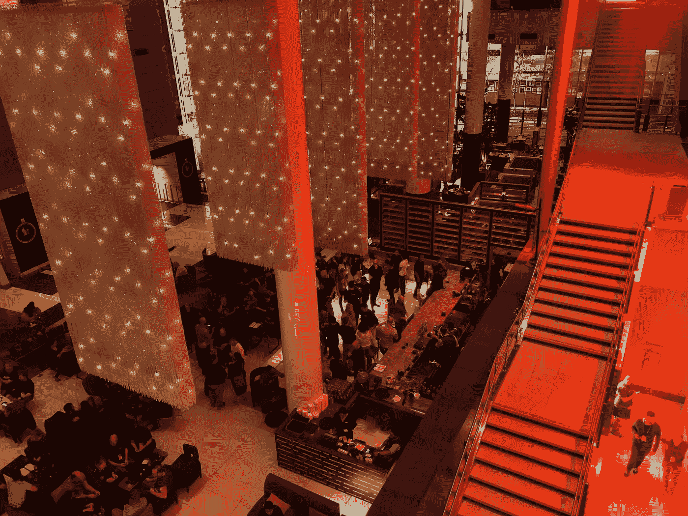
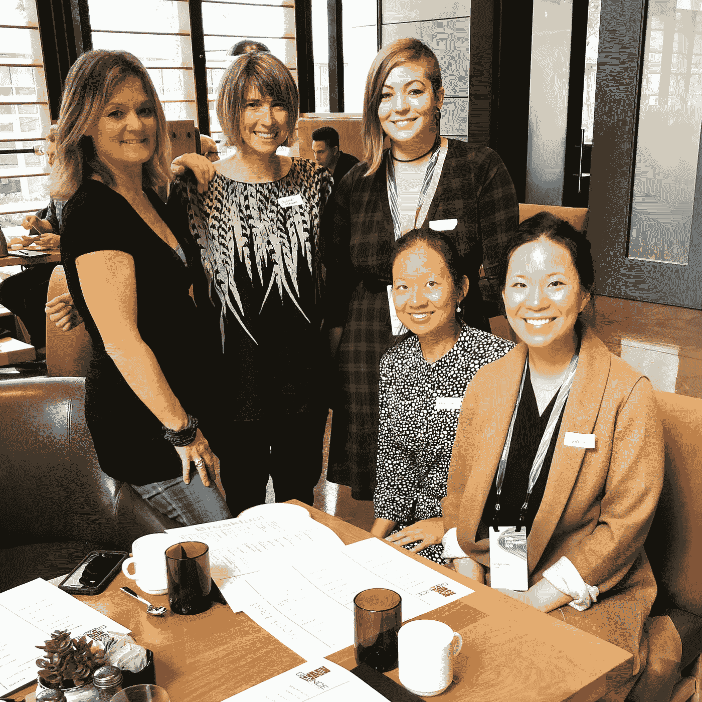
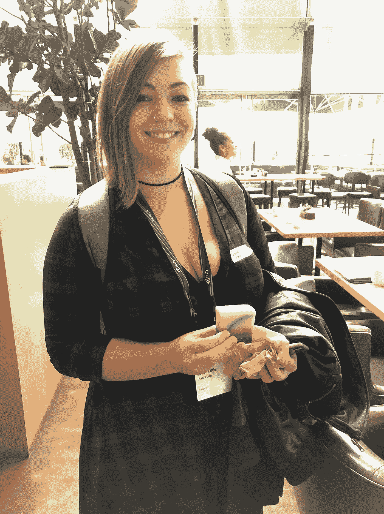

# 从我的第一个#UniteLA 中学到的 3 条人生经验

> 原文：<https://medium.datadriveninvestor.com/3-life-lessons-learned-from-my-first-unitela-192df907a474?source=collection_archive---------45----------------------->

Lobby of JW Marriott LA Live

我在 10 月份参加了我的第一次#UniteLA，老实说，我不知道会发生什么。我事先在寻找女性科技活动，因为我认为这将是一个主要由男性参加的会议。在做了一些调查后，我无法为这次会议找到[# women itech](https://twitter.com/search?q=%23WomenInTech&src=tyah)的聚会。

我想联系和认识经历相似挑战和机遇的女性，这样我们就可以分享我们的经历。我很幸运也很感激有这么多了不起的女人，一大早就出现，和我一起吃早餐。有些女性没有参加#UniteLA，她们能加入我们并赶上进度真是太好了！

这是一次非常非正式的早餐，我们分享了我们的背景和经历。有机地，我们能够通过想法和不同的视角相互联系和支持。

有一个抽奖活动，为一位幸运的女士赢得了一块当地的肥皂(他们的机会真的很大！)，遵循[早餐搏击俱乐部](https://medium.com/@isiciliana/breakfast-fight-club-awe-2018-c1b541408691)的主题，由[西西里安娜·特雷维尼奥](https://medium.com/u/3622a1106c46?source=post_page-----192df907a474--------------------------------)主持。

获胜者？Becca Little ，来自国营农场的软件开发员。

我不得不承认，当我走进主要由男性主导的会议时，我有点害怕。有一次我走进了一个疗程，在那里我感到很不自在。有人对我说，这是*“非常技术性的”*会议，他的语气给人一种感觉，让我感到不舒服。

当女性越来越多地出现在#科技活动中时，这类会议的动态将会发生变化。我很高兴我尝试了一些新的东西，走出了我的舒适区。

总而言之，我很高兴我参加了，因为我对#AR 有了更多的了解，主要是参加了 [#autotech](https://blogs.unity3d.com/2018/10/25/the-latest-from-unity-for-automotive-from-autotech-summit-at-unite-la/) 会议来扩展我的知识和成长。

#UniteLA 主题演讲是现场直播的，可点击此处观看。

**教训？**

*   反馈，而不是失败。我们每时每刻都在得到反馈。尝试和重复意味着我们每天都在前进和变得更好。失败就是我们彻底放弃。
*   穿得好让我自我感觉更好。当我穿着让我自我感觉良好的衣服时，会有一种自信的感觉。多亏了 MM.LaFleur 的 M Dash 的帮助，我感觉自己几乎变成了另外一个人。
*   真实性。忠于自己。即使感觉我应该“更加技术化”，我也必须不断提醒自己，我已经足够了。

非常感谢你的阅读！你也参加了#UniteLA 吗？如果是，对你来说最重要的是什么？