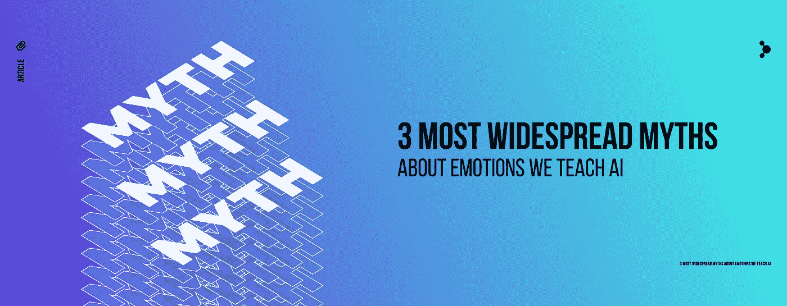
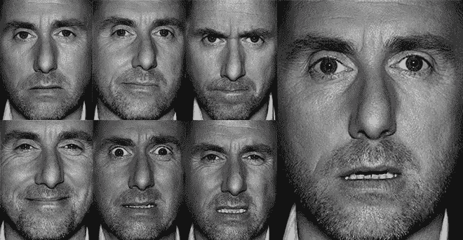

# 我们教给人工智能的关于情感的 3 个最普遍的神话

> 原文：<https://medium.datadriveninvestor.com/3-most-widespread-myths-about-emotions-in-affective-computing-7ae67f427d96?source=collection_archive---------9----------------------->

如今，情感在商业中扮演着越来越重要的角色。在某个时候，我们想到了一个观点，即购买决策不仅受到消费者对产品的看法的极大影响，还受到他们对产品的实际感受的影响。这就是为什么今天的公司试图将情感因素融入他们所做的一切:客户分析、服务和技术。

对于人类来说，没有感情的理性主义时代很久以前就已经结束了，但是机器现在才刚刚开始他们的情商。在过去的十年中，我们看到了情感技术的快速发展，这个领域通常被称为情感计算。但是当涉及到情感的时候，总会有一些谜团。

虽然有一些错误的陈词滥调，我们更经常遇到。我们将考虑在媒体和商业世界中复制的关于情感计算中情感的三个最普遍的神话。

# 神话 1:保罗·艾克曼的遗产

保罗·艾克曼的理论基础可以概括为:就面部表情而言，人们以普遍的方式展示和识别一些他称之为“基本”的情绪。不管我们在哪里，不管我们在和谁说话，当我们的谈话者表达五种情绪时，我们总是能识别出来:愤怒、恐惧、厌恶、快乐、悲伤。

**惊奇被排除在理论修改后的基本情绪列表之外。*

Paul Ekman’s basic emotions (plus neutral state) by Tim Roth, who has played the protagonist in the ‘Lie to me’ TV-series.

心理学家詹姆斯·罗素是埃克曼理论的第一批批评者之一。[他否认了情绪普遍性的观点](http://emotionresearcher.com/moving-on-from-the-basic-emotion-theory-of-facial-expressions/)，声称情绪和面部的联系并不像埃克曼最初假设的那样简单:同样的面部表情在不同的语境中可能有不同的含义。后来，Beatrice de Gelder 在她的书《情感与身体》中声称，在 fMRI 实验中，没有在人脑中找到神经学上的依据来证实各种情感是基本的或普遍的。

最近，著名的神经科学家 Lisa Barrett，Ekman 基本情绪理论的最著名的批评者之一，声称情绪不是天生的，而是通过经验习得的。情绪因文化而异，因人而异。在一系列的实验中，一个研究小组去了纳米比亚，检查一个与世隔绝的部落，辛巴族，如何识别快乐、悲伤、恐惧、愤怒、厌恶和中性的面孔。虽然积极的面部表情没有并发症，但辛巴人倾向于混合消极的表情，如厌恶或愤怒。在其他部落进行实验时，也得到了类似的结果。因此，巴雷特总结道，我们解释情绪的方式在我们的文化中是刻板的——我们给实际上具有不同性质的东西起了相同的名字。

尽管在 [2011](http://journals.sagepub.com/doi/abs/10.1177/1754073911410740) 中，埃克曼已经改变了他所指的情绪的定义，包括文化和个体特征，甚至从基本情绪列表中排除了一种情绪，许多与*情感计算*合作的公司仍然将他们的方法建立在旧的埃克曼理论的基础上。他们仍然在数据集中包括像“基本”情感这样的本质。用这种方法，正如 Liza Barrett 所说的，他们将会失败。但是，她说，如果加入外部和内部环境，这项技术有可能彻底改变情感科学。

从事情感分析的实验室和公司应该避免陷入情感普遍性偏见的错误。首先，用于算法训练的情感数据应该是具体的，也就是说，在试图确定表达什么情绪时，要考虑到文化、语言、性别甚至年龄。第二，情感识别算法应该对上下文敏感。重要的是，一些实验室已经做了整合上下文的尝试(例如，这里的)，但是到目前为止还没有“大”的情感计算公司这样做。

# 误解 2:微笑表示幸福

埃克曼的理论很自然地得出结论，情绪表达可以与人们内心的感受联系起来。

例如，微笑是最容易察觉的情绪之一，它有一系列的含义:感到快乐、高兴、满足、支持、欣赏等等。这就转化为一个问题:微笑的作用是什么？

在最近的研究[1]中，受试者被要求解决显示器上显示的九个困难任务。当他们设法给出正确答案时，他们会微笑，尽管除了电脑，他们没有微笑的对象。同时，[社交展示理论](https://www.sciencedirect.com/science/article/pii/S1364661318300299)指出，当一个人在社交环境中或独自一人时，微笑的功能是不同的。

在*情感计算*中，至少在它的商业版本中，目前的情感识别技术只能从社会背景中单独分析情感。因此，要真正理解微笑的含义，我们应该教会机器区分不同场合下出现的情感表达，无论是社交场合还是非社交场合。我们与人分享的微笑和在显示器前的微笑是有区别的。

这也正是我们应该考虑情感的更复杂本质的原因。被分析的面部表情可以用声学参数、身体运动和生理表现来补充。这种方法被称为情感的多模态。

# 误区三:身体“语言”？

到目前为止，我们得出的结论是，情绪不是普遍的，基本情绪的概念是一个有争议的问题，情绪表达似乎是文化，个体和上下文相关的。这种情况变得更加复杂，因为情感表达确实不仅限于我们的面部，还包括声音、肢体动作、人际距离、生理表现。

这就是为什么人们一直试图通过观察面部暗示来了解一个人是否在说谎，他们试图用身体动作来做同样的事情。例如，身体姿势几乎与所有事情都有关联，最著名的可能是摸嘴和说谎，或者身体伸展和安全感。这一理论已经变得如此广泛，以至于在压力管理、安全事务甚至电影摄影中都有所反映。

在机场，安全问题一直是重中之重。第一个自动行为检测系统在 20 世纪末被放置在美国机场，并且从那时起已经在世界各地使用。通常，乘客属于风险类别的概率是基于一组与高风险相关联的关键特征来计算的。许多研究声称，到目前为止，还没有发现可以用来描述恐怖分子特有的“个性”的特定心理特征。[2]一个人的动作和他或她在说谎这一事实之间的联系，并不像民间心理学中认为的那样简单明了。

总而言之，是否有民间版本的身体‘语言’可以揭示一个人的感受，这是一个值得商榷的问题。当然可以获得一个人的非语言信号和情感行为之间的联系。今天，一种叫做身体追踪的独立技术处理大量关于身体运动的数据。在*情感计算*中，它旨在发现我们的身体表达与特定情绪之间的统计相关性。

# 综上

情感计算在科学和商业领域都是一个令人兴奋而又复杂的领域。它确实处于高科技的前沿。然而，在许多情况下，情绪识别技术的商业应用基于过时的方法，原因有很多:要么是一种著名方法的创始人的合理名字，要么是这些应用旨在实现的有限目标。

显然，每个人都喜欢“阅读”情感，就像著名的电视剧《对我撒谎》中的主角一样。重要的是要记住，情感的本质更加微妙和复杂，不要陷入颅相学和手相学。

在情感计算中，我们列举了一些关于情感科学的最普遍的神话。有必要摆脱它们，这样这项技术才能为人类服务，否则预测就会不准确和有偏见。

**参考文献**:

[1] Harry J. Witchel 等人.自动化形成性测验中微笑的触发-底物模型，第 36 届欧洲认知工效学会议论文集-ECCE ' 18(2018)。多伊:10.1145/3235363636486

[2]基于模糊深度机器学习的航空公司乘客简档(2016)。郑，于军*等*doi:10.1109/TN nls . 2000000000005

**作者**:

神经数据实验室首席研究官奥尔加·佩列皮奥尔金娜

Kristina Astakhova，神经数据实验室的传道者，认知科学和语言硕士