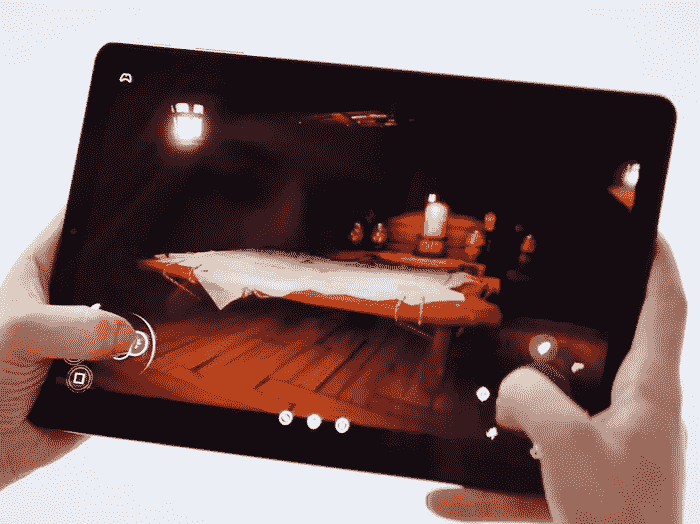

# 云游戏中的 3 个动作会让你抛弃游戏机

> 原文：<https://medium.datadriveninvestor.com/3-movements-in-cloud-gaming-that-will-make-you-ditch-the-console-3118e5167a4?source=collection_archive---------22----------------------->

## 因为没人再用 CD 或卡带了。咄。

视频游戏已经走过了漫长的道路。首先，它是 Pong，然后是 Super Mario Bros .，现在我们在去学校的火车上用手机碾碎糖果，更不用说在网上建造堡垒和与来自世界各地的其他人一起玩了。但是没有人——我是说**没有人**——能够为下一代视频游戏做好准备，这种游戏不仅会改变我们玩游戏的方式，还会改变我们获得游戏的方式。云游戏来了。

# “云游戏”到底是什么？

图片有能力玩一个真实世界的膨胀故事*没有*一个控制台**和** *没有*一个磁盘或墨盒。想象一下。现在想象一下，你甚至不需要在任何地方下载游戏。你甚至不需要把它下载到云存储中。

你想玩的游戏*已经存在于云中*，就像一个设计用来存放你所有信息的中枢——从你的积分总数到你的库存，甚至你的特征。这是一个惊人的概念，实际上已经存在了很长时间(他们被称为“mud”)。但是直到现在，他们才超越了聊天室的感觉，甚至把云带到了比你所习惯的更高的位置。

云已经让事情变得非常简单。你可以通过浏览器在线访问它。经常你不得不下载额外的文件。它们经常会占据你的电脑或数码设备的空间。多亏了我们现在所了解的，云游戏做得更多，例如:

## 苹果商场

你还记得订阅模式是怎么回事吧？网飞、Hulu、亚马逊 Prime 等等。想象一下，如果有一个游戏云订阅会是什么样子！[而且苹果上面有货。](https://vigyaa.com/@pierre/apple-gets-an-arcade-in-the-cloud-and-we-couldnt-be-happier-4d63b7ae/)

## 谷歌呢？

也不要把他们排除在外。毕竟，他们是 Google Play 背后的策划者，但现在该公司正在支持他们自己的独家品牌云游戏，这可能会改变一切。

## 最后，英伟达和软银

这两家公司在做什么？令人惊讶的事情…[点击这里，找出答案(仅此一项就改变了云游戏的运作方式)](https://vigyaa.com/@pierre/cloud-gaming-servers-will-rise-up-in-the-sky-of-japan-thanks-to-n-f9c30e1c/)。

# 难怪云游戏是最新的技术热点之一

在其他任何地方，你都不会看到世界各地的灵魂通过游戏相互联系。这是终极聚会。游戏让人类的一切都变得伟大，所以当你像这些思想领袖那样把这个模型放到云端时，只会让人类受益更多。你对云游戏有什么看法？ [**注册一个 VIGYAA 账号，让大家知道你的想法。**](https://vigyaa.com/accounts/login/) 也一定要去 [**看看数据驱动的投资者对技术行业的更多见解**](http://datadriveninvestor.com) **。**