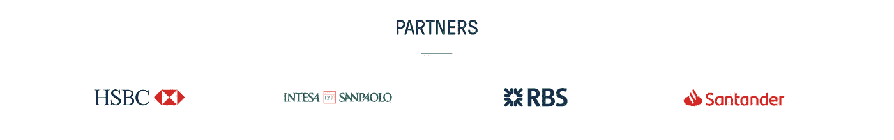

# 3 个强有力的信任信号，开启你的金融科技创业公司的成长

> 原文：<https://medium.datadriveninvestor.com/3-powerful-trust-signals-to-unlock-your-fintech-startups-growth-cb13f75d09b1?source=collection_archive---------5----------------------->

金融科技初创公司通常擅长技术、UX 和设计，但往往难以获得客户。其中一个主要原因是未能认识到信任在客户获取中的关键作用。

建立信任与产品或服务的质量或实用性同样重要，因为人们只会从他们信任的公司买东西。在金融科技领域尤其如此，这里涉及到金钱、生计和敏感数据。

 [## 分散金融的出现|数据驱动的投资者

### 当前的全球金融体系为拥有资源、知识和财富的人创造了巨大的财富

www.datadriveninvestor.com](https://www.datadriveninvestor.com/2019/03/14/the-emergence-of-decentralized-finance/) 

创业公司需要填补信任缺口才能成长。问题是，怎么做？

答案是发展信任信号。这些就像指示器或标记，向潜在客户说明可信度和可信赖度。

# 信任信号 1:有价值的内容

有效的内容创作是关于在你的创业公司和目标受众之间建立信誉和关系。这并不是为了推销你的产品或服务而大量输出普通内容。你必须致力于无私地提供价值，否则你所有的努力只会得到平庸的结果。过于“廉价”的普通内容甚至会让你的初创公司看起来不可信。

看看这些发现。

*   当被问及买家为何选择胜出的供应商时，*75%的受访者表示胜出供应商的内容对他们的购买决策有重大影响。(需求生成 B2B 买家报告)*
*   *内容营销获得的 ***线索是付费搜索广告的 3-5 倍*** 。(内容营销学院)*
*   *拥有博客的小企业将比没有博客的小企业平均增长 126% 。(内容营销学院)*
*   *活跃博客的商家在谷歌上有 434% 更多的索引页面， ***55%*** 更多的访问者， ***97%*** 更多的入站链接。(轮毂点)*
*   *80%的商业决策者更喜欢从一系列文章而不是广告中获取公司信息。(B2B 公关意识)*
*   **47%的 B2B 购买者在与销售人员接触之前会消费三到五件内容。(需求性别报告)**
*   ***84%的人期待品牌产生内容。(有意义的品牌)***
*   ****95%的买家愿意分享他们的姓名、公司和电子邮件地址，以换取内容。(需求性别报告)****

***好处显而易见。但是你必须用正确的方法。***

***这是关于你的顾客的事情。他们不会立即信任你的公司，就像他们不会立即信任一个陌生人一样。他们想知道你了解他们的需求。你理解他们的顾虑和问题，并有正确的解决方案。换句话说，在他们开始信任你之前，他们需要你表现出一些可信度。***

***内容是传达你的可信度和专业知识的最佳方式之一。这也是提高你的创业公司在线知名度的一种方式。随着 67%的 B2B 购买者的旅程以数字方式完成，创造内容变得前所未有的重要。***

***首先开发内容，解决目标受众正在寻找答案的关键问题。他们面临什么问题？你也可以建立一些内容来展示市场、行业趋势等方面的知识、洞察力和专业技能。***

***这里有一个例子—***

***如果您的目标客户是银行或其他高度监管的金融公司，合规是一件大事，对吗？创建展示对具体和相关合规性挑战的理解和见解的内容，有助于提高可信度和加快销售周期。***

***选项是无穷无尽的，但所有有价值的内容都有一个共同点。这对你的观众很有用。不要只是为了点击量或浏览量而创作内容。开发您的受众关心的内容，并渴望成为他们的首选资源。***

# ***信任信号 2:社交证明***

***人们几乎总是通过观察他人的行为来指导自己的决策过程。社交证明是利用第三方来影响你的目标客户的购买决策。***

***当你浏览一个网站，看到一个客户或行业专家的评价，那就是社交证明。当你在谷歌上搜索一家公司，找到一个客户案例研究，这是另一个社会证明的例子。***

*****案例分析:**这些银行的杠杆率大大低于正常水平。案例研究是一份数据驱动的、关于您的产品或服务的实施和所取得的成果的深度报告。通过提供真实的商业利益和投资回报率的证据，案例研究可以将您的公司定位为权威并建立信誉。他们的研究对购买者来说很有分量，尤其是在恰当的时候使用。***

*****评价/评论:**这些满足了人们在做决定时对确认的需求。他们让人们对与你的公司建立联系更有信心，因为他们通过一个独立的团体传达可信度。根据 [G2 人群](http://go.g2crowd.com/2018-benchmark-report-B2B-reviews.html?__hstc=171774463.b5b7a08ad648b0b16182bcbb2dcac106.1563256116377.1563256116377.1563259728773.2&__hssc=171774463.1.1563259728773&__hsfp=1026563361)、**、 *92%* 、**的 B2B 买家更有可能在阅读可信评论后进行购买。Trustradius 的另一项研究发现， [***62%***](https://vendors.trustradius.com/the-rise-of-peer-reviews-key-insights-from-the-2016-b2b-buyers-survey/) 的 B2B 决策者认为同行推荐是一个强大的购买触发器。***

****信托图标&认证:**你是否获得过知名投资人的资助？在受尊敬的行业出版物中被提及？也许你与一个行业领先的组织合作或者已经获得了一些认证？这些都是重要的信任信号，应该分享。在你的网站和任何你认为合适的地方添加标识来创造可信度。但是，不要走极端。为你参与的任何事物添加图标都会对你不利。保持它的相关性和排他性。**

****商业证书:**提升你的商业证书会给你的公司增加巨大的可信度和信任度。显示你拥有的客户数量，或者列出知名客户，就是商业凭证的两个例子。即使你只有几个测试客户，也不要害怕在你的网站上分享他们的标识。**

****社交媒体:**在社交媒体平台上发展自己的形象并建立追随者会增加可信度，因为它允许人们参与进来，并让其他人看到这种参与。参与能创造信任，因为它表明你是可以接触到的，并致力于建立一个对它所做的事情充满热情的长期业务。说到关注者，你的社交媒体档案上有数千人可以被视为对你公司的广泛认可。**

# **信任信号 3:伙伴关系和合作**

**金融机构仍然是最值得信赖的金融服务提供商。他们通过长期的关系和几十年的知名度建立了信任。参与伙伴关系和合作都是为了利用这些现任者和其他更成熟的品牌的信任。相信你没有。**

> **金融科技公司的主要竞争优势是它们启动和转向的灵活性，它们对客户体验的高度关注，以及它们摆脱了遗留系统的负担。然而，由于缺乏信任、缺乏知名品牌、已建立的分销基础设施、资本和法规遵从性专业知识，这些在历史上都是现有公司的优势，因此他们在扩展业务时也面临着挑战。**
> 
> **——2018 年世界金融科技报告**

**除了信誉和信任之外，伙伴关系和合作也是建立知名度的绝佳方式，也是推动创新和获得庞大客户群的绝佳方法。**

****

**如果您与某个知名品牌建立了合作伙伴关系或协作关系，请记住尽可能地进行沟通——通过您公司的网站、电子邮件、公告以及其他形式的内容。**

***我总是有兴趣会见从事挑战性项目的创始人和技术人员，所以请随时通过* [*LinkedIn*](https://www.linkedin.com/in/anthonyback/?source=post_page---------------------------) *与我联系。***

***我是一名技术分析师、内容营销人员和作家，为金融科技和区块链公司创造高价值的内容。我曾与世界上一些最大的金融机构和领先的技术公司合作，以确定和交流推动思想领导力、建立信任和吸引客户的真正见解。参观*[https://anthonyback.com/](https://anthonyback.com/)**