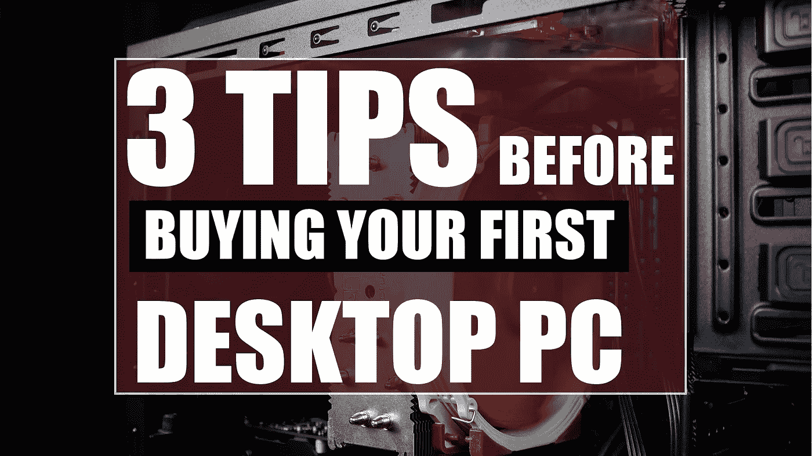
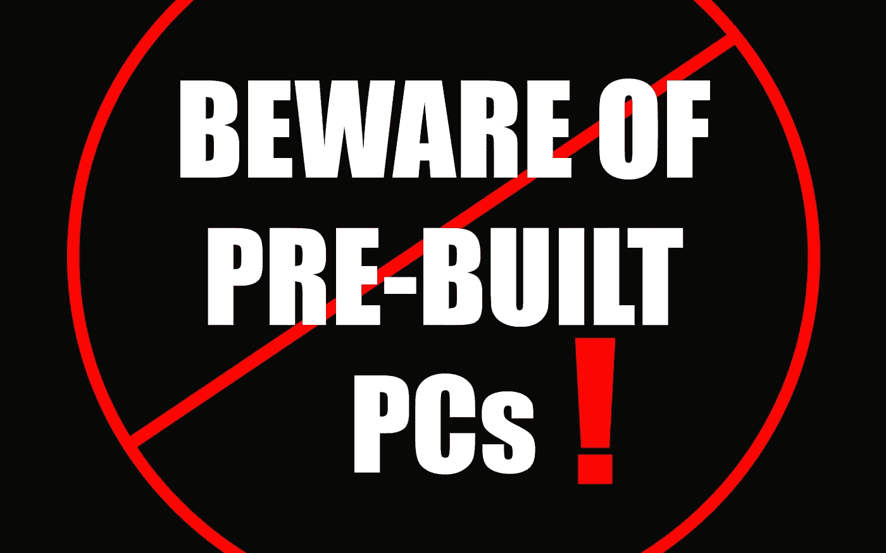

# 购买第一台台式电脑前的 3 个快速提示

> 原文：<https://medium.datadriveninvestor.com/3-quick-tips-before-buying-your-first-desktop-pc-6fa305d92f8a?source=collection_archive---------14----------------------->

购买您的第一台台式电脑是一项巨大的投资，尤其是如果您想要像样的性能。我在第一次购买时犯了一个巨大的错误，希望我能帮助你避免犯同样的错误。

这更适合高级用户:开发者、游戏玩家、内容创作者等。

# 提示#1:当心预建的个人电脑！

我将开门见山，找出我在决定如何购买我的第一台电脑时犯下的**最大的一个错误**—**在*亚马逊*** 上预装的 Cybertron Hellion GM1213B(我仍然在使用这台电脑)。

 [## 认识 Raspberry Pi——革命性的计算设备——数据驱动的投资者

### 计算机过去笨重、昂贵且难以操作的日子一去不复返了。随着技术的进步…

www.datadriveninvestor.com](https://www.datadriveninvestor.com/2019/01/23/meet-raspberry-pi-a-revolutionary-computing-device/) 

大约 4 年前我买了这台电脑，当时我对制造、更换或升级台式电脑毫无经验。我肯定不想自己造一个，当然也不相信自己能挑选出合适的组件来购买。

我的预算也低得令人难以置信，这通常是首次购房者的情况。我相信你们很多人都有同感。

## 不要总是相信亚马逊的评论

不幸的是，我决定相信亚马逊上的一些评论，这些评论声称这款电脑是一款不错的游戏电脑，性能足以满足当时大多数游戏的需求。他们大错特错了！

不仅评论看起来很好，而且这台电脑还得到了 4/5 星的评级，这显然是误导。老实说，我给它 1/5 颗星。*原因如下*:

## 赛博坦地狱号 GM1213B 的真相

1.  **NVIDIA gt 740 显卡**在一般的显卡设置下，运行基本游戏的能力刚刚好。我试着玩了更高的图形密集型游戏，如使命召唤黑色行动 3 和死亡之光，它甚至不能处理绝对最低的设置。如果你买了这台电脑，你必须立即升级到更好的 GPU。
2.  **AMD FX-6300 3.50 GHz 6 核处理器**也很可怕。这东西很耗电，性能低得令人难以置信。即使是在预算上，大多数人会告诉你有价格差不多的更好的 CPU。刚刚看了这个论坛的评论:[tomshardware.com](http://www.tomshardware.com/answers/id-3653836/processor-6300-ghz-core-gaming.html)。
3.  **400 瓦非模块化电源**太低，无法升级。你不仅需要升级图形处理器和中央处理器，还需要一个新的电源来处理它。当我升级我的显卡时，我还买了一个 600 瓦的模块化 PSU。
4.  **最后，Aerocool 冷却系统**很一般，基本上只适合电脑自带的普通组件。我的 CPU 风扇大概一年半后就不工作了，导致电脑过热自动关机。我更换了它，现在它还在工作，但是我*更喜欢有一个液体冷却系统*。

因此，不仅亚马逊的评论具有误导性，而且我最终在升级上花了更多的钱，而这些钱本可以花在更好的组件上。**你从亚马逊**上的这些预建物中得到你所支付的。

# 提示#2:如果你不想建造它，去[伊隆塞德](https://ironsidecomputers.com/forge-a-pc/)

在伊隆塞德，你从精选的零件中选择，他们建造它，并把它送给你。该网站简单、直观，消除了首次购买电脑者的许多困惑。

*不，伊隆塞德不是这个网站的赞助商，我也没有因为链接到他们的网站而收到任何形式的附属佣金。我只是真心相信他们很棒。*

## 预配置的构建和定制

你基本上选择一个预配置的构建，然后改变部分来定制你想要的。或者，你可以保持简单，按原样购买。

您还可以随电脑添加任何外设，如 ***鼠标******键盘******显示器******控制器******麦克风******扬声器*** ，甚至 ***服装***

## 在游戏社区的受欢迎程度

我注意到，在过去的两年里，伊隆塞德在游戏社区变得越来越受欢迎。我在 YouTube 上订阅的几个内容创建者都是由伊隆塞德赞助的，他们的电脑给了我很棒的体验

在不久的将来，我打算卖掉我的赛博坦，一旦我买得起，就从伊隆塞德买一台新电脑。

# 提示 3:提前做好尽职调查

当你购买第一台台式电脑时，我建议你做的最后一件事是确保你花时间做一些研究

## 看看所有的利弊

就像我之前说的，不要只相信亚马逊上的评论。如果你确实找到了一台你喜欢的电脑，不管是在亚马逊、百思买，甚至是在伊隆塞德，看看其他网站和资源，看看你感兴趣的电脑的所有优点和缺点。

我个人认为，每台电脑或每项技术都有一些缺点或缺陷，所以你需要四处搜索，看看别人经历了什么。

我犯了一个错误，看到了亚马逊的一些好评论，没有做尽职调查就做出了冲动的决定，结果花了 1000 多美元。

## 把这个建议用在你的优势上

我鼓励你接受我给你的这个建议，从我买第一台电脑时犯的错误中吸取教训，这样你就可以避免它们。当你开始寻找你的第一台台式电脑时， ***记得要有耐心，花时间研究多种来源，并看看伊隆塞德*** ***电脑，因为我真心相信它们是你最好的选择*** *。*

*原载于 2018 年 12 月 24 日*[*Austin Howard . tech*](https://austinhoward.tech/3-quick-tips-before-buying-your-first-desktop-pc/)*。\*