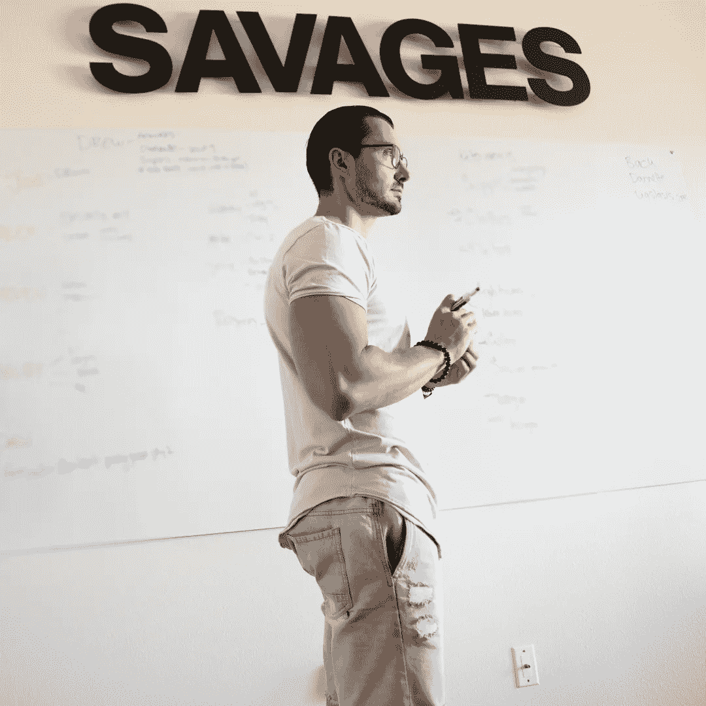

# 影响者应该获得高门票的 3 个原因

> 原文：<https://medium.datadriveninvestor.com/3-reasons-why-influencers-should-have-a-high-ticket-offer-eb32ca1a37bb?source=collection_archive---------36----------------------->

创造一个更高的门票往往可以是最好的事情，你可以在你的业务。

今天，我想和你谈谈你在工作中可能会做或不会做的一件大事。

你需要创造一个高票价的业务。

现在很多人会说，“Los，我不知道我是否应该。我不知道我是否需要。我不知道我是否准备好了。”

让我解释并给你一些真正的见解，为什么你应该，为什么你准备好了。

如果你目前正在做较低层次的事情，这并不重要。比如销售更实惠的数码产品，或者低端产品。

无论是什么，你都可以拥有更高的等级。

我与健康和健身领域的大量有影响力的人一起工作。

很多有影响力的人销售补充品、运动服、健身项目等等。

你正带着人们通过这条路，通过你的生意，财政困难的生意，这意味着你需要一大笔钱。**你需要大量资金来重新投资你的企业。**

任何电子商务都是如此。

你需要一大笔钱回到你的生意中，并继续投资到那个生意中，不管是…衣服、补充品、小玩意、程序…无论什么都不重要。

你需要更多的资本。

**引入更多资本，让你的企业变得更加“资本友好型”的最好方法之一就是给出更高的报价。**

每个人都会买东西，不管是你的还是别人的。

你已经在和人们交流了。你已经在与人交往，人们已经在某种程度上信任你。

那么**创造一个更高的报价，这样你就可以有更多的现金流**，这样你就可以有更多的杠杆作用，这难道不是有意义的吗？

现金是大多数企业的王道，也是大多数企业失败的原因。

通常，增长会让人们失败，因为他们没有资本来维持增长。

所以，建立一个教练服务或者一个为你服务的服务，是非常重要的。

你可以有一百万种不同的产品和一百万次浏览你的内容。

然而，创造一个更高的票价往往是你在生意中能做的最好的事情，因为你已经有了信任你的人。

它有助于你的现金流。这有助于你实现可持续发展，让你有机会加大对企业的投资，从而实现增长。

所以今天问问你自己这些问题…

在我的生意中，我能做些什么来获得更高的回报？我能做些什么来在我的业务中创造更多的优势？我能做些什么来创造一些东西，让我建立一个更大的长期业务？

我总是试图鼓励人们不要只关注眼前，而要关注你的长期业务。

我有一个朋友兼导师，他说你的客户群应该扩大你的客户群。

现在听听这个。你的客户群应该扩大你的客户群。

你认为这是怎么发生的？

它发生在优秀的产品、优秀的服务和来自内部的强大帮助上。你为人们服务，帮助他们所做的事情。

所以**今天想一想。**

在你的生意中，你能做些什么来创造更多的现金流，从而获得更高的回报？你能做些什么来**创造一个机会，在你的业务中利用**更高的票价计划？

不要仅仅认为更高的门票就等于更多的钱。

> **认为更高的票，更高的帮助。**

更多有影响力的人帮助你，说你的产品和服务是最好的。因为这样你就真的能以那样的能力帮助更多的人。