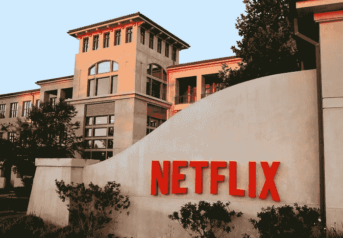

# 网飞应该担心这场新媒体流战争的三个原因

> 原文：<https://medium.datadriveninvestor.com/3-reasons-why-netflix-should-worry-in-this-new-media-streaming-war-7ca84dc29f2b?source=collection_archive---------14----------------------->

## 因为站在这个科技塔的顶端确实很糟糕。

为什么？因为这是一个竞争激烈的行业。看历史，其实。微软与苹果的战争，任天堂与创世纪的战争，以及我们将看到的汽车特许经营权之争，都与增强我们的车辆、游戏系统、电话甚至家用电器的技术有关，这些技术将引起前所未有的媒体狂热。我们想知道为什么新闻不更多地关注这些，而不是我们最终看到的所有负面的东西。

# 唉，虽然它们可能是“战争”，但它们不是致命的

有些人可能会说这就像生命的循环。比如**狮子王**。通常，品牌会因创新而萌芽，要么生存下来，要么被吃掉。这是进化，宝贝。技术本质上是同一种动物——一些新的和创新的东西出现了，像[区块链](https://vigyaa.com/@pierre/germany-takes-a-chance-not-a-risk-on-the-blockchain-and-heres-5ab50e24/)或[无人机技术](https://vigyaa.com/@pierre/infrastructure-technology-takes-it-to-another-level-with-drone-ma-707de562/)，我们趴在地上等着看这种新技术解决方案是否能站住脚并继续存在下去。

当然，其他技术在没有捕食者威胁的情况下继续蓬勃发展，如无人机技术和机器自动化，但让我们现实一点:*不是所有的技术都可以得到保护*，我们都可以哀悼一个致命的布拉德在一辆被许多人引以为豪的娱乐技术车上的损失:*大片*。

进入:**网飞**。丛林之王，但你知不知道这个国王有可能很快被废黜？是的，你猜对了:又一场流媒体战争即将到来，虽然网飞和 Hulu (Plus)已经争论了很长时间，而且刚刚显示出可能是大红黑棋胜出(与“氢弹”争夺一些碎片，但仍在踢)，但事实是我们已经有了另一场流媒体战争**即将到来，这就是为什么网飞可能只是有点害怕** …。

## 首先，有迪斯尼

是的。如果你还没有关注媒体娱乐的新闻，鼠标之家将进入网飞的媒体流技术之家并接管它。[看看吧。](https://vigyaa.com/@pierre/why-netflix-and-others-must-fear-the-house-of-mouse-86ee3f74/)

## 或者美国电话电报公司怎么样？真的吗？

你没听错。虽然很难相信。事实是，一个简单的小电信公司将会为这场反对网飞的战争准备一些大武器，你可以在这里读到所有的信息。

## 最后…当心苹果

现在我们在谈话。没错，苹果可能正把他们的目光放在网飞为自己聚集的垄断上，这是最令人震惊的部分。一家电脑公司已经为有史以来最大的媒体流战争投入了你的芯片。[您可以点击此链接了解更多信息。](https://vigyaa.com/@pierre/will-apple-be-the-new-netflix-707de562/)

# 我们不要忘记无数其他品牌也加入了这场游戏

会没完没了的。我们有 DC 漫画品牌做他们的事情。WWE 网络。不寒而栗的恐怖流。甚至脸书。我们不要忘记亚马逊 Prime。的确，这将是一场丑陋的战争(至少对那些卷入其中的人来说)，但可以肯定的是，我们所有人可能都会从观看这样的战争中获得最大的乐趣！

(说真的，看看你可以在自己的智能手机上观看的一系列节目就知道了。太恶心了。)

关于媒体流技术，你还有其他我们应该知道的消息吗？ [**用你自己的免费 VIGYAA 账号告诉我们，开始写吧！**](https://vigyaa.com/accounts/login/)