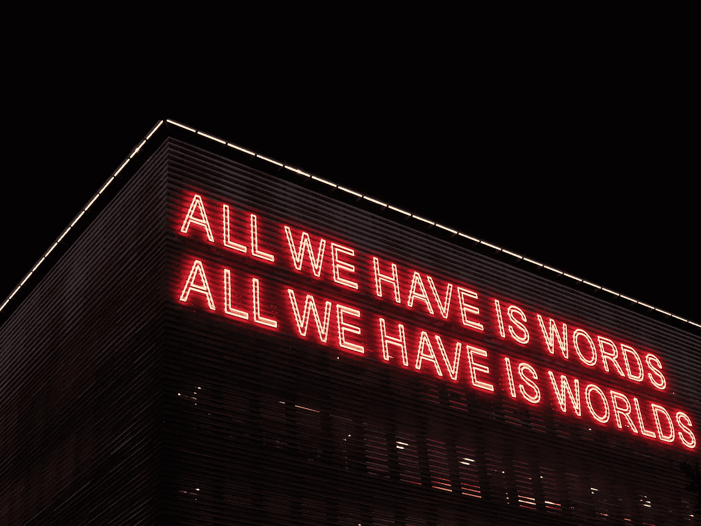
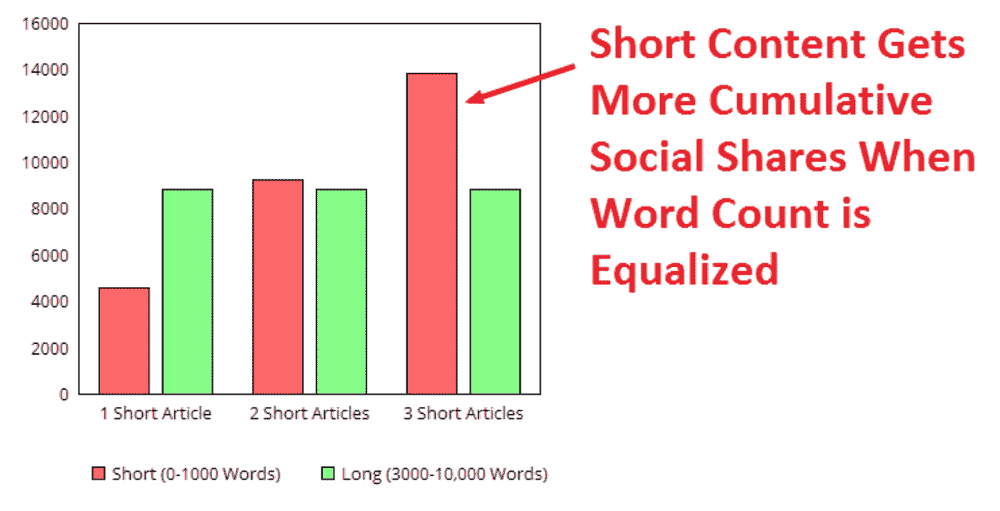

# 短篇小说接管内容营销的 3 个原因

> 原文：<https://medium.datadriveninvestor.com/3-reasons-why-short-stories-are-taking-over-content-marketing-bf3c6289ed28?source=collection_archive---------6----------------------->

By Alexandra from Unsplash

多年来，营销人员一直强调在你的内容策略中写长文章的重要性。

虽然在 2019 年仍然相关，但阅读习惯在过去几年已经发生了变化。研究表明，超过一半的读者只是浏览博客文章。

 [## 零工经济如何改变未来的就业前景——数据驱动的投资者

### 随着自动化的发展和 Z 世代的出现，劳动力的构成和动态正在发生变化…

www.datadriveninvestor.com](https://www.datadriveninvestor.com/2018/12/19/how-is-the-gig-economy-changing-the-future-jobs-landscape/) 

此外，明智地使用，[短格式的内容可以胜过长文章](https://www.searchenginejournal.com/debunking-myth-long-form-content-data-driven-case-short-content/157148/)的流量。

*source: Debunking the Myth of Long Form Content: A Data-Driven Case for Short Content — Search Engine Journal*

你的内容策略需要适应这种趋势。

但是写简短的内容是不够的:一条推文、一个大头针或一个故事的寿命很短。

你需要写**短篇小说**。

以下是三个原因。

# 短篇小说是有帮助的。

短篇小说对读者有帮助。

*Source: Photo by* [*Ksenia Kudelkina*](https://unsplash.com/@kseny?utm_source=unsplash&utm_medium=referral&utm_content=creditCopyText) *on* [*Unsplash*](https://unsplash.com/search/photos/sign?utm_source=unsplash&utm_medium=referral&utm_content=creditCopyText)

人们不读你是因为你很好。他们阅读你的内容，因为他们认为这将有助于他们。他们想要生活窍门、技巧或建议，来帮助他们改善自己，解决问题，或者只是让他们的生活更轻松。

# 它们鼓舞人心。

一个好的短篇故事总是鼓舞人心的。

*Source: Photo by* [*Kristopher Roller*](https://unsplash.com/@krisroller?utm_source=unsplash&utm_medium=referral&utm_content=creditCopyText) *on* [*Unsplash*](https://unsplash.com/search/photos/inspiration?utm_source=unsplash&utm_medium=referral&utm_content=creditCopyText)

人类需要的所有知识可能都在维基百科或 Wikihow 中。如果人们只是简单地寻找他们问题的答案，互联网将会是一个巨大的问答。不会有任何社交网络，博客或播客。

让人们坚持和你在一起的是你讲述自己故事的能力。

" [*你的第一次独自旅行*](https://www.faqtr.me/microblog/post/4879/my-first-solo-trip-in-arizona-and-utah-by-shankthetank19) *给你上了什么人生课？*"或"*你在这种情况下应用了哪些学习？*“是你要回答的问题类型。

你的读者不想要答案。他们想要你的答案。

# 他们是相关的。

你的简短内容对你的听众是有帮助的，你自己的经验使它值得信赖。但是你还需要一件事来确保你的读者参与你的短篇故事:你必须包括他们。

你应该听到他们说:“*哦，那是我！它总是发生在我身上！*

*Source: Photo by* [*Matthew Kalapuch*](https://unsplash.com/@matthewkalapuch?utm_source=unsplash&utm_medium=referral&utm_content=creditCopyText) *on* [*Unsplash*](https://unsplash.com/search/photos/backpacker?utm_source=unsplash&utm_medium=referral&utm_content=creditCopyText)

在写短篇小说之前，要设身处地为你的读者着想。不要写你认为他们做了什么。写下你知道他们在做什么。

# 结论

许多博客在乐于助人、鼓舞人心和与人相关方面做得很好。但是他们中的大多数人在这上面花了几个小时。

如果你的内容用尽可能少的话来说是*有益的*、*鼓舞人心的*和*相关的*，那么恭喜你:你现在有一个短篇故事了。

确保你的观众阅读它取决于你:)