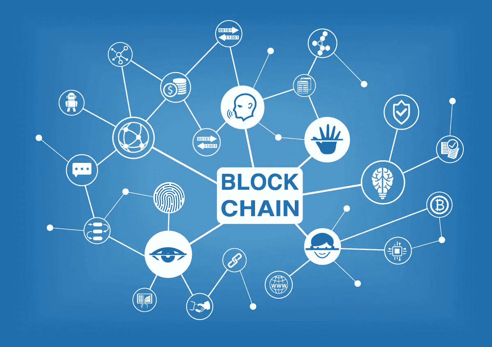

# 你必须自学区块链技术的 3 个理由

> 原文：<https://medium.datadriveninvestor.com/3-reasons-why-you-have-to-educate-yourself-on-blockchain-technology-8e5c187d0722?source=collection_archive---------0----------------------->

“我们没有做错任何事，但不知何故，我们输了”，诺基亚首席执行官，2013 年。2009 年，iPhone 被斥为“不应该改变我们的思维方式”和“这种设备不可能获得很大的市场份额”。4 年后，iPhone 享有 45%的手机市场份额，而诺基亚只有 2%。

我们生活在一个日新月异的时代，科技创造了新的产业，同时也淘汰了其他产业。你可能不是技术的大力支持者，也可能不是加密货币的投资者(也不打算成为)。然而，即使表面上你与区块链毫无关系，**你也必须自学区块链的基本原理，除非你想成为诺基亚**的首席执行官。如果你想了解这个令人敬畏的发明，我建议你从阅读[这本](https://medium.com/@petrosleandros/introduction-to-blockchain-technology-part-1-dc8f827d8e30)开始。

## 1.有利可图的工作机会

随着区块链被更多的公司采用，对区块链专家的需求增加。2017 年期间，伦敦对区块链软件开发人员的需求相对于前一年增长了 40%。久而久之的工作机会相对数量上的空间会增加。不用说，由于利基市场和缺乏专业知识，区块链相关的工作机会薪酬非常高。**这里有一个独特的机会，让先驱们专攻这个利基领域，并在未来享受巨大的职业成功。**

## 2.商业机会

[正如我之前的一篇文章](https://medium.com/@petrosleandros/5-industries-which-will-be-revolutionized-through-blockchain-technology-17b379adfcda)中所讨论的，有很多行业将被区块链技术彻底改变。随着技术的采用和发展，将会有越来越多的企业利用这一趋势。已经有足够多的区块链创业公司被频繁创建。**围绕区块链构建的商业生态系统为企业家和投资者提供了巨大的盈利机会。**精明的企业家可以利用该技术创造新产品并解决现有问题，而投资者可以从支持具有增长潜力的区块链项目中获利。

## 3.日常生活的数字化

区块链技术的采用，将导致我们日常生活的进一步数字化。该技术将推动我们走向无现金社会(毕竟，加密货币是完全数字化的)，它将加速物联网应用的采用(包括无人驾驶汽车、智能家居和生态城市)，并增加存储在网络中而不是以物理形式存储的数据量(例如，照片、政府文件细节、实体书等)。我向你保证，如果你不熟悉这项技术，下一代会像你现在看手机里有“蛇”的人一样看着你。蛇？).

区块链技术将很快对我们的生活产生深远的影响，我们都应该努力熟悉它。这对于技术领域的个人和有抱负的技术企业家来说尤其重要，但是，每个人都应该至少对技术及其用途有一个基本的了解。

你同意让人们理解技术的重要性是最重要的吗？请在评论区告诉我你的想法。如果你喜欢这篇文章，请随意与朋友和家人分享。

Petros Leandros，理学硕士