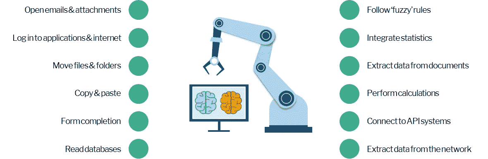
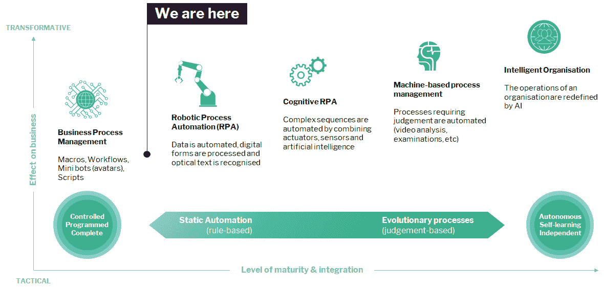
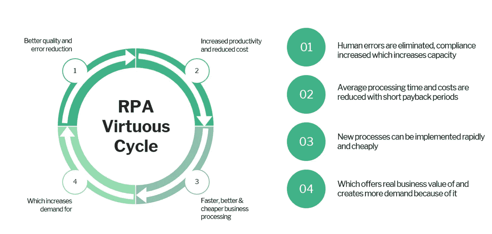
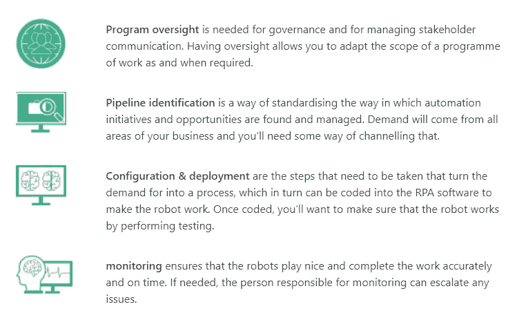
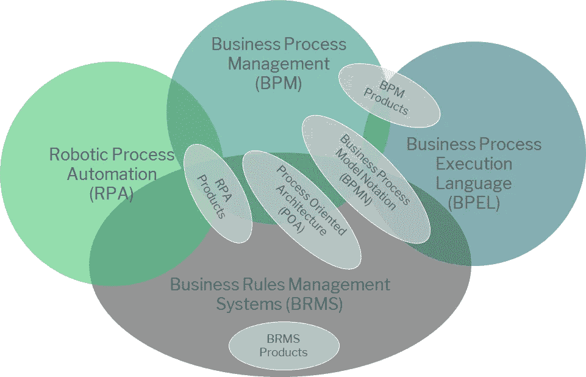
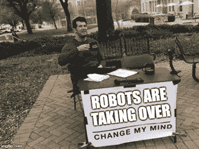

# RPA 部署失败的 3 个原因，以及如何应对

> 原文：<https://medium.datadriveninvestor.com/3-reasons-why-your-rpa-deployment-will-fail-and-what-to-do-about-it-b847a30c6e94?source=collection_archive---------12----------------------->

## 过程自动化的真正挑战是什么

## 机器人过程自动化(RPA)是一个具有双重含义的术语。它既是一种技术，也是一种方法论。

作为一项技术，它的主要目的是使用软件机器人(或机器人)来自动化业务流程。该软件与现有的应用程序并列，用于通过模拟人类活动来执行重复性任务。

普通的和可重复的步骤，如读取数据或复制和粘贴信息到表格中，使用软件记录下来，然后作为一个正在进行的例行程序自动执行。对于过程自动化更细微的应用，机器人可以被编程为遵循“模糊”规则(如果这个，那么那个)，并执行不同复杂程度的计算。

Typical use cases for RPA

作为一种方法，RPA 框架通常被视为对基本脚本、工作流和宏的改进；机器学习和自动化智能的第一步。

理论是，通过消除那些重复枯燥的任务节省下来的时间将让你的员工有时间花在更多增值的认知任务上，这些任务依赖于创造力、建立关系或直觉。

The evolution of autonomous processing

您企业中的少数机器人可能会以更快的处理时间和减少手动工作的形式提供一些边际收益。更不用说质量提高的价值了；这是不可低估的，因为每一次增长都有与之相关的货币价值。

例如，在一个典型的组织中，流程自动化估计可以减少会计错误，并减少大约 30%的纠正性返工。根据最近 *Gartner* 的一份报告，这个数字相当于大约 25，000 工时。

但是，这项新技术的总体财务影响将在很大程度上取决于 RPA 项目在组织中的受欢迎程度，但事实是这样的；**爱国军只是一个临时解决方案。**

存在这样一种风险，即企业会将 RPA 作为一种花哨的装饰来隐藏低效流程的丑陋，并使糟糕的情况*变得不那么糟糕*不会为一些需要的长期变化提供解决方案。

随着采用率的增加，好处也会增加，但是如果没有适当的规划，所能达到的效果是有限的。

在缺乏企业范围的集成和治理的情况下，在快速实现这种自动化的兴奋中，可能的结果将是许多分散的项目分散在企业中，为少数早期采用者提供中等的好处。

# 要避免的 3 个主要陷阱

## 1.过于关注角色和结构，而不是责任

传统 IT 角色之外的人越来越容易接触到业务技术。Gartner 估计，未来五年，超过 50%的技术支出将从核心 IT 转移到业务线和其他支持功能。

**这意味着到 2024 年底，一个组织内部采购的技术将有一半被淘汰。**

在这种忙乱中，你组织中的不同部门都在摆出姿态，在他们的组织中建立角色和层级，而不是专注于所需的职责。

未能意识到这种思维转变对你的项目来说可能是致命的，但如果做得正确，接受这种转变会非常有益。

RPA responsibilities

*   确保您有适当的治理和监督。
*   您将需要一个管道系统来管理自动化请求的需求和优先级。
*   需要采取措施来确保正确配置和测试流程。
*   最后，您需要能够监控所有这些机器人，以确保它们在所有气缸上点火。

## 2.RPA 计划与企业范围的业务流程管理活动不一致

RPA 与业务流程管理(BPM)和技术一样重要，两者之间有许多重叠。

要构建一个机器人，你需要分析你的业务流程，要做到这一点，你需要了解你的流程是什么，以便你可以找到提供最大利益和最快投资回报的流程。

Robotic Process Automation (RPA vs BPM)

您可以快速部署高效的半自动解决方案解决方案，同时制定并实现长期转型变革，但始终存在一种风险，即容易激动的领导者会想要开拓自己的 RPA 小领地，而不是努力建立真正的治理和监督。

## 3.认为 RPA 就像任何其他软件或应用程序一样，并以同样的方式对待它

业务需求总是会超过交付能力，由于 RPA 的快速部署能力，它被错误地称赞为能够解决问题和低效流程的灵丹妙药。

然而，考虑到这一点，使用瀑布方法来管理这种技术的实现也不会有什么效果。如果你试图使用一个更适合 ERP 的框架来实现 RPA，那么大多数计划甚至都不会成功。

剔除多余的内容，找出你需要的最低可行产品，然后尝试按照敏捷原则快速部署机器人。

> “…严重依赖读写、计算、处理和分析技能的工作现在几乎不需要人工参与。即使那些工作——在行政管理、制造业和各种服务中——仍然由人类来做，它们也不会持续太久

我很想听听你对这个话题的看法，关于你在这个领域的经验，或者你喜欢(或不喜欢)的任何内容。

跟我上[T3【Linkedin.com】T5](https://www.linkedin.com/in/mrobbo1984/)