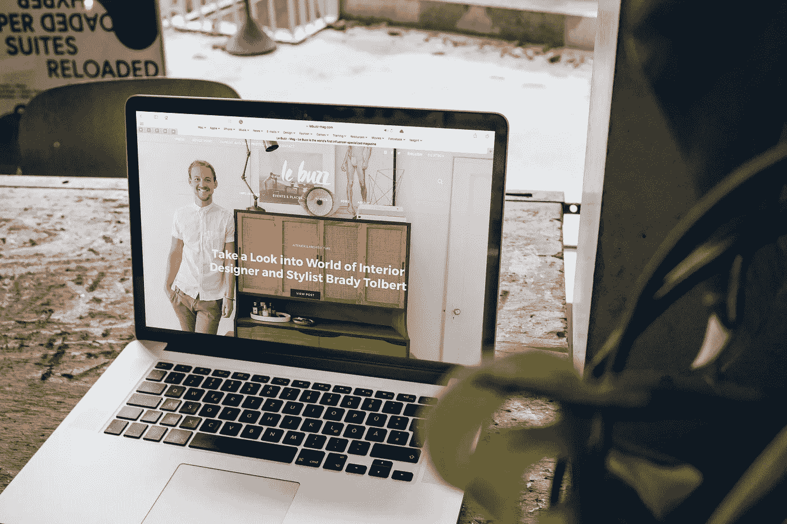

# 你的网站没有销售额的 3 个原因

> 原文：<https://medium.datadriveninvestor.com/3-reasons-youre-not-getting-any-sales-from-your-website-b6bc371a3670?source=collection_archive---------1----------------------->

在和你的网站开发者/设计师一起花了几个小时在你的网站上，或者自己创建了一个网站之后，现在终于是时候发布了。您对开始参与这些销售感到兴奋！

你发射；你等着。什么都没发生…

你需要废弃你的整个网站并从头开始吗？

> [**小测验:你需要重新设计网站的 7 个征兆**](https://www.the-emms.com/blog/7-signs-your-website-needs-a-redesign)

在我们得到这个问题的答案之前，让我们首先确保你理解你的分析，以及它们对你的网站意味着什么。(注意:如果您还没有建立任何分析，或者如果您没有定期从开发人员那里获得报告，这应该是您的第一步！)

 [## 在创业之旅中，拥抱学习数据驱动的投资者

### 好像建立一个数百万美元的公司还不够困难，企业家必须额外照顾他们的…

www.datadriveninvestor.com](https://www.datadriveninvestor.com/2018/10/16/on-the-entrepreneurial-trek-embrace-the-learning/) 

## 了解您的分析:

当你不是数字营销人员时，看看你的分析可能会感到畏惧。这一切意味着什么？以下是需要关注的最重要的指标:

**用户**:你网站的访客数量。

这一指标没有通用的基准。无论你认为你的流量是高还是低，都应该与你的营销活动和你接触的人数成比例。

跳出率:仅浏览一页后离开网站的流量百分比。

这可能是最重要的指标。根据[基准](https://www.gorocketfuel.com/the-rocket-blog/whats-the-average-bounce-rate-in-google-analytics/)，低于 40%的跳出率被视为优秀，41%至 55%为一般，56%至 70%高于一般，70%或以上为较差。

**平均会话持续时间:**访问者每次访问在您的网站上停留的平均时间。

这个指标给你一个指示，说明访问者对你的网站的参与程度。一个好的平均花费时间取决于你的网站内容的类型，但是通常任何低于 1 分钟的时间都是值得关注的，因为你希望人们在你的网站上停留尽可能长的时间来了解你的产品。

**每次会话的页面数:**人们访问你的网站时浏览的平均页面数。

这是另一个指标，它让你了解用户对你的网站的参与程度，以及他们通过主页发现你的网站的可能性。根据您的站点设置，通常一个好的基准应该是每个会话至少 2 到 3 个页面。

**站点转换率:**采取购买、要求演示或提供电子邮件等行为的访问者的百分比。

根据你所追踪的内容和你的分析设置，你可能需要自己计算出一段时间内总转化数相对于流量的百分比。这里的基准因行业和国家而异，但平均而言，电子商务网站的典型转化率约为 1%至 2%，潜在客户生成页面的转化率约为 2.35%。

注意:对于 B2B，请记住，你的线索可能不总是直接来自你的网站。人们也可能会给你发电子邮件，直接给你打电话，或者通过社交媒体联系你和/或你的团队。尝试通过清晰的线索捕捉流程(即使只是一个电子表格)来记录这一点，以便在进行评估时有一个全局视图。

现在，您已经知道了要测量什么以及如何对您的性能进行基准测试，让我们来看看它们可以帮助您发现的典型缺陷:

## 1.没人知道你的网站！

有时网站表现不佳，需要重新设计，但是通常他们没有足够的流量来推动销售，甚至不能评估是否有问题。

想想看，如果通常网站的转换率在 2%左右，而你的目标是本月销售 100 件，你必须让至少 5000 名相关人员访问你的网站才能实现你的目标——假设你的网站运行最佳。

如果你的营销活动没有做到这一点，你可能做得不够和/或你的网站可能无法找到在线，因为它不是正确的 SEOd。

为了更好地理解这一点，看看你的流量来自哪里。你能看到你所有的渠道都与你的努力成比例吗？你得到任何有机网站的访问吗？基于这些见解，重新审视你的[营销计划](https://www.the-emms.com/blog/how-to-create-a-marketing-plan-for-your-start-up)，并开始关注你的 [SEO](https://www.the-emms.com/blog/why-you-should-care-about-seo) 。

## 2.你的营销不起作用！

你得到了大量的流量，但转化率很低。在你废弃你的网站之前，确保你的网站从你的营销活动中获得高质量的流量！

看看你的渠道:流量从哪里来？哪些渠道在带动好的流量；哪些导致交通拥堵？

审核表现不佳的渠道，以了解其表现不佳的原因。是信息、格式、目标等吗？？调整你的策略，看看情况是否有所改善。

## 3.你的网站坏了！

您是否在各渠道表现不佳？你的网站需要改进！从哪里开始？看看这 7 个维度:

**美学:**你网站的视觉观感。

这是网站失败的首要原因！如果你的网站没有很好的品牌和专业设计，它不太可能吸引观众和推动销售。如果你不是设计师，考虑雇人给你的网站来一次专业的更新。

**文案:**你网站的文字内容。

你的文案需要做的不仅仅是听起来不错。它需要引人注目，内容丰富，易于理解。例如，在电子商务中，您的产品描述是推动销售的关键，而在潜在客户网站上，快速概述优势和功能对于抓住潜在客户的注意力至关重要，因为他们可以快速比较竞争对手。

**图片:**展示在你网站上的照片和图片。

B2B 企业通常可以使用高质量的库存照片，但聘请设计师来创建品牌图形给你的网站带来独特的感觉是一个好主意。另一方面，对于消费品牌来说，生活方式和产品摄影可以决定成败，所以不要吝啬雇佣一个好的专业摄影师。

导航:引导人们探索你的网站的结构。

清晰、直观的导航对转化、搜索引擎优化和客户体验至关重要。保持你的菜单简短，容易找到，并确保有一个清晰的行动号召(CTA)来引导人们通过你的网站进行转化。

用户体验:你的网站使用起来有多简单、直观和愉快。

不要在这里多此一举；遵循行业标准，使购买、预订或联系您的路径尽可能无缝。如果点击次数超过 3 次，你就失去了你的客户！

**移动优化**:你的网站在不同设备上的运行效果如何。

我们生活在一个移动优先的世界。移动优化不是可选的！你的网站需要在任何设备上都有良好的外观、感觉、加载和性能。

**行动号召(CTA)** :引导用户通过你的网站最终转化的按钮或文本。

如果你在其他方面都表现良好，但你的网站没有转化，这可能是因为它没有转化优化。你网站上的每一页都应该有一个按钮、注册或其他 CTA 来引导用户实现你的目标。

## 后续步骤

一旦你完成了所有的事情，你可能会发现你可以自己解决一些问题，而其他方面可能需要专业的帮助。例如，你可能花了一些时间在你的 SEO 上，但是雇佣了一些人来提供新的摄影或者修复你的 UX。

如果你已经完成了所有这些项目，但你似乎仍然不能销售，这可能是你的营销或你的网站都没有问题。有时一种产品或服务不适合你的市场，或者提供的不够吸引人。在这种情况下，尝试更好地了解您的客户，优化您的产品以满足他们的需求，测试不同的定价水平或测试新的目标受众。

## [还是觉得卡住了？联系我获得免费的网站评论！](https://www.the-emms.com/contact-us)