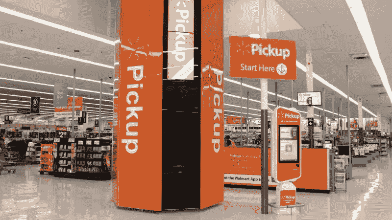
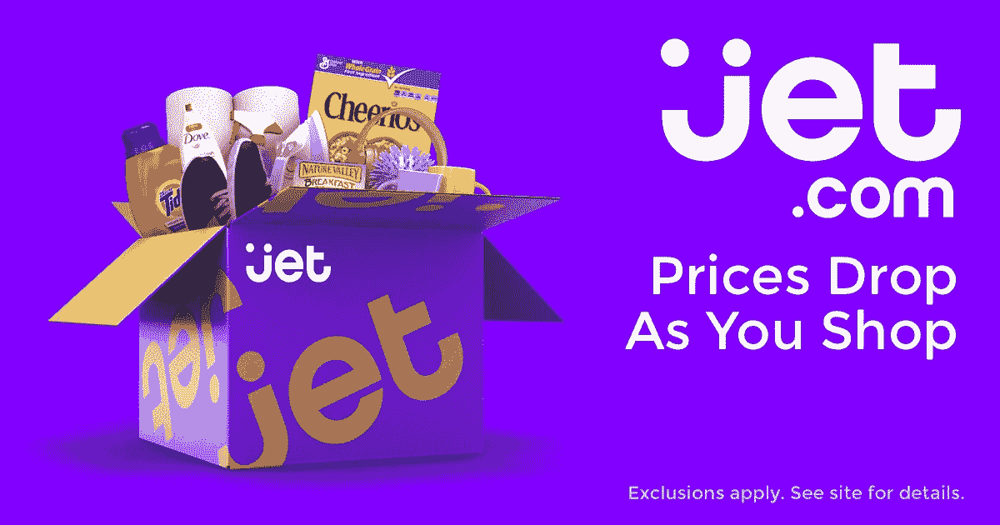
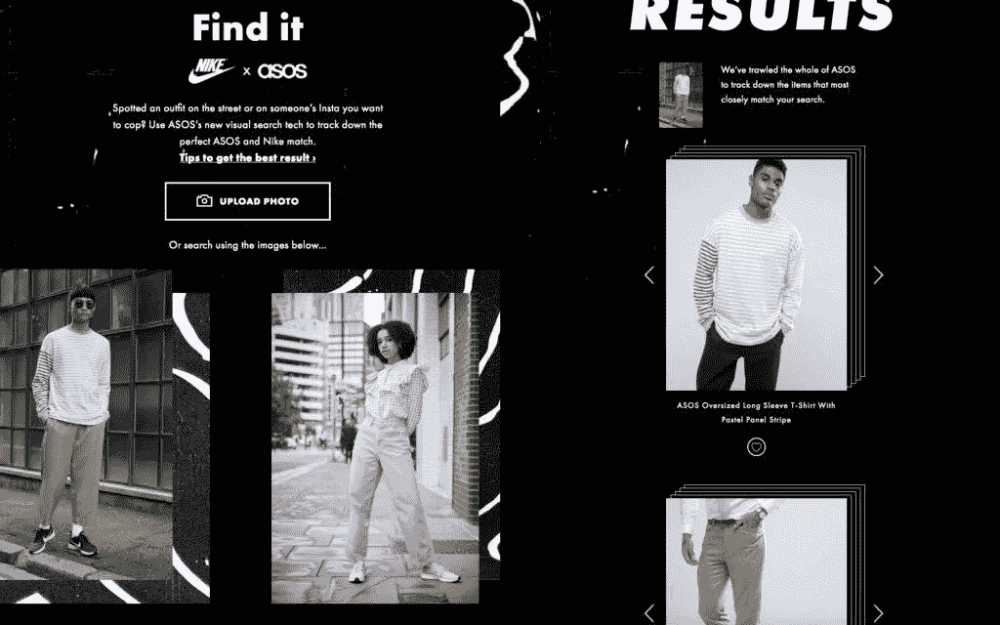

# 人工智能和大数据如何帮助沃尔玛、捷达和 ASOS 赢得新客户

> 原文：<https://medium.datadriveninvestor.com/3-retail-leaders-using-big-data-ai-to-drive-efficiency-6358706730f5?source=collection_archive---------4----------------------->

当我们明智地使用信息时，信息就是力量。太多的零售高管被他们公司收集的海量数据压垮了，这些数据往往累积成一座巨大的、令人生畏的珠穆朗玛峰。

然而，最成功的零售商是那些投资大数据分析和人工智能(AI)的零售商，这并非巧合。他们敏锐地知道自己坐拥大量数据，将这些数据转化为可操作的见解可以帮助他们做出快速、基于事实的决策，从而提高效率并获得竞争优势。

以下三家零售商利用大数据和人工智能节省时间和精力，改善客户体验。

# 沃尔玛为其在线分类战略拥抱人工智能

这家全球最大的零售商转向大数据和人工智能来改善其在线分类战略。为了发现其在线分类中的差距，Walmart.com 使用人工智能有效地扫描电子商务格局，以收集对新兴产品趋势的见解。这些见解帮助沃尔玛发现了消费者正在购买的商品和 Walmart.com 已经提供的商品之间的差距。

**大数据洞察帮助沃尔玛衡量消费者兴趣**，并从其在线分类中剔除不太受欢迎和评价差的产品，为畅销和独特的产品腾出空间，使沃尔玛从竞争对手中脱颖而出。人工智能和大数据洞察给了 Walmart.com 更强大的电子商务分类，从 2011 年的 70 万件商品扩展到 2017 年的[6000 万件](https://venturebeat.com/2017/10/23/how-ai-helped-walmart-go-from-700000-to-60-million-items-online/)。

像 [Incompetitor](http://www.intelligencenode.com/products/incompetitor) 这样的竞争基准解决方案抓取数十亿件产品，使用深度学习人工智能将它们分类成清晰的标准化类别，以实时提供准确的数据。该技术使用人工智能和机器学习来确保你有正确的产品组合，独特的产品来区分你的公司，并且你知道你的竞争对手的目录，包括流行和新推出的产品。

# Jet 使用动态定价来保持竞争力

购物者比以往更加足智多谋和见多识广。在网上或店内购物之前，他们通常会用比较价格信息来武装自己，这样他们就知道谁以最便宜的价格出售特定的产品。

这就是为什么像 Jet 这样具有前瞻性思维的零售商采用大数据和人工智能进行动态定价，这可以实时自动改变产品的在线定价，以保持竞争力。Jet 擅长使用定价数据来帮助购物者在网上购物车中的每件商品上获得最佳交易。

**大数据分析使您能够**审查您的定价数据，为您的产品找到最佳价格范围，从而实现销售最大化。例如，一些电子商务网站将人工智能应用于他们的在线定价策略，以确保他们总是以比亚马逊相同商品低 10%的价格出售特定商品。

像 Inoptimizer [这样的价格优化工具帮助零售公司实现实时价格优化](http://www.intelligencenode.com/solutions/dynamic-pricing-optimization/)，并通过自动化零售定价解决方案为购物者提供最佳价值。我们复杂的价格优化软件分析您的竞争对手的反馈和内部数据，以简化定价并最大限度地提高利润率。基于规则的引擎可以根据实时因素优化价格，如库存、竞争对手的缺货情况和折扣。

# ASOS 提供高效的视觉搜索

为了让消费者更容易、更快地找到他们想要的东西，人工智能有助于快速视觉搜索，以高效地发现产品。移动零售应用程序中人工智能驱动的图像识别技术允许消费者上传图像，比如刚刚在街上路过的人的可爱钱包的照片。手机应用程序可以将图像与类似的产品进行匹配。这就像是 Shazam 的产品，而不是歌曲。

让购物变得更容易、更快捷、更愉快，促使在线服装零售商 ASOS 推出了一款视觉搜索工具，[风格匹配](https://www.forbes.com/sites/rachelarthur/2017/08/10/asos-visual-search/#149b6e2d2b32)，可在其原生应用程序上使用。ASOS 的在线分类包括 85，000 种产品。为了减少网上的混乱，购物者可以使用 Style Match 搜索 ASOS 大量的在线产品系列，找到与消费者上传的产品图片相似的建议。

视觉搜索工具使用机器视觉来检测网络或在线分类上的商品，并建议相关商品。其他使用视觉搜索提供卓越在线购物体验的零售商包括 Target、Wayfair、John Lewis、Shoes.com、Neiman Marcus、Nordstrom 和 Urban Outfitters。

[一个产品的视觉搜索引擎](http://www.get-hook.com/)现在允许购物者使用人工智能时尚反馈比较来自 150 多个品牌的时尚产品，并且一个尖端的匹配引擎通过分析个人喜欢或添加到他们在线愿望清单的产品图片，实时了解购物者喜欢什么，帮助购物者加快找到他们喜欢的商品的过程。

正如这些领先的零售商所显示的那样，大数据和人工智能让你能够找到新的机会来提高效率，改善客户体验，并在竞争对手之前发现新的趋势。这些前沿技术没有放缓的迹象，因为数据洞察是在当今精明、有眼光的消费者中获得竞争优势的关键。

*原载于 2018 年 9 月 27 日*[*【www.intelligencenode.com】*](http://www.intelligencenode.com/blog/3-retail-leaders-using-big-data-ai-to-drive-efficiency/)*。*