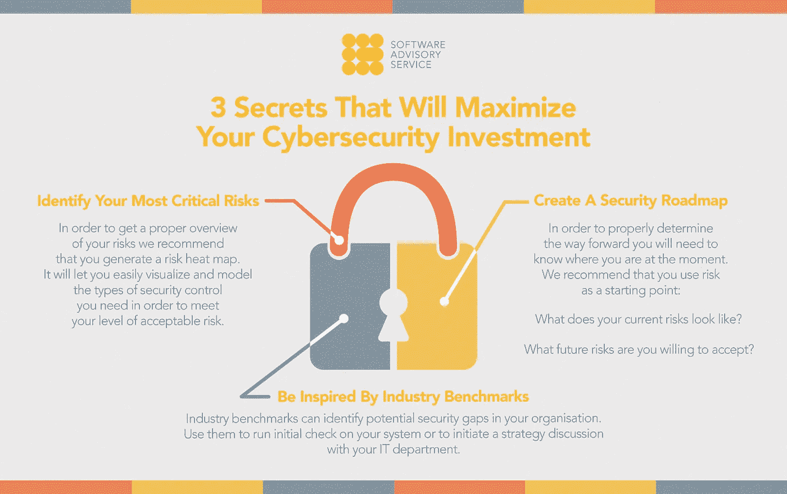

# 将使您的网络安全投资最大化的 3 个秘密

> 原文：<https://medium.datadriveninvestor.com/3-secrets-that-will-maximize-your-cybersecurity-investment-c6a78ac9425e?source=collection_archive---------50----------------------->

随着灾难性的数据泄露成为世界各地的头条新闻，越来越多的组织开始思考如何最大限度地提高安全性并妥善保护他们的宝贵资产。

[*文章最初发表在这里。*](https://www.softwareadvisoryservice.com/blog/)

网络安全应该是你今年的首要任务。[我们之前已经报道过](https://www.softwareadvisoryservice.com/blog/mid-size-businesses-lose-more-to-cybercrime/)英国的中型组织受网络安全漏洞的影响最严重、最频繁。研究表明，虽然中型组织几乎与大型组织一样频繁地受到攻击，但他们在安全基础设施方面的投资要少得多，这使他们容易受到网络钓鱼攻击和其他形式的网络犯罪的攻击。

是时候确保将“支付和祈祷”作为主要网络安全策略的日子已经一去不复返了。在这份电子指南中，我们收集了 3 个行业秘密，将帮助您在 2018 年实现网络安全投资的最大化。

# 创建安全路线图

为了正确地确定前进的方向，你需要知道你目前的位置。我们建议您将风险作为出发点。

*   你目前的风险是什么样的？
*   你愿意接受什么样的未来风险？

这些问题的答案将帮助您规划您的网络安全战略——或者您也可以称之为网络安全路线图。从那里开始，前进的道路将由你的能力来铺设。您的安全措施有多一致？它们能提供您实际需要的保护吗？

这些评估可以帮助您了解当前安全策略中的差距，并了解您需要在哪些方面重新分配资源，以实现您的目标并降低风险。

# 确定你最关键的风险

为了正确了解您的风险，我们建议您制作一份风险热图。

通过使用热图，您将看到您最关键的网络安全风险在哪里，从而指出将从您的投资中获益最多的资产。

换句话说，热图将让您轻松地可视化和建模您需要的安全控制类型，以满足您的可接受风险级别。

# 受到行业基准的启发

虽然应该有所保留，但行业基准仍然可以成为评估您的网络安全工作的合理起点。

行业基准可以识别组织中潜在的安全差距。使用它们对您系统进行初步检查，或者与您的 IT 部门讨论策略。但是请记住，安全投资不会给你带来投资回报，除非它们完全符合你的需求和你的情况，换句话说，永远不要仅仅因为“其他人都在做”某件事就做出决定。

允许自己受到启发——但永远不要忘记根据自己的具体需求定制基准。

# 规划就是一切

网络安全不是魔法，当然也不必过于复杂。

如果您正在努力理解您的目标安全级别应该是什么，那么是时候回到基础了。你需要保护什么？为什么要保护它？最有效的方法是什么？通过将路线图与您的实际业务需求保持一致，您将从网络安全投资中获得更多回报。

请记住，网络安全不应该是一种反应，而应该是一种实际的战略。

*我是数字内容作家* [*这里*](https://www.softwareadvisoryservice.com/) *。如果您有任何问题、建议或葡萄酒推荐，请随时联系我。*