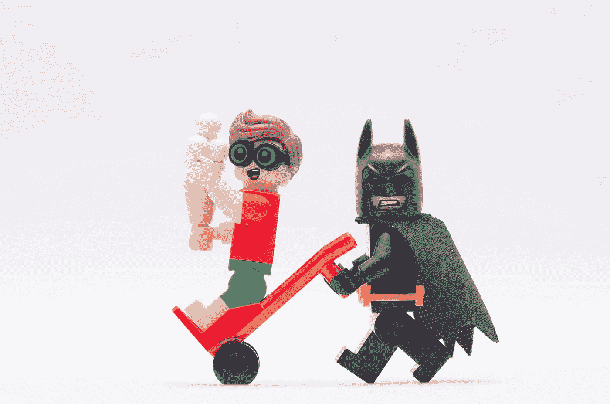

# 3 个简单的方法，让你的演示效果提升 550%

> 原文：<https://medium.datadriveninvestor.com/3-simple-ways-to-boost-your-presentations-impact-by-550-e80b719086e4?source=collection_archive---------20----------------------->

你听说过这句话“幻灯片之死”

也许你自己也经历过，坐在一个会议上，看着一堆幻灯片让你失去了活下去的意志。幻灯片怎么会变得如此糟糕，以至于我们用它们来杀人？

> 有一种更好的方式与他人联系，这需要关掉投影仪。

如果放弃屏幕进行演示的想法让你整个身体都停止了跳动，不要惊慌——你并不孤单。

在给一个客户上演示课的时候，我走进教室，要求把投影仪和屏幕从教室里拿走。客户认为我疯了。

"你将如何教我们做一个没有幻灯片的演示？"她问。

太多时候，我们依赖视觉辅助工具来为我们做演示。或者很多人用幻灯片来提醒自己该说什么。

## 但是听众不可能一边听你说话，一边接受大量的文本。

通过简化你的视觉辅助，你把焦点放在了它应该在的地方——你自己身上。

**1。删除文本**

关于如何设计幻灯片，有很多相互矛盾的信息，其中大部分是没有帮助的。

事实上，就在昨天，我遇到了一位女士，她自豪地告诉我她知道所有关于幻灯片的 1-7-7 技巧。这教你有一个标题，然后七个要点，每个要点七个词。

这意味着一张幻灯片至少要有 50 个单词！如果你有 100 张幻灯片，那么你是在要求人们在你与他们交谈的同时阅读一份 5000 字的文件。

这是不可能的。

> 限制你要求人们关注的事情的数量。

这意味着删除幻灯片中所有多余的文字。

你的听众不能阅读，听你讲话，*和*同时理解你在说什么。那太多了。

减少人们在你演讲时接受的刺激会让他们从和你在一起的时间中获得更多。

**2。添加图像**

人们不能一边读一边听。

为此所需的大脑部分靠得太近了。但是，我们*可以*看图像，听。事实上，一项研究表明，观看带有要点的演示文稿的人三天后只能记住其中的 10%。但是一个观众看到同样的精彩图片会记住 65%。

## 这就是为什么你的演讲需要引人注目的视觉效果来配合你的论点。

你想让你的观众参与进来，但你也想让他们有一个视觉表现来巩固他们的记忆——更不用说好的视觉效果可以帮助人们坐得更久。

想想*指环王*电影。它们长达几个小时，大多数人坐着看完，而不必每隔 40 分钟起身去洗手间或喝咖啡。图像和人物对话足以让观众一口气看三个多小时。

*这就是*图像的力量。

我不是说你的演示需要有精灵和巫师以及与兽人的史诗般的战斗。但是你希望你的视觉教具也同样令人难忘，帮助人们关注你所谈论的主题。

**3。记住:你是蝙蝠侠，你的视觉助手是罗宾**

每个人都想成为蝙蝠侠。

说到介绍，你*就是*蝙蝠侠。你的视觉助手是罗宾。你需要成为当下的焦点。

> 因为当你做演示时，你是专家，是房间里最聪明的英雄。

如果你需要支持，你的视觉辅助工具就在那里，随时可以帮助你。

通过用更少的文字和更多的图片来简化你的视觉教具，你会使它们的效率提高 550%。你只需要让你的听众在你演讲的时候听你讲话，配合强有力的、支持性的图像，你的演讲将会令人难忘。

没有斗篷你也能做到。

去[https://borntospeak.com](https://borntospeak.com/)了解更多，订购新书《你生来会说话》，其中包含实用的、经过验证的帮助你成功的技巧。

*最初发表于:*[*https://blog.ukbodytalk.com/*](https://blog.ukbodytalk.com/)