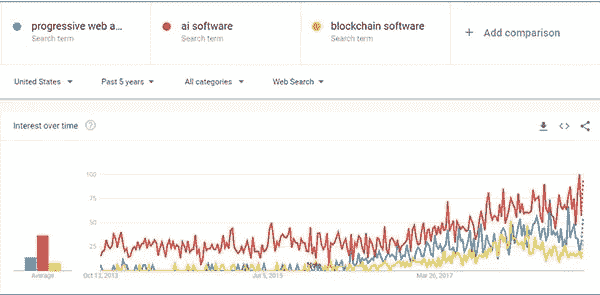
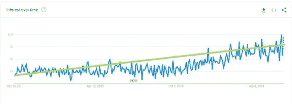
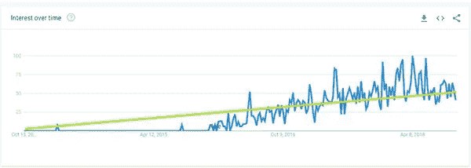
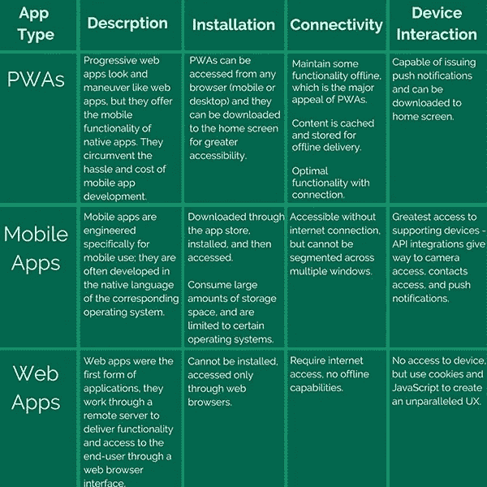
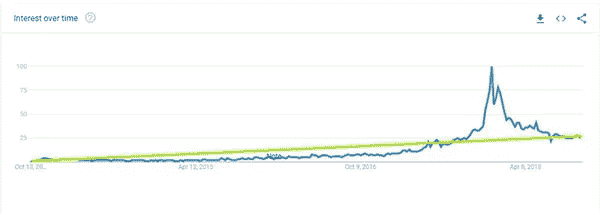

# 今年我们不能忽视的 3 个软件趋势

> 原文：<https://medium.datadriveninvestor.com/3-software-trends-we-cant-ignore-this-year-9f96c137d8a4?source=collection_archive---------47----------------------->

毫无疑问，你已经听说过区块链不可渗透的账本，以及它如何挑战传统银行业务的局限，或者考虑过人工智能如何重新想象预测性维护和增强消费者关系，但对它们的应用潜力仍有疑虑。

我知道我们有时会问自己，区块链是一个很快就会平息的流氓浪潮，还是去中心化的银行业务将在未来十年使中介机构过时？PWA 是未来还是狂热的应用程序开发环境中的一个插曲？

在接下来的几个月里，我们肯定会看到一大堆预测明年软件必备的内容——这是不可避免的。谬误的文章和未经证实的声明也是不可避免的，找到有价值的插入物就像大海捞针。

我们希望赶在新年热潮之前，关注我们不能忽视的三个软件开发趋势，通过数据驱动的分析解释这些下一代技术的重要性，并围绕它们的发展构建一个商业案例。

因此，为了找到一些答案，揭开围绕[区块链](https://www.chetu.com/solutions/blockchain.php)、[人工智能软件](https://www.chetu.com/solutions/artificial-intelligence.php)和[渐进式网络应用(PWAs)](https://www.chetu.com/solutions/mobile.php) 的传言，我们进入谷歌趋势，看看这些关键词的搜索量在过去五年中是如何起伏的，以及它们的搜索量模式对未来一年的影响。

下图显示了五年间我们的四个关键词的搜索趋势。

谷歌趋势显示，五年期间(2013 年至 2018 年)，所有三个术语的搜索量都在持续增长。没有迹象表明这种日益增长的兴趣不会持续到下一年。我们可以看到，从 2016 年夏天开始，搜索量开始更积极地增长，并一直保持这种模式，预计量会逐月波动。

人工智能软件这个词是三个词中最有希望的搜索量模式，渐进式网络应用以明显的优势位居第二。

既然我们已经确定这三种技术都得到了不断增长的用户群的验证，那么让我们来分别研究它们。

**1。AI 软件:这个比 Siri 大**

让我们把人工智能软件从对比图中拿出来，看看它的搜索量是如何独立完成的。

我们画了一条绿线来帮助引导你走向我们看到的人工智能软件的总体模式。

从这些数据中，我们知道人工智能很有可能会继续攀升。我们将此归因于对人工智能如何横向整合的理解日益加深。

直到最近，我们错误地将人工智能囚禁在难以置信的平凡形式、聊天机器人和类似 Siri 的助手中，或者在人工智能可以在所有情况下充当人类替代品的虚假借口下操作。

是的， [AI 软件](https://www.chetu.com/solutions/artificial-intelligence.php)可以解释和响应自然语言模式，是的，AI 软件在分析一系列输入后被训练成公式化和情境化输出，但是，不，AI 不是人类-即兴猜想和批判性思维的替代品。

艾就像一瓶好酒，越陈越香。我们可以短视地思考这个问题:我的人工智能系统将学习超出我们训练它知道的概念的概念，或者从大的方面考虑，如果人工智能现在是这样直观的，我无法想象 20 年后它会在哪里。

AI 是超级员工，在工作时间之外承担继续学习和个人发展责任的员工。但是，用同样的比较，这位员工将永远无法用非语言交流做出反应，发展内省智能，或根据视觉线索采取行动。

因此，随着我们进入新的一年，我们将经历一场人工智能范式的转变。我们不会用聊天机器人取代所有的客户服务代理，而是会找到一种方法来培养人类劳动力和人工智能工具之间的关系，以形成一种共生关系，其中一方和谐地依赖另一方。

随着我们发现更完善的工作流程和用户体验的机会，重点也将从对话式人工智能转向预测式人工智能。预测性人工智能超越了垂直领域，通过改变形状来缓解各种各样的痛点，直到我们有办法消除这些痛点时，我们才意识到它们是痛点。

有时它就像预测的兴趣和查询一样简单，这是我们在谷歌上看到的。谷歌人工智能根据历史数据预测我们的搜索，定位我们的搜索以匹配我们的环境，并预测我们可能会有哪些与我们最近的查询相关的问题。

在其他情况下，赌注更高，也更制度化。美国陆军现在使用人工智能来预测故障车辆系统，并提供对运营健康的见解，充当自动化设备技术员。这是机器和人工智能软件之间以一种共同语言进行的持续对话，然后由人工智能软件重新包装成我们熟悉的语言。

我们怀疑预测性车辆维护仅仅是个开始，很快这种技术将变得对平民更加友好。模式识别显然不是车辆健康的专利；人工智能模式识别可以应用于股票波动、天气模式和其他我们还没有找到解码方法的谜团。

**2。渐进式网络应用:不要让你的 PWA 成为争夺可访问性的筹码**

当我们从图形比较中分割出渐进式 web 应用程序时，我们得到的是:

我们可以看到 [PWA](https://www.chetu.com/solutions/web-development.php) 搜索量有一些非常有希望的增长，我们用绿线表示。

让我们来解决这个问题:什么是渐进式 web 应用程序？

如果我们将传统的网络应用 DNA 和[移动应用](https://www.chetu.com/solutions/mobile.php) DNA 等份结合，我们最终会产生一个进步的网络应用(PWA)。pwa 是两种截然不同的用户体验的中间地带，是它们最佳功能的熔炉。

我们将 PWA 定义为具有广受欢迎的本机应用美学和设备连接性，但具有 web 应用的基于浏览器的用户体验的应用。渐进式网络应用程序可以做普通网络应用程序或移动应用程序无法独自完成的事情，为跨渠道的可访问性设计完美的公式。

用户可以从任何网络浏览器访问 PWAs，并从任何操作系统获得相同的用户体验。他们使用渐进式 web 堆栈(JS、HTML、CSS)来重现移动应用程序体验。

要使用移动应用程序，用户必须访问应用程序商店，下载应用程序(有时通过购买)，等待下载，然后通过屏幕上出现的缩略图与应用程序进行交互。由于导航限制、加载速度和中断的用户旅程，品牌有时会失去在移动应用前端的参与。考虑到 pwa 是传统 web 应用程序的一个亲戚，它们与一个 URL 相关联，使它们可以链接和共享。

PWAs 通过向用户提供最大的可访问性来选择阻力最小的路径。用户有两种选择:继续通过浏览器导航到 PWA，或者将快捷图标下载到主屏幕以获得更好的可访问性。pwa 非常容易实现、使用和更新，在各方面都是双赢的。用户节省了设备上的存储空间，品牌降低了开发和应用维护成本。

我们甚至在设备与 pwa 的兼容性上更进了一步，因为当连接受限时，pwa 仍能保持功能。概述线下特征应该是品牌的第一要务。当你的用户成为变化无常的互联网连接的受害者时，哪些功能应该仍然可用？

对于没有广泛连接的国家来说，pwa 是线下品牌消费的可行媒介，也是拓展新市场或重振旧市场的机会。

虽然移动应用程序必须通过应用程序商店下载，并遵守应用程序商店的指导方针和法规，但 pwa 可以独立运行，恢复品牌计划的创作自由。

**3。区块链:战胜比特币炒作**

比特币热潮何时开始，牛市何时结束，这一点非常清楚。2018 年 12 月是比特币可能永远不会再经历的异常主义。至此，市场已经稳定下来，开始走向成熟。即使这对比特币持有者来说是一个悲惨的消息，但这对区块链来说却是一个好消息。

我们逐渐联想到的加密货币的不可预测性迫使区块链脱离比特币泡沫，进入现实世界。它完成了一项相当不错的工作，独立生存，不受母舰的束缚。

到 2018 年 1 月，[区块链](https://www.chetu.com/solutions/blockchain.php)创业者被迫在点对点交易之外的环境中考虑区块链，考虑去中心化账本的安静优势以及他们在非货币化交易中会如何反应。为了解开这些优势，我们必须回到区块链的根源。

区块链的诞生恰逢互联性日益增强，以及对新的可访问性如何危及数据的担忧。区块链是一个去中心化、不可渗透的账本，提供了集中式流程的替代方案。一旦一个事务的参数被编码并且一个新的块被创建，该事务就根据参数自执行。所有交易都经过验证，交易细节都是匿名的，不会威胁隐私。

也许我们先来看看明显的应用，银行业。甚至像 Visa 这样的支付巨头也会经历服务中断。如果个人 A 通过 Visa 与个人 B 进行交易，而 Visa 没有将信息传递给个人 B，则个人 A 被迫等待断电并延迟支付处理。极少数的行为者控制着大量的资金，因此，所有的股东都必须遵守他们的程序。

在支付网络的控制下，国际交易所尤其脆弱。通常情况下，国际交易需要 3-5 天才能完成，而且每笔交易的成本很高。像 Ripple 和 Tron 这样的区块链替代品可以大大降低费用，并在不到一半的时间内确认交易。

绕过大银行是一个有吸引力的第一想法，这就是为什么我们看到区块链充斥着银行和金融网点。我们还能从等式中去掉哪些中介？这个名单很长，不断演变，有时是非人类的。

我们可以指出数据安全中的严重失误，并扭转他们所引发的偏执。或许，我们可以将区块链应用到投票过程中，淘汰那些安全协议糟糕的软件。如果我们将房地产过渡到一个完全独立的过程，在没有经纪人的情况下买卖房屋，并通过区块链网络验证销售和支付，会怎么样？

甚至云计算和区块链也很好地并列在一起，用加密记录来减少漏洞百出的协议。

基本上，我们现在知道，只要有隐私问题，只要需要匿名，区块链技术就适用。

**4。应用:逃离软件炼狱**

有时很难将趋势联系起来并应用到你的业务中。我们明白了。但是要知道，下一代技术读起来很有趣，但是如果没有应用这些信息，它几乎没有任何用处(如果我们诚实的话)。因此，把你目前的软件解决方案从炼狱中拿出来，为它们搭建一座通向事物光明面的桥梁。

我们来分解一下外卖。

*   如果有隐私或安全问题……[区块链](https://www.chetu.com/solutions/blockchain.php)。
*   如果你想打开新的流量，增加参与渠道 PWAs。
*   如果你需要预测智能，或者发现自己在重复性任务上浪费资源……人工智能。

区块链、人工智能和渐进式网络应用的最大好处在于，它们不局限于垂直领域；它们是水平的。很有可能至少其中一个可以极大地改善你的生活，以及你提供的任何服务或产品所带来的生活。

你很幸运，我们是所有人的主人。如果您有兴趣了解如何将明年的必备软件整合到您的开发路线图中，或者只是好奇我们在做什么，[让我们知道](https://www.chetu.com/contactus.php)。

**免责声明:**

*Chetu，Inc .不影响本文观点。除非另有说明，否则提及软件、公司或个人的具体名称并不构成任何一方的认可。所有案例研究和博客都是在提到的个人的充分合作、了解和参与下撰写的。本博客不应被理解为法律建议。*

*Chetu 成立于 2000 年，总部位于佛罗里达州。我们向财富 500 强客户的企业家提供世界级的软件开发解决方案。我们的服务包括流程和系统设计、软件包实施、定制开发、商业智能和报告、系统集成以及测试、维护和支持。Chetu 的专业知识横跨整个 IT 领域。*

*-详见:*

**原载于*[*www.chetu.com*](https://www.chetu.com/blogs/technical-perspectives/software-development-trends.php)*。**