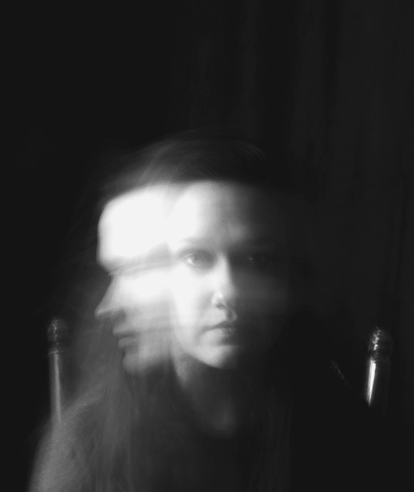
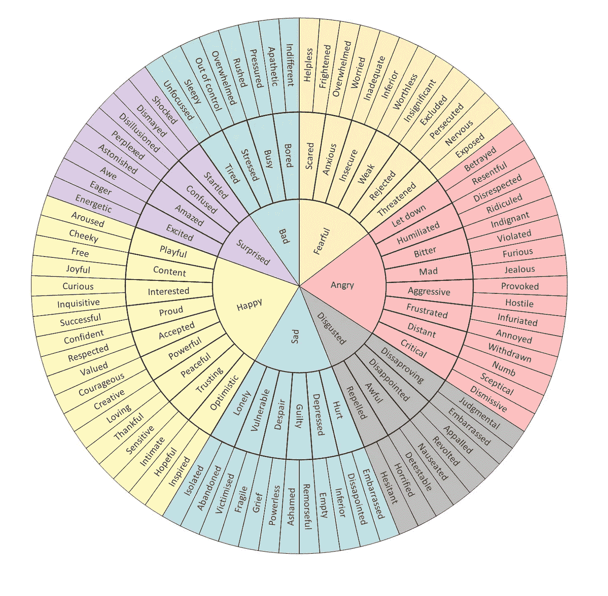

# 3 种增加勇气的方法

> 原文：<https://medium.datadriveninvestor.com/3-steps-to-grow-courage-d7d9a041fc1c?source=collection_archive---------4----------------------->

## 你的孩子，你自己，或者你的生活

Photo by [Oliver Cole](https://unsplash.com/@oliver_photographer?utm_source=medium&utm_medium=referral) on [Unsplash](https://unsplash.com?utm_source=medium&utm_medium=referral)

> “正如阿德勒所说，‘没有被教导如何面对挑战的孩子会试图回避所有挑战。’"
> 
> ~岸田文雄和阿桔文武

# 勇气的第一步:即使你不喜欢，也要学会说是

"特雷弗，你想成为职业教练吗？"

“什么？”我问。

 [## 成功人生的 25 种自我提升方式|数据驱动的投资者

### “我活得越久，学到的就越多。学的越多，体会的越多，知道的越少。”―米切尔·莱格兰德时间到…

www.datadriveninvestor.com](https://www.datadriveninvestor.com/2019/03/12/25-self-improvement-ways-for-a-successful-life/) 

"是的，作为我们在比利时的主教练."

“嗯，”我说，不相信地摇摇头。“我什么时候能出来说话？”

“明天。”

“去比利时？”

“是的。”

神圣的垃圾。

”**是的！** **我来了，就这么办吧，**”我说着，搓着手掌。

# 增加勇气的第一步是对你不确定要做的事情说“是”。

我最喜欢的书之一《艺术之战》的作者斯蒂芬·普雷斯菲尔德说，我们大多数人都有两种生活:我们过的生活和我们有能力过的生活。今年夏天，我决定尝试一些我不知道自己是否有能力做的事情。我不能撒谎说没有恐惧。绝对有。但我还是飞到比利时，基于我说好，践行改变生活勇气的自信，签下了我的合同。移动和指导职业选手的问题深深触动了我——它确实让我的神经系统兴奋不已。我的朋友兼生活教练特拉维斯·托马斯写了一本书，《摆脱困境的 3 种方法: *说好，还有……*，他的话一直萦绕在我心头:

> 就说好，然后…以后再想具体的。

我运动生涯的大部分时间都是在接受挑战，无论是打职业篮球还是去甲级篮球赛，或者建立一个全国公认的健身创业公司。但是成为一个没有经验的职业队主教练？是的，我听到了。似乎很可笑。

> 但是为什么不呢？

首先，我会更多地了解这个游戏。我会成为一个更好的领导者。我会帮助运动员成长，帮助新秀成熟。我会在欧洲简单生活，少消费。答应吧，迎接挑战，以后再想办法解决具体问题。

真正的挑战、转变或变化会在某种形式的恐惧、怀疑或兴奋中产生麻木的电流，像一辆 MAC 卡车一样沉重地打击你。然而，这种精神上的抗拒意味着什么。检查一下。试试看。别挡路，过自己的生活。开枪吧。

从职业篮球赛退役后，我经历了惨痛的教训——无论是决定作为新手在加勒比海航行六个月，还是购买租赁房屋并进行装修，还是搬到芝加哥尝试新的健身创业公司。但我最终同意了，我为自己尝试的决定感到骄傲。

# 生活是一系列我们决定说是或不是的时刻。

每一刻都可能是一个对大挑战说“是”的机会，或者是一个保持好习惯的小选择。从整理床铺，到健身，到累了的时候和妈妈(或伴侣)通电话，再到接受一份欧洲的首席职业教练的工作，把你所知道的一切都抛在脑后——这些都是你必须接受的时刻，这样你才能开始过你有能力过的生活。

## 应对生活挑战有两种方法:

> 说是或不是，然后继续前进。要么鼓起勇气，迎接挑战，要么在恐惧中退缩，保持舒适。然后继续前进，演下一出戏。

如果我们把所有事情——从养育子女到创业，到退休或离开我们讨厌的工作，到为了身心健康而锻炼——都视为挑战，会怎么样？如果我们相信自己无所不能呢？如果我们相信这两个选择是我们做任何事情的秘密呢？

# “除了我们自己，没有人能拯救我们。没有人可以，也没有人可以。我们自己必须走这条路。”—佛陀

Photo by [Callie Gibson](https://unsplash.com/@calliebec95?utm_source=medium&utm_medium=referral) on [Unsplash](https://unsplash.com?utm_source=medium&utm_medium=referral)

# 勇气的第二步:学会应对说“是”

人类通常习惯于自己的方式。我们通过例行公事创造出有意识或无意识的习惯。当我们不得不改变生活中的某些事情时，感觉并不好。我举了一个和你不再爱的人分手的例子。我们大多数人都知道这种感觉。你不犹豫是因为你知道，你犹豫是因为你害怕感到不舒服的情绪和感觉的决定。那就算你的了。处理羞耻。罪恶感。焦虑。压力。压力。是的，那些感觉很糟糕，但是为了成长，我们需要经历它们。靠过来。我知道我是一个在糟糕的关系、工作和情况中呆得太久的人，因为我不想处理我的决定的垃圾。

> 这不是一种勇敢的生活方式(或者可能是一种奇怪的方式，谁知道呢？)

在我们正常的惯例和无意识的习惯之外，隐藏着不舒服的感觉。走出舒适区的方法之一是对你认为自己没有能力做的事情说“是”。

> 再次，我要再说一遍:对某事说是或否并不像处理那个决定的感觉和情绪那样困难。

# 你知道你的感受吗？

> 如果你不识别你正在处理的事情并审视自己，这些感觉会导致压力。

## 压力的定义:由不利或苛刻的环境导致的精神或情感紧张或紧张状态。

当我举重时，我会让我的肌肉和心血管系统处于压力之下。通过每天这样做，我使我的身体更强壮。当我阅读时，我让我的大脑承受压力来集中注意力。当我冥想的时候，也是一样。通过一遍又一遍地做积极的事情，我的身心得到了成长。但是当我们一次又一次地停止勇气的时候呢？如果我们不允许我们的孩子在失败中成长和发展呢？通过理解这种伴随挑战而来的情绪？

大多数人都会同意，反复做某事会成为习惯。因此，如果我们日复一日反复做的事情是构建我们能够过的生活的最重要的部分——不管是赢是输——那我们为什么要逃避培养勇气的习惯呢？

> 我认为这是因为人们讨厌，确切地说是讨厌，恐惧圈里的感觉(上图):失败、被拒绝、焦虑、虚弱或不安全这些词会让大多数人逃离。
> 
> 但具有讽刺意味的是，挑战的全部意义在于不知道自己是否能做到，以及如何应对自己。一个诀窍是停止考虑结果，专注于过程。

> 在篮球中，我们说，相信过程。做正确的练习。尽你所能去玩。演下一出戏。时刻鞭策自己。通过相信这个过程，你就接受了做和重复这些行为的责任(并且对你认为你做不到的事情说“是”)，这将帮助你更快地成长。

当我同意职业教练时，我知道我将离开我的初创公司 Swish House 社区。我知道我会有艰难的感受、过渡和变化要处理，老实说，我知道我没有任何职业或大学教练经验，这是世界上最高水平的篮球之一——但真正重要的是(最终)我有能力通过尽可能多地努力投入日常行为和学习来信任成长过程。

这到最后真的变成了认识自己的心理游戏。

# 勇气第三步:你相信自己吗？

如果你不知道(我知道你的感受)，试着说是，以后再想办法。这可能会让你审视内心，感受到疼痛、痛苦、焦虑、压力、恐惧、兴奋、欣快，或者一百万个想法同时刺痛你的灵魂和大脑。对我来说，这是成长的正常阶段。接受不好的事情。这种勇气开始在内心建立，在每天面对失败、嘲笑或生活的决定中。

> “勇气是所有美德中最重要的，因为没有勇气，你就无法始终如一地实践任何其他美德。”
> ― **玛娅·安杰洛**

> 创造一致行动的勇气创造了导致更快成长的习惯。

# 首先，我的经验告诉我说“是”只是一个开始。

为了有成功的机会，你必须说是。你必须站起来，努力战胜挑战。如果时机需要，就去做。

不要犹豫。

所以它适用于体育或任何重要的事情。你起来。你去吧。你呼吸。你工作。你建造。你创造。通过对让你舒适的事情说不，你对帮助你成长的事情说是。通过对你害怕做不到的事情说“是”,你走向了你还看不到的成长。

> 我们舒适区的存在是有原因的:不断测试它的边界。

Photo by [Kunj Parekh](https://unsplash.com/@kunjparekh?utm_source=medium&utm_medium=referral) on [Unsplash](https://unsplash.com?utm_source=medium&utm_medium=referral)

当你意识到你可以放开自己去尝试的时候，你就会明白为什么恐惧没有勇气强大。

> “当一个人没有完成任务时，并不是因为他没有能力。阿德勒心理学告诉我们，这里的问题不是能力的问题，而只是“一个人已经失去了面对自己任务的勇气。”如果是这样的话，首先要做的就是找回失去的勇气。"
> 
> ~岸田文雄和阿桔文武

Photo by [Clark Young](https://unsplash.com/@cbyoung?utm_source=medium&utm_medium=referral) on [Unsplash](https://unsplash.com?utm_source=medium&utm_medium=referral)

## 这是企业家、创意者、教练、孩子、父母的道路——成为对挑战说是的战士。

一些父母会试图让孩子远离挑战。保护他们。拯救他们。安慰他们。我要说的是，教育我们的年轻人如何走进未知，无论成功还是失败，都要昂首挺胸。玩吧。创造。摔倒。起来吧。之后再谈。

我现在一个人。这份新工作。在世界各地。压力越来越大，你可以感觉到这个行业想要从你这里得到什么。我提醒自己生活没那么严肃。没什么严重的。篮球是一种游戏，就像生活一样，每天你都有成长或萎缩的选择。这就是我喜欢运动的原因。人类通过竞争被人格化；我们最大的弱点和优势会浮出水面让每个人都看到。

普雷斯菲尔德说得对，如果我们有能力过两种生活，那么我们需要每天问自己，我们想对哪种生活说是。通过对让我们成长的挑战说“是”，那些时刻、决定和行为会日复一日地为我们提供救赎。

我可能不会成功，但我会承诺每天都接受挑战。

这是战士的方式。