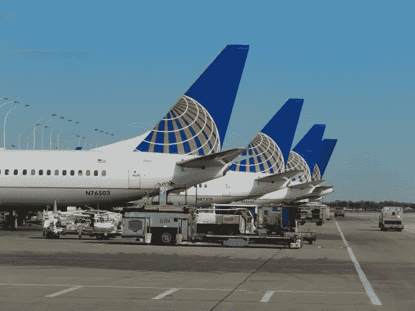

# 关于航空业的 3 个故事，将技术部门置于前沿和中心

> 原文：<https://medium.datadriveninvestor.com/3-stories-on-the-aviation-industry-that-put-the-technology-sector-front-and-center-3b89fe702685?source=collection_archive---------27----------------------->

## 我们说的是头条新闻。主要的。

当我们说话的时候，忘记无人机产业仍在蓬勃发展的事实，更不用说无数关于太空旅行和创新的故事了。但是*飞机*？谁知道呢，对吧？我们认为我们已经经历了所有这些，飞机似乎工作得很好。你上网，买票，托运行李，穿过飞机跑道，坐下来吃点花生。如果那样的话，你将在几小时内到达目的地。

# 但是没有人知道技术创新的背景，这些技术创新让航空业变得更好

老实说*有*可以变得更好。你不会经常看到可能令你不安的故事——比如最近由于计算机系统故障导致的波音飞机在印度尼西亚和埃塞俄比亚的坠毁。我们不想看到人们受到惊吓。

 [## 危机管理乘“飞机”飞行——真相数据驱动的投资者

### 当埃塞俄比亚航空公司的一架 737 Max 飞机起飞后不久坠毁，整个国家陷入危机。最好的…

www.datadriveninvestor.com](https://www.datadriveninvestor.com/2019/03/26/crisis-management-flies-on-plane-truth/) 

事实上，航空业持续创新的时机已经成熟，尤其是那些旨在使整个过程不仅更方便、更优化，而且更安全的技术。当然，你还记得 **9/11** 吧？那些是黑暗的日子。最近，我们已经不用担心那么多了，因为安全措施已经加强了很多。

但是涉及到技术，那就是完全不同的邮件了。当一台计算机出故障时，生命危在旦夕。简单明了。因此，随着机器自动化和机器学习的最新趋势，FAA(联邦航空业)确实处于尴尬的境地，试图优化一个到处都有问题的行业，但现在我们都在经历成长的痛苦和过渡，以尽可能使这一新流程简化和可靠。

# 以下是航空业的三大故事，它们会让你意识到我们的生活现在更加依赖于技术

首先，请记住就业市场:

## 信息技术和故障排除将成为现在航空业的一个重要因素

当然，飞行员可以驾驶那些飞机。但是如何排除电脑故障呢？那鸿查看这篇关于为什么下一个技术呆子可能会在联邦航空局找到一份高薪工作的文章。

## 联邦航空局也将确保负责这些系统的软件是固定的

认为一个有缺陷的程序会导致飞机失事是疯狂的。但这就是我们生活的世界。根据这篇文章，毫无疑问，当涉及到技术时，我们的员工很重要。

## 最后，你想知道联邦航空局实施这些新流程要花多少钱吗？

我们谈论的是飞机批准和认证。故障排除检查、诊断。机械师很棒，但在飞机在机场开始工作之前，有人会在驾驶舱里简单地检查仪表板上的小计算机程序。看，我们就不要叽叽喳喳了:[读读这个](https://vigyaa.com/@pierre/faa-regulation-is-proof-that-technology-can-be-costly-f62d5745/)。

# 你明白我们在说什么吗？这是一个正在发展的行业。

可以说，旅游业是 T4 最大的利用科技的行业，因此，专家们需要确保所有正确的音符都被击中。我们是认真的。你如何看待航空业的技术？这对你来说有什么大不了的吗？注册一个 VIGYAA 账号，开始写自己的社论吧！ 此外， [**查看数据驱动的投资者，了解更多关于技术的见解**](http://datadriveninvestor.com) **。**