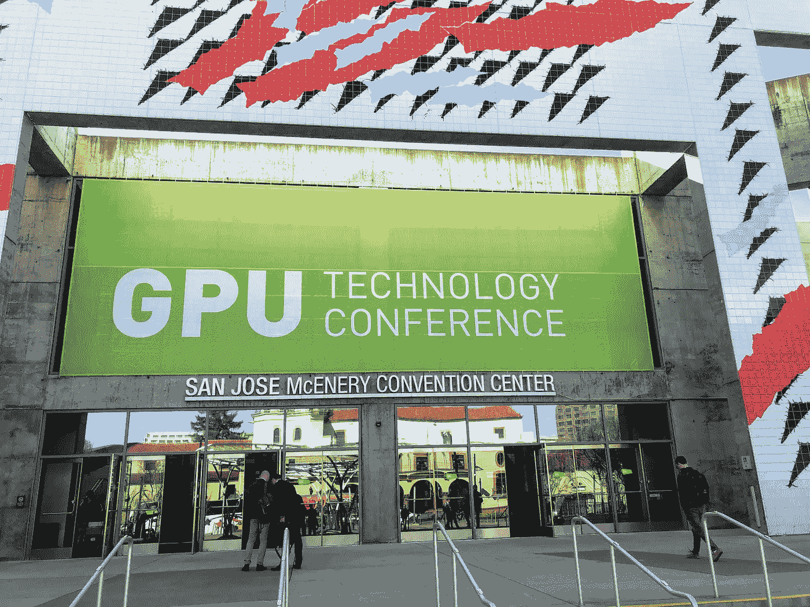

# 2019 年 GTC 的 3 个外卖

> 原文：<https://medium.datadriveninvestor.com/3-takeaways-from-gtc-2019-815d6271a1a7?source=collection_archive---------10----------------------->

从 NVIDIA GPU 技术大会(GTC)出来，很难不被这场盛会的宣传和表演所吸引。自动驾驶汽车、机器人和超现实图形的惊艳因素可能会在本周抢尽风头，所以我想采取不同的方法，强调一些有可能显著影响企业 IT 格局的创新。

# AI/ML 操作化

Photo by [Helloquence](https://unsplash.com/photos/5fNmWej4tAA?utm_source=unsplash&utm_medium=referral&utm_content=creditCopyText) on [Unsplash](https://unsplash.com/search/photos/enterprise?utm_source=unsplash&utm_medium=referral&utm_content=creditCopyText)

人工智能和机器学习(ML)已经成为 IT 专业人士的常见行业术语。人工智能解决“无法解决”的问题和预测未来的宏伟承诺最初对企业很有吸引力。然而，专业人士开始看穿炒作，并提出重要的问题，如“我们实际上可以用人工智能解决什么问题？”以及“在我们的业务中实现人工智能需要什么”。

 [## 机器学习对外汇交易的挑战——数据驱动的投资者

### 机器学习是人工智能的一个分支，之前占据了很多头条。人们是…

www.datadriveninvestor.com](https://www.datadriveninvestor.com/2019/02/18/the-challenge-of-forex-trading-for-machine-learning/) 

虽然与人工智能相关的令人惊叹的因素肯定在 GTC 展出，但展厅显示，it 专业人士也同样关注如何操作人工智能。一些供应商，如 [Skymind](https://skymind.ai/) 、 [Iguazio](https://www.iguazio.com/) 、 [Determined AI](https://determined.ai/) 和 [DotScience](https://dotscience.com/) 正在通过提供自动化的模型定义、部署和监控来简化将 AI 和 ML 投入生产的过程。这些展览挤满了与会者，他们试图了解如何将人工智能应用到他们的业务中。

# 加速人工智能工作负载

Photo by [Marc-Olivier Jodoin](https://unsplash.com/photos/NqOInJ-ttqM?utm_source=unsplash&utm_medium=referral&utm_content=creditCopyText) on [Unsplash](https://unsplash.com/search/photos/fast?utm_source=unsplash&utm_medium=referral&utm_content=creditCopyText)

正如 GTC 的名字所暗示的，GPU 是整个会议的中心展示。对于 GPU 来说，更引人注目的企业用例之一是人工智能工作负载的加速。GPU 的并行加速允许数据管道和查询以更高的速度执行。主题演讲期间的[演示](https://youtu.be/LztHuPh3GyU)展示了使用支持 GPU 的数据准备工具( [Datalogue](https://www.datalogue.io/) )和支持 GPU 的数据分析平台( [Omnisci](https://www.omnisci.com/) )在几秒钟内处理和可视化万亿字节数据的强大功能。这个演示在演示过程中引起了人群的热议，随后两家公司的展位在展厅受到了高度关注。其他使用 GPU 加速工作负载的厂商包括 [Fastdata](https://fastdata.io/) 、 [BlazingDB](https://blazingdb.com/#/) 和 [SQream](https://sqream.com/) 。

# 训练数据/合成数据

Source: [https://understand.ai/](https://understand.ai/)

开发新人工智能(机器学习、深度学习、计算机视觉等)的主要障碍之一。)models 拥有足够多的高质量数据来训练它们。这些模型对数据有着巨大的胃口，模型的准确性很大程度上取决于它的训练程度。对于具有视频和图像识别的更复杂的模型，训练数据的质量至关重要。必须准确标记视频和图像，以确保模型的准确性，这可能是一个繁琐而及时的过程。像 [Samasource](https://www.samasource.com/) 、 [Understand.ai](https://understand.ai/) 和 [Handl.ai](https://handl.ai/) 这样的供应商希望通过提供标记训练数据集的服务和平台来消除收集和整理这些数据的痛苦。其他厂商如[mosely . ai](https://mostly.ai/)采取了一种略有不同的方法，基于其他数据集生成合成训练数据。