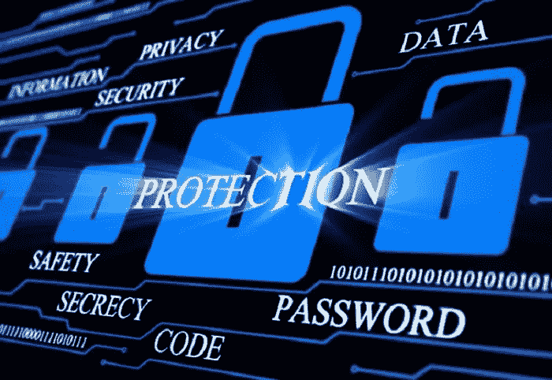
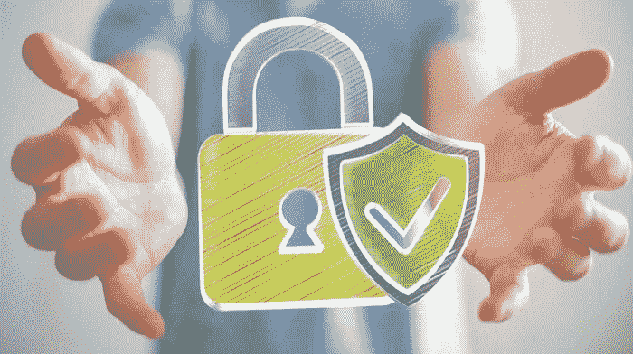

# 3 个网络恐怖主义的故事证明了技术是你的后盾

> 原文：<https://medium.datadriveninvestor.com/3-tales-of-cyber-terrorism-that-prove-technology-has-your-back-baa66e8a8912?source=collection_archive---------10----------------------->

## 因为网络安全会一直监视着…

我们相信你已经听说过像 **LifeLock、**双因素认证和验证码这样的技术巨头。他们的目的是成为互联网的网络看门狗，确保没有网络掠夺者在黑暗的网络中捕食无辜者，在不被察觉的情况下窃取从身份到银行账户的一切。网络恐怖主义可能是下一波能把世界烧成灰烬的大规模杀伤性武器，所有执法部门和军队都将努力跟上时代，用枪支换电脑，用眼睛寻找大黑客。

# 所以不用担心——网络安全在这里监视着公司和普通人

但是，当然，伴随而来的也不是没有一些恐惧:我们都不喜欢看到这种事情发生在我们身上，但是感谢这些服务，总会有补偿。正义必胜。这些故事无疑证明了这一点:

 [## 网络安全非营利组织帮助中小企业打击网络犯罪-数据驱动的投资者

### 一个名为全球网络联盟(GCA)的非营利组织发誓要改善…

www.datadriveninvestor.com](https://www.datadriveninvestor.com/2019/02/22/cybersecurity-non-profit-to-help-smes-fight-against-cybercrime/) 

## 你听说过那个讨厌的初创公司 ICO 利用数字货币来对抗法律吗？

当然，某个 ICO——除非你点击这里，否则它不会被命名[——*声称*没有任何伤害。但当你看到我们谈论的加密货币有多少时，你会发现很难相信这一点。](https://vigyaa.com/@pierre/startup-ico-gets-slapped-by-swiss-financial-watchdog-863507f4/)

## 或者针对一家挪威制造公司的令人讨厌的网络攻击又是怎么回事？

知名公司面临严重的网络问题是很常见的。很明显，这就是钱的来源。然而，谢天谢地，保险单涵盖了很多这样的问题。在这里阅读故事的其余部分。

## 最后，西班牙看到了一些涉及他们军队的重大问题！

比如，一些黑客——或者更糟——试图窃取秘密军事信息。现在*这就是*网络恐怖主义。你*让*到[查一下这个故事](https://vigyaa.com/@pierre/spain-facing-viral-internet-attack-for-high-tech-military-info-863507f4/)看看发生了什么。会让你大吃一惊的。

# 谢天谢地，事情本来可能会糟糕得多(信不信由你)

你最好相信黑客网络罪犯会一直在附近试水，并试图利用太特权或无辜的。这就是我们不介意让复仇者联盟这样的超级英雄使用闪存盘而不是锤子、盾牌或爆能枪的地方。有些事情比外星人入侵更糟糕，你知道吗？

你怎么看待现在的身份证防盗？值得得到？ [**注册一个 VIGYAA 账号，开始发布。**](https://vigyaa.com/accounts/login/) [**查看数据驱动的投资者也是如此，了解更多技术洞察**](http://datadriveninvestor.com) **。**