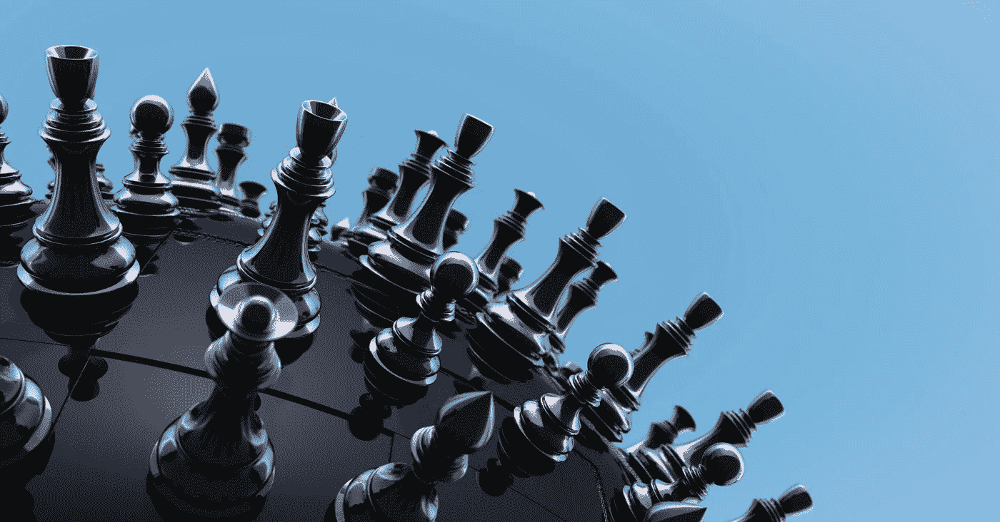

# 伟大投资者正在做而你没有做的三件事

> 原文：<https://medium.datadriveninvestor.com/3-things-great-investors-are-doing-that-youre-not-3b0d592ab35?source=collection_archive---------1----------------------->

Murat Göçmen

很有可能你已经在做下面列出的三件事，在这种情况下，恭喜你走在了潮流的前面，或者你已经在没有它们的情况下取得了巨大的投资成功。无论哪种方式，都有大量的证据支持所有这三种考虑，我鼓励你在下结论之前通读它们。还必须提一下，我不是理财顾问，下面的建议是我的，也是我一个人的。尽管这些建议得到了很好的支持。

让我们开始吧。

## 伟大的投资者相信数据胜于直觉

不要沉迷于 FOMO！(害怕错过)尽管存在客观、可知和确凿的风险或变量，但人们很容易被自己对机会的直觉所迷惑。一个有魅力的领导者或一个新颖的产品可能看起来是一生只有一次的机会。伟大的投资者会超越这些情绪，挖掘原始数据。

在[华尔街日报](https://www.wsj.com/articles/SB991681622136214659)上有一篇很棒的旧文章，引用了一项研究，一只被蒙住眼睛的猴子比专业交易者挑选出更好的股票。这项研究多年来已经重复了很多次(有和没有猴子),至今仍然有效。一次又一次，指数和被动策略甚至比最好的交易者选择的[股票还要好。是的，确实有一些交易者可以战胜困难，但是他们是例外而不是规律，这些交易者在某个时候会回归均值。](#)

在给定的交易中，有一个快速估算赔率和收益的技巧(估算赔率是可以的，你会比你想象的更接近)。假设你有一笔 1000 美元的交易。你认为这笔交易有 50%的机会支付 2000 美元，有 50%的机会支付 0 美元，这笔交易的价值是多少？如果你将 2000 美元的支付乘以 50%的赔率，你将得到 1000 美元。为价值 1000 美元的交易支付 1000 美元是浪费时间——把这些赔率玩 50 年，你会收支平衡。然而，如果同样的 2000 美元奖金以同样的 50%赔率摆在桌面上，买入费却只有 500 美元；突然间，你为一个价值 1000 美元的机会支付了 500 美元。我每天都玩这个游戏，并在随后的 50 年里变得非常富有。

这是我提供的另一个思维实验。你会用你所有的一切去赌另一个人中彩票的几率吗？简答是；你应该。然而，许多美国人一年到头都在玩相反的游戏。美国人平均每年在彩票上花费 225 美元(T2)。如果同样的钱以每年 7%的复利投资 35 年，他们将有额外的[33，505 美元](https://www.investor.gov/additional-resources/free-financial-planning-tools/compound-interest-calculator)为他们的退休储蓄。(如果对未来 35 年的彩票捐款进行通胀调整，结果会更好)这种心态适用于美国人的许多集体财务决策。

伟大的投资者会做自己的研究，或者相信别人会替他们做，他们不会屈服于自己的直觉。不要投资。相反，做好工作，播下种子，这些种子将会长成摇钱树。就像沃伦·巴菲特说的那样——“我们不必比其他人更聪明，我们必须比其他人更自律。”

## 伟大的投资者关注长期的被动收入，而不是短期收益

大多数伟大的投资者都会错过机会，就像前面的例子，花 500 美元掷硬币，可能会得到 2000 美元。如果你只有 500 美元可花，那就太冒险了。然而，高风险高回报的投资远不是唯一的选择。如果你把 500 美元投资于一个机会，你将永远得到每年 50 美元的回报，那会怎么样？

我喜欢从现金流与增长的角度来思考这个问题。如果你依靠一家公司发展新市场，或者从一家小型初创企业发展成为全球领先企业，风险就会增加。比起从无数可行的创业点子中挑出一个赢家，你更有可能失去你的钱。相反，如果你用那 500 美元在一个点对点借贷平台上购买了一只股息股票、一张债券、一张 CD 或一笔贷款，那么这笔钱现在为你工作了，而不是相反。除了别人管理你的投资，一个勤劳的投资者还可以投资拥有现金流资产的房地产。复式住宅、小型仓储设施或带有风力涡轮机或太阳能电池板的房产。

我知道 500 美元不足以购买一处房产，但它可能足以为一间备用卧室购买一些装饰品，并在 Airbnb 上出租。如果你没有[你的房子](#)，你可以用它作为一辆二手车的[首付](#)，你可以在[月](https://turo.com/)日租出去。或者把这 500 美元和几个朋友和家人一起投入到更大的项目中。

重点是，当你做其他事情的时候，专注于让你的钱来完成工作。我还必须提到，在股市过度膨胀的时期，这种策略尤其明智。现在有很多反对上述逻辑的理由，所以我建议你在逃避并完全忽略增长机会之前，先找出一些理由。

## 越来越多的优秀投资者开始考虑 ESG 因素

环境、社会和治理。这种前瞻性投资策略的关注点和力度怎么强调都不为过。当历史的作者回顾我们的时代时，传统的投资因素可能会相形见绌。

我们必须面对这样一个事实:气候变化将在未来几十年里让美国经济损失数万亿美元，让全球经济损失数十万亿美元。我们还必须接受人类活动导致了这一点。(此外，[阅读此](https://theoutline.com/post/4643/ignoring-climate-change-global-warming-cost-gdp-economy-world-trillions?zd=1&zi=bolte36k)，并记住停止 1.5%的变暖是不可能发生的)这是一个不可否认的事实，任何仍然持观望态度的人现在都可以站在理性的一边了……好了，你过来了吗？不要！…好吧——对不起，我帮不了你…啦啦啦，这里没什么好看的。

这一现实将是痛苦的，我们当中最脆弱的人将会感受到更大的痛苦。美国经济的最底层将比中产阶级遭受更多，比富人多一个数量级。现在，把美国最贫困人口的艰难程度乘以 10，再乘以 10，得出新兴经济体中挣扎的人们的艰难程度。现在这个数学是为了证明一个观点，我还没有深入研究痛苦的确切分布，但是你明白了。

那么这和投资有什么关系呢？一切。

想象一下，你正在考虑购买一只看似便宜的股票，但一位值得信赖、知识渊博的朋友提到，一项新技术刚刚进入竞争，将使你打算购买的公司完全过时。你会买那只股票吗？想象一下，你正在考虑购买一处投资性房产，而另一位值得信赖且知识渊博的朋友提到，一家保险公司很快将停止为该地区的房产提供保险，原因是火灾风险或洪水。你会买下那处房产吗？

此外，想象一下，你想[投资](#)任何可能受到影响的事物:化石燃料的能源转移、减少碳排放的技术转移、面临饥荒的农业实践、海平面上升导致的大规模人口迁移和干旱导致的不适宜居住区域扩大、全球生态系统崩溃，即海洋酸化导致的渔业、火灾和侵占导致的树木砍伐失败、中产阶级现金自由流动减少和自然环境萎缩导致的生态旅游失败、导致战争的边境经济体的社会结构和政府崩溃，等等。

现在，用一个由敬业的科学专业人士组成的完整的全球社区来取代这位“值得信赖、知识渊博的朋友”，他们几十年来一直努力为我们提供气候数据。不要相信我(也不要相信任何说“相信我”作为任何事情论据的人)相信这个全球社区对客观现实的最接近的总结。

尽管这一切听起来很可怕，但上面列出的气候风险甚至还没有触及表面。我承认这将是一个缓慢的过程，而且今天天不会塌下来。但是，任何不考虑这一轨迹的投资者都错过了 21 世纪最大的风险。

**S 和 G**环境风险显然是最引人注目的，但这并不能低估 S 和 G 的重要性。Magni Global 的[研究](https://www.magniglobal.com/wp-content/uploads/2015/11/The-G-in-ESG.pdf)表明,“G”是在“E”和“S”类别中创造变革的唯一最有效的工具。如果利益相关者和股东让企业领导人承担责任，那么局面就会朝着正确的方向发展。

S 因素最直接地影响着人们，能被纳入战略中感觉很好，更不用说真正改变生活了。我不会对这两个问题说太多，因为这不是一个非常专业的领域。也就是说，对于任何比最新社交媒体更新看得更远的人来说，S 和 G 是必须计入投资组合的风险。(哇，听起来我 33 岁了)

听着，让我们关注积极的一面。你可以在为未来挣钱的同时有所作为。不幸的是，这种悲观情绪是真实的，但并非完全没有希望。投资者必须竭尽全力保持全球经济引擎运转，同时调整策略和预期以适应现实。如果发动机停止运转，这几万亿都没办法支付。我已经准备好尽我的一份力量了，你也应该如此。用你的美元投票，用你的行动投票，用选票投票。

祝你好运。

*我最初在 CleanUSAPower.com 为博客撰写了这篇文章*