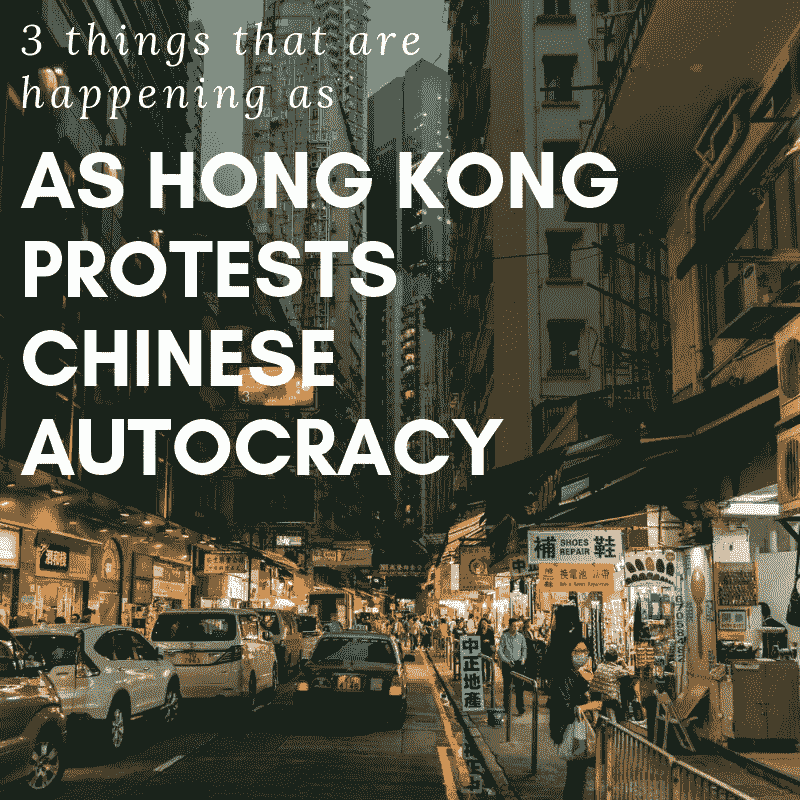
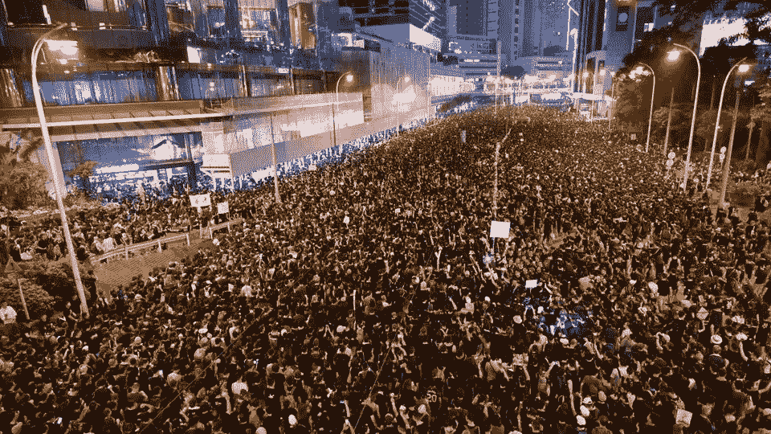

# 香港抗议中国独裁时发生的 3 件事

> 原文：<https://medium.datadriveninvestor.com/3-things-that-are-happening-as-hong-kong-protests-chinese-autocracy-d667d6d199b2?source=collection_archive---------9----------------------->

# 香港抗议的是什么？

过去几个月，香港经历了混乱。数百万香港市民走上街头抗议北京政府。随着警察对示威者使用武力，一些抗议演变成暴力。为了更好地理解香港抗议的潜在后果，我们需要首先了解原因。香港行政长官林郑月娥建议修改香港的引渡法案。拟议中的修改将允许香港公民被引渡到 mainland China。这将有效地使中国的独裁政府能够瞄准并起诉任何以香港为基地的对其政府的威胁。香港市民将引渡法案的拟议修改视为中国政府越权的又一例证。抗议似乎不会很快消失。那么，当香港抗议中国的独裁时会发生什么？

# 1.美国政府正在利用抗议活动作为贸易战谈判的杠杆

美国和中国政府正在进行一场旷日持久的 T2 贸易战。针锋相对的关税伤害了两个超级大国的经济。随着两国政府寻求在贸易谈判中占据上风，美国正在利用香港抗议活动作为对抗中国的杠杆。美国副总统迈克·彭斯最近谴责中国对待香港抗议者的方式。通过继续向中国施压，美国希望中国更愿意做出让步。我们可能会看到美国妖魔化中国，以争取对其在贸易战中的立场的支持。也就是说，美国对中国针对香港的行动的谴责没有产生任何影响。

 [## 在中国做生意:如何优化您的运营|数据驱动的投资者

### 中国是一个受本地和外国公司欢迎的商业中心。在一个国家设立实体存在…

www.datadriveninvestor.com](https://www.datadriveninvestor.com/2019/03/17/doing-business-in-china-how-to-optimize-your-operations/) 

# 2.香港旅游业正在衰退

由于香港国际机场的抗议活动，进出香港的航班暂时停飞。旅游业受到了严重影响。抗议视频已经在全球媒体上传播，向潜在游客展示了香港目前的形势有多危险。

香港最大的航空公司国泰航空(Cathay Pacific)的代表建议不要进行非必要的出港旅行。旅游业的下滑将拖累该地区的经济。旅游减少导致消费减少。香港可能需要应对数千万美元的收入损失。

# 3.地区性和香港的银行正敦促迅速解决问题

HSBC, Hong Kong’s largest bank, recently published advertisements in five newspapers calling for a peaceful end to the protests. Citing that social stability and calm as cornerstones of Hong Kong’s success, HSBC’s business prospects depend on a swift end to the protests. The protests have provoked uncertainty in the financial markets, causing increased volatility amid an already volatile market backdrop. While slowing growth in the mainland is already hurting Hong Kong businesses, the protests are exacerbating the pain. Hong Kong pumped $2.4 billion into its economy in an effort to stave off a recession. Standard Charter and Bank of East Asia, two other large, regional banks, have also voiced their concerns about the protests. With the business community growing increasingly alarmed, Beijing is feeling the pressure from multiple angles.

# How to Stop the Chinese Autocracy

Xi Jinping, China’s president, is now able to serve a lifetime tenure. Without term limits, he intends to carry out his vision of centralizing authority over China and its territories. Surveilling, censoring, and imprisoning government opposition is the norm under Xi’s regime. The only way to stop the Chinese autocracy is through collective action, just as that which we’re witnessing in Hong Kong. Ensuring that Xi does not maintain his tight grip over China for the foreseeable future is the best path forward for both the country and the world. The Hong Kong protests, one could only hope, are just the beginning of the revolution.

Originally posted at [https://bunkerbasics.com/hong-kong-protests-chinese-autocracy/](https://bunkerbasics.com/hong-kong-protests-chinese-autocracy/)