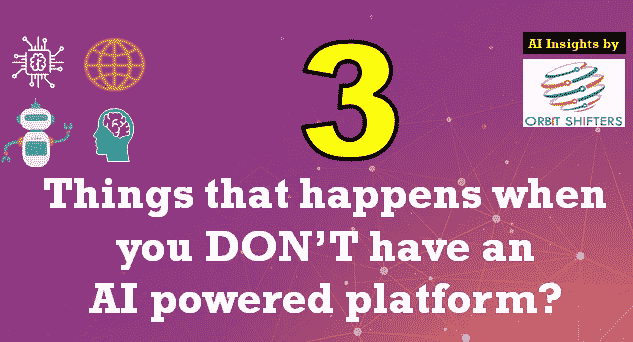
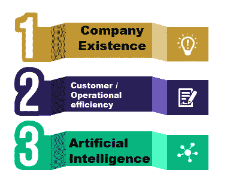
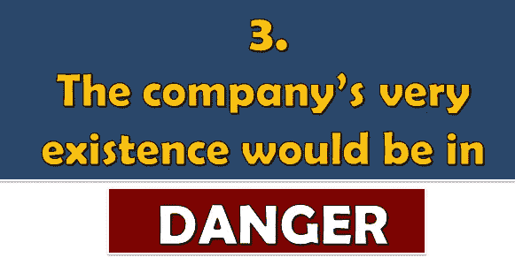
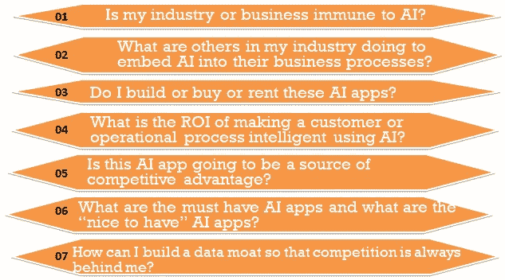
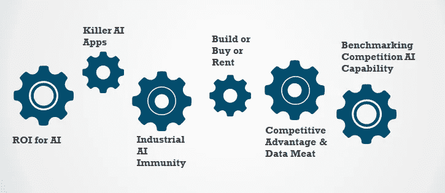
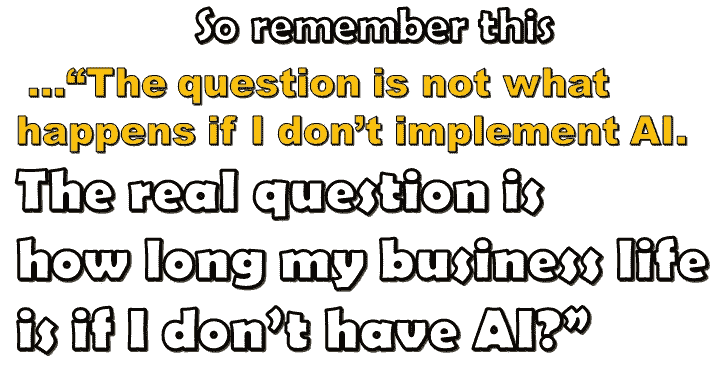

# 没有人工智能平台时会发生的 3 件事？

> 原文：<https://medium.datadriveninvestor.com/3-things-that-happens-when-you-dont-have-an-ai-powered-platform-1b540eb9e46c?source=collection_archive---------14----------------------->

俗话说“软件正在吞噬世界，人工智能正在吞噬软件”。人工智能正在通过为无人驾驶自动驾驶汽车提供动力来扰乱汽车市场。人工智能正在扰乱医疗保健市场，软件可以比放射科医生更好地检测癌症异常。人工智能正在扰乱教育市场，它可以根据学生的行为预测下一个最佳个性化课程。3 个不同的行业，触及每个人的日常生活，完全被人工智能所改变。

所以让我们问一个问题“那又怎样？如果我决定不为人工智能的未来做好准备，而照常经营一家企业，会发生什么？”。根据我们丰富的经验，三件事开始发生。

一家全球领先的银行创建了大约 26 个平台。其中一个核心平台是支付和关系管理。在寻求增加企业信用卡的客户基础时，他们做了一个“喷雾祈祷”活动，导致企业客户的客户体验很差。如果他们使用人工智能，他们可以做更多的外科手术。

一家领先的制造公司有一个瓶颈流程，导致价值 2 . 2 亿美元的废品。如果他们使用人工智能，他们可以预测即将到来的产品质量，从而防止不合格品。

在线流媒体公司的存在取决于其产品推荐引擎的有效性，它会推荐下一部最佳电影。其有效性的微小提高可能意味着企业的生死存亡

 [## 人工智能预测能力的神话——数据驱动的投资者

### AI(人工智能)最有前途的优势之一似乎是它预测未来的能力…

www.datadriveninvestor.com](https://www.datadriveninvestor.com/2019/03/01/the-myth-of-ais-predictive-power/) 

成为一家基于人工智能、基于平台的公司比大多数人认为的传统 IT 转型更进了一步。创建作为一组平台运行的 It 环境是一项根本性的组织和运营变革。与任何重大转型一样，它需要强有力的 CEO 领导、质量团队、强大的项目管理、沟通以及价值保证。

因此，如果你想防止组织死亡，因为你没有实施人工智能，这里有 7 个问题要问，

成为一家人工智能驱动的公司最终是一个心态问题。它既需要坚持到底的决心，也需要根据平台团队所学的知识进行改变和调整的灵活性。通过采用这种方法，IT 可以停止减缓变化，并开始加速变化。

