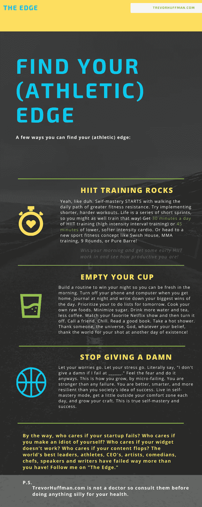

# 2020 年，你需要每天做 3 件事来改变生活、运动和商业

> 原文：<https://medium.datadriveninvestor.com/3-things-you-need-to-do-every-day-to-rock-in-life-sports-writing-and-startups-in-2020-51022b74e894?source=collection_archive---------4----------------------->

Photo by [Chase Clark](https://unsplash.com/@chaseelliottclark?utm_source=medium&utm_medium=referral) on [Unsplash](https://unsplash.com?utm_source=medium&utm_medium=referral)

我叫特雷弗，是一名世界级的体育和激励作家(好吧，还不是真正的世界级作家，但我相信世界级的人会用这个过程来提高自己)，前职业篮球运动员、企业家、狗爸爸、萨尔萨舞者、创业新手，现任 Okapi Aalstars 的主教练，Okapi AAL stars 是世界十大联盟之一的职业篮球队。

> 这是我第一年担任职业主教练和神圣的*什叶派教徒，我学到了很多！*

但是，我最近决定，体育只不过是生活的缩影，或者商业，或者创业，或者金融，或者银行，或者为人父母，或者开始上大学，想知道你到底在做什么。所有的起起落落。压力。这种担心。恐惧。无形的增长。腐烂的缓慢燃烧。

运动给我的大脑带来的痛苦和焦虑就像一百个点燃的鞭炮放在有盖子的垃圾桶里。

 [## 成功人生的 25 种自我提升方式|数据驱动的投资者

### “我活得越久，学到的就越多。学的越多，体会的越多，知道的越少。”―米切尔·莱格兰德时间到…

www.datadriveninvestor.com](https://www.datadriveninvestor.com/2019/03/12/25-self-improvement-ways-for-a-successful-life/) 

然而，通过这一切，我明白了 2019 是一个祝福。我觉得活着很荣幸。我很感激。最重要的是，我相信对自我、技能、职业、一切的掌握，就像在运动中一样，可以与掌握我们生活中想做的任何事情联系起来。

## 如果我们采取这种心态，就没有什么好害怕的。

你想成为更好的 CEO 吗？

那么，学习如何更好地照顾你的团队。上一堂情商课。做一些让你真正快乐的事情。

你想成为一个更好的父母吗？

好吧，开始你一天两次的教育吧。观看 YouTube 上关于伟大父母的频道。看书。记日记。

# 以下是我关于如何在 2020 年改变生活、找到/保持优势的三个自我提升建议:

