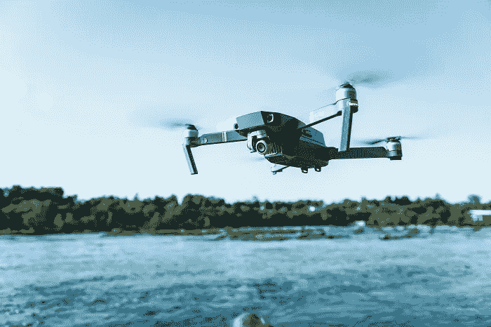
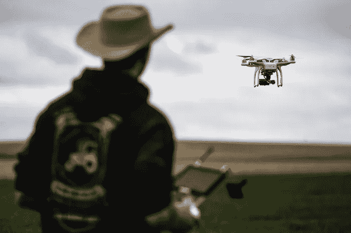
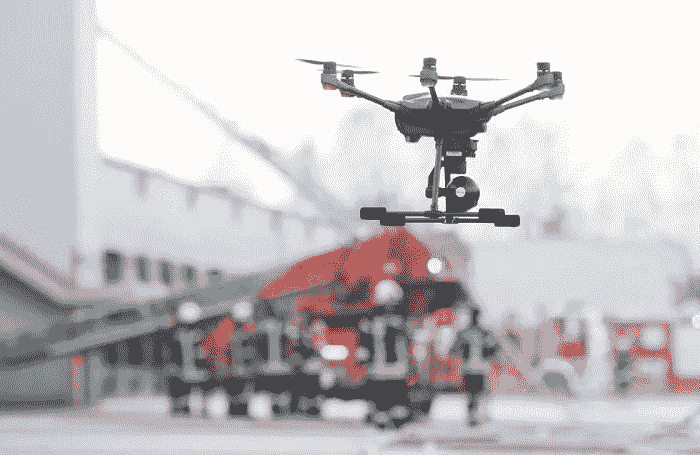

# 受益于无人机技术的 3 个顶级职业(你可以打赌很快会有更多！)

> 原文：<https://medium.datadriveninvestor.com/3-top-professions-benefiting-from-drone-technology-and-you-can-bet-more-will-soon-4ff9f4ec1b2d?source=collection_archive---------21----------------------->

你根本不可能猜到是哪些职业。

说真的，我们已经从作为娱乐的无人机飞行变成了作为有偿职业的无人机飞行了？绝对的。这就是科技的进步，简单地让钢铁巨兽在空中飞行实际上可以让你赚到一些钱——或者更好的是，让你当场被雇用。原因如下:

# 对无人机技术的经验让你具备了“一套特殊的技术技能”

此外，你通常在沟通、手眼协调和运动技能方面都很熟练。正如制造无人机需要很多技巧一样，驾驶无人机需要更多技巧。毕竟，你可能不得不经历大量的坠机事件来学习驾驶无人机的细节，更不用说编程让一架无人机以近乎自动化的方式做你想做的事情了。

说到自动化，我们已经来到了一个传感器、摄像头等像手套一样适合无人机的时代，这就是为什么这三种职业在创新的热门商品方面排名靠前，从而改善了整个行业:

## 首先从海洋生物学开始

你没听错。没错:海洋生物学家似乎看到了无人机技术的好处，[以下是原因](https://vigyaa.com/@pierre/how-drone-technology-can-drive-success-for-marine-biology-and-mor-74b93f76/)。

## 或者牛仔怎么样？

等等，什么？没错:*牛仔*。更具体地说，养牛人和牧场主肯定有充分的理由喜欢无人机。[点击这里查看文章，了解更多信息。](https://vigyaa.com/@pierre/what-do-drones-and-cowboys-have-in-common-002bcf3c/)

## 更重要的是，消防和救援

对于消防员来说，甚至对于救援队中的任何人来说，无人机的重要性应该是显而易见的，无论是在空中还是水中。老实说，你甚至不需要离开大学就能在消防站工作！点击此处了解这个故事。

# 说真的，你甚至可以了解更多关于无人机技术的知识…

事实上，就在这里。令人咋舌。这种技术创新的前景非常有希望，所以下次你上大学的时候，看看机器学习、自动化的前景，嗯，只是为了好玩而驾驶你的无人驾驶直升机。事实上，你从来没有诚实地坠机和烧伤可能是任何国家，州或市政府可能雇用你进行研究和开发的最大原因。

你怎么看待技术创新？注册一个免费的 VIGYAA 账户，开始写你所知道的！

【vigyaa.com】最初发表于**。**