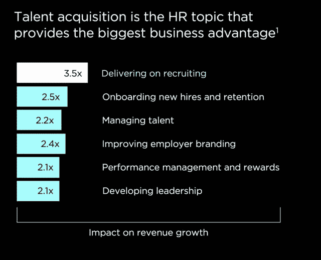

# 依赖申请人跟踪系统来制定招聘计划是一个错误的三大原因

> 原文：<https://medium.datadriveninvestor.com/3-top-reasons-why-relying-on-your-applicant-tracking-system-to-develop-a-hiring-plan-is-a-mistake-18d160ea5c4f?source=collection_archive---------15----------------------->

在利用数据分析做出更好的决策方面，人才收购仍在努力赶上世界其他地区。不幸的是，大多数申请人跟踪系统(ATS)平台缺乏分析功能，无法帮助招聘人员更快、更有效地做出更明智的决定。以下是为什么依靠你的求职者跟踪系统来制定长期招聘计划是一个错误的原因。

# 正确招聘的重要性

根据人力资源数据分析平台 [Visier](http://www.visier.com) 最近进行的一项研究，对人力资源收入增长影响最大的是招聘。最优秀的招聘人员知道这一点，并痴迷于数据分析，以帮助分析他们的努力，以扩大最大的结果。承认人才是底线收入的关键驱动力的公司不仅继续投资于内部人才获取团队，还投资于分析如何侵入或最大化招聘结果的工具。

 [## 如果你想惩罚一名员工，私下进行。数据驱动的投资者

### 我经常看到伟大的商人作为伟大的领导者失败了，问题是他们的自我变得太膨胀了…

www.datadriveninvestor.com](https://www.datadriveninvestor.com/2018/11/20/if-you-wish-to-discipline-an-employee-do-it-in-private/) 

不幸的是，大多数 ATS 公司没有跟上这一趋势。他们倾向于关注候选人的体验和易用性，而不是候选人漏斗和招聘工作的分析。我为我们团队做的大部分分析都是将信息从 ATS 导出到 excel 工作表或 Google Data Studio 仪表板中的结果。即便如此，我也质疑来自 ATS 的信息的数据完整性。我发现这些信息更多的是二进制的，而不是直观的。

# 申请人跟踪系统不能告诉你你最好的雇员来自哪里

这也许是我作为招聘经理存在的祸根。为什么我用来处理候选人的中央系统不能为我提供[分析来帮助我了解我的招聘来源](https://sprintrecruiting.com/2019/08/08/3-top-reasons-why-relying-on-your-applicant-tracking-system-to-develop-a-hiring-plan-is-a-mistake)？

在过去十年中，我使用的三个主要 ATS 平台中没有一个包含允许我分析候选源的功能。如果我不知道我的员工在哪里找到我的职位，我如何最大限度地利用这一渠道找到更多优秀的候选人？领导者应该能够利用他们的 ATS 来了解他们每年的预算支出。

许多人力资源分析公司，如 [Visier](http://www.visier.com) 已经认识到了这一差距，并建立了人才获取平台来插入你的 ATS，以帮助分析你的招聘来源。[访问者](http://www.visier.com)人才获取模型帮助我了解我们的人才获取团队在哪里找到最好的人才，以便我们能够在该渠道上扩大努力，并停止在其他几乎没有价值的渠道上浪费时间。

[招聘经理想要了解他们最好的雇员是从哪里来的](https://sprintrecruiting.com/2019/08/08/3-top-reasons-why-relying-on-your-applicant-tracking-system-to-develop-a-hiring-plan-is-a-mistake)如果他们仅仅依赖 ATS 平台所能提供的，他们将会失败。

# 您的 ATS 无法跟踪员工的生活

大多数 ATS 平台会跟踪员工的生命周期，直到他们说“我愿意”。当然，ATS 最有可能插入您的 HRIS 和工资系统，但我们应该看到更多。

仅跟踪候选人的生命周期是许多人才获取策略的一个缺陷。如果不跟踪重要信息，跟随“我愿意”会造成一年多次为同一个职位招聘的无尽循环。这不仅是招聘资源的浪费，也是公司投资的浪费。

如果 ATS 平台跟踪整个员工生命周期，招聘人员可以了解哪些员工留下来并取得成功，这样他们就可以复制这种成功。

# ATS 平台无法告诉您瓶颈在哪里

招聘流程就像任何正常的业务流程一样存在瓶颈。运行一个精简高效的人才获取策略的关键是知道那些瓶颈在哪里，并消除它们。

去年，我花了一个周末的时间从我们的 ATS 下载原始数据来绘制候选人的旅程。我们从经理那里收到反馈，说这个过程花费的时间太长，也有候选人抱怨这个过程的滞后。我不能进入我的 ATS，点击菜单来查找候选人在旅程的每一部分花费的天数，我必须下载 excel 中的原始数据，并编写复杂的公式来提供我需要的答案。

我痴迷于我们的招聘经理和候选人的经历，但不幸的是，我不知道 ATS 有这种痴迷。在花了几个小时以我可以使用的格式获取数据并创建了一个仪表板后，瓶颈就从仪表板上跳了下来。我了解到，来自经理的反馈循环是一个巨大的瓶颈(反馈的平均时间大约为 20 天)，从候选人与招聘团队面谈到收到聘用通知的时间(另外 20 天)。

这些信息帮助激发了 Sprint 招聘的一些基本原则。当我们实施这种方法的测试版时，我不得不不断地进去，下载原始数据，并对其进行分析，以查看 [Sprint Recruiting](https://sprintrecruiting.com/sprint-recruiting-the-book/) 流程是否有助于或有损于我们增强经理和候选人体验的努力。

如果有一个 ATS 为我做这件事，那就太棒了。

如果我们把招聘比作驾驶飞机，我们的 ATS 就是我们的导航面板。你能想象在只有 ATS 提供的有限信息的情况下飞行吗？或者更好的是，你能想象从你的导航系统下载原始数据并手动创建一个仪表板来确保你走在正确的路上吗？

创建 ATS 来提供对招聘流程和员工生命周期的每个主要方面的简单分析的 ATS 平台公司将在市场上占据主导地位。人才获取功能加载了数据，招聘人员应该可以随时获得这些数据，以帮助最大化招聘工作和股东价值。

不幸的是，ATS 行业可能还需要一段时间才能赶上！如果你发现自己需要一个伟大的分析平台，你一定要看看像 Visier 这样的公司，他们专门使人力资源数据变得容易。

*原载于 2019 年 8 月 8 日*[*http://sprintrecruiting.com*](https://sprintrecruiting.com/2019/08/08/3-top-reasons-why-relying-on-your-applicant-tracking-system-to-develop-a-hiring-plan-is-a-mistake/)*。*