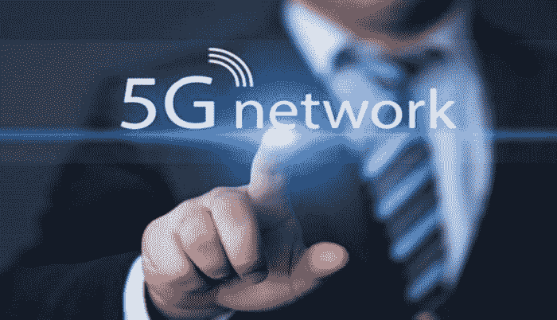

# 5G 移动技术的 3 个更新你必须在为时已晚之前了解一下

> 原文：<https://medium.datadriveninvestor.com/3-updates-on-5g-mobile-technology-you-have-to-check-out-before-its-too-late-d5c43d48280d?source=collection_archive---------16----------------------->

## 下一波移动网络正在向我们袭来！

令人震惊的是，我们已经*接近体验一切，从在火车上快速播放的手机，到笔记本电脑和平板电脑进行视频通话而不打嗝或冻结。5G 就是它所在的地方。想想看，我们对 4G 很在行，而当前的技术正好满足我们的目的，让 3G 和拨号上网看起来像美国在线一样古老。然而，你确实需要了解[移动技术](https://vigyaa.com/@pierre/5-reasons-why-mobile-technology-benefits-the-money-minded-00331c57/)的最新创新的时代和趋势，毫无疑问——因为尽管你知道它即将到来，你*也不知道它有多快，以及*在哪里*。**

# *在这里，您可以获得关于 5G 移动技术的有用信息，请做些笔记*

**

*要了解世界是如何转变的，现在就来看看所有这些。会让你大吃一惊的。从…开始。*

## *意大利在 5G 移动技术上的进展*

*当你想到这一点，这是完全令人兴奋的。过去，移动技术或多或少集中在技术进步中心，主要是在美国和中国。不再是了。整个世界都卷入其中，意大利是最大的玩家之一。[看这个。](https://vigyaa.com/@pierre/italy-helps-out-the-united-states-with-5g-technology-given-shaky-f9c30e1c/)*

## *然而，德国呢？*

*很高兴你问了。德国也不算太寒酸。最近，在初创企业、技术进步等方面，这个国家已经完全成为了自己的中心。那里发生的很多事情可能会让你大吃一惊，但你不会知道，除非你现在就去看看这篇文章。*

* [## 2019 年移动应用开发之路——数据驱动投资者

### 任何在移动应用程序开发行业工作的人，无论他们是专注于在伦敦开发 iOS 应用程序还是…

www.datadriveninvestor.com](https://www.datadriveninvestor.com/2019/01/15/the-path-of-mobile-app-development-in-2019/) 

## 最后，一个鲜为人知的公司叫做…威瑞森无线

是的，移动技术(以及更多)的领先提供商之一。不应该感到惊讶，但威瑞森计划在 5G 方面采取什么行动(和在哪里采取行动)(如果他们还没有这样做的话)?你现在只需点击这里，自己寻找答案，好吗？

# 这仅仅是 5G 移动技术的开始

毕竟，每个人都在说，这种更新的移动技术将比 4G 和 4G LTE 快 20 到 100 倍。对于我们中那些认为 4G 可以满足我们需求的人来说，这让一切都变得不可思议，当你全面审视这一点时，你会说在通常不会如此有效的区域进行流媒体传输的能力，或者在无线网络中进行流媒体和视频通话，而你的兄弟、姐妹、叔叔、阿姨、堂兄弟和父母已经在你的豪宅中做着完全相同的事情。我们可以和其他人在他们自己的房间、浴室、客厅和厨房里同时做我们想做的任何事情，有了卓越的互联网连接，并且根本不会经历延迟、减速或缓冲。

….那很重。

你如何看待 5G 移动技术？你兴奋吗？ [**在数据驱动投资者**](http://datadriveninvestor.com) 查看更多信息，同时 [**注册一个免费的 VIGYAA 账户，立即成为有价值的技术影响者！**](https://vigyaa.com/accounts/login/)*