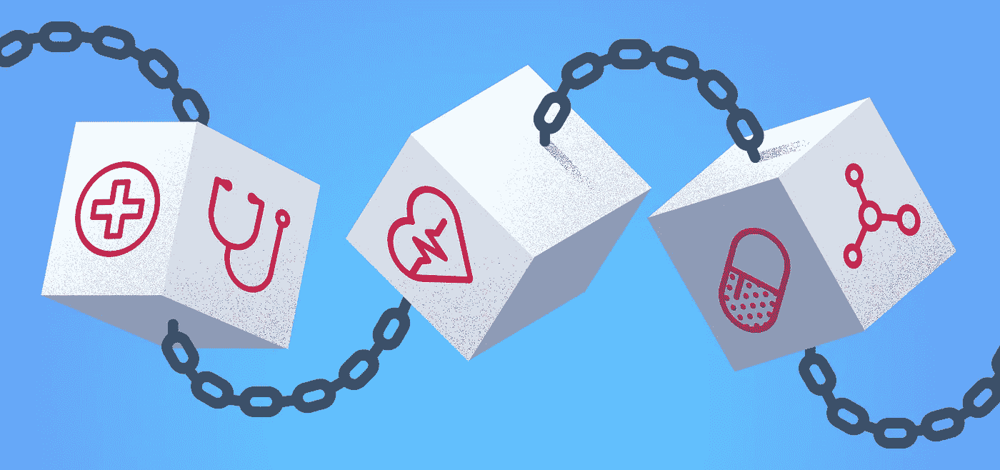

# 区块链变革医疗保健的 3 种方式

> 原文：<https://medium.datadriveninvestor.com/3-ways-blockchain-can-revolutionize-healthcare-4886be4bb722?source=collection_archive---------2----------------------->

几周前，我的一个好朋友 Ilia 问我区块链在医疗保健行业的潜在应用。伊利亚正在学习成为一名医生，我知道她有多努力，我相信她会在努力中取得成功。我认为像她这样的医疗保健个人意识到区块链在革新现代医学和制药实践中的潜力是很重要的，因为这项技术能够提供显著的优势，可以大大提高患者服务和医疗保健系统的整体生产力。事实上，在 2018 年初，美国有 200 名医疗保健高管接受了采访，其中 16%的人预计将在今年的某个时候大规模部署至少一个商业区块链解决方案。因此，我决定写这篇文章，我将提供区块链如何变革医疗保健行业的 3 种方式。

Blockchain in the Healthcare Industry

## 1.患者健康数据交换

患者经常面临的一个问题是，为了获得医疗建议和接受有效的治疗，需要靠近医院/医生，例如，患者通常需要访问特定的医院，以便接受该医院医生的检查和指导，即使患者有其他医院的病史，也很难访问他的数据。在大城市，有许多医院和诊所，彼此之间距离很近，这不是一个大问题，但是，对于住在远离大型综合医院的农村地区的病人来说，这就成问题了。

尽管已经尝试了解决这个问题的方法(例如，电子医疗解决方案，其中医生可以通过共享他们的数据与患者进行远程通信，或者医院与其他医疗中心共享数据，以共同决定对患者治疗的最佳行动方案)，但是与数据安全和患者匿名相关的问题仍然存在。鉴于区块链增强了与数据安全和匿名相关的功能，它有可能实现这种解决方案的开发并增强其可扩展性。

## 2.药品供应链增强

卫生保健行业面临的另一个问题是，在足够近的距离内保持足够大的药品和药物库存以根据要求在任何给定的医院/中心交付通常是困难和昂贵的。尤其是在罕见疾病事件中，很少(如果有的话)需要药物。此外，现有的供应链基础设施不能提供足够的准确度和精确度来提供关于被要求递送的药品和药物的跟踪和准确到达时间的信息。

正如我们在我之前的一些文章中所述，区块链技术有可能为供应链管理和库存跟踪相关的应用提供主要的竞争优势。因此，如果医疗保健组织能够受益于区块链的优势，更好地跟踪和测量要求为患者治疗提供的药物和药物的储存、库存和到达时间，这将是有益的。此外，区块链技术允许收集、保存和利用数据，如采购需求、供应链管道中不同阶段的存储时间、药物分布图等。医疗保健高管应该认真考虑实施区块链解决方案来增强药品供应链，因为它有可能提供可观的成本、时间和效率改进。

## 3.欺诈防范和计费管理

到医生办公室就诊的患者经常抱怨得到了不道德的医疗处方建议(例如，医生可能会开出一种特定类型的药物，即使实际上并不需要，因为他从制药公司赚取佣金)，或者他们被鼓励重复不必要的到医生办公室就诊(例如，医生可能会鼓励患者每两周去一次，因为他每次就诊都会得到补偿，尽管患者可能不需要这样密切/经常的监督)。特别是在私人诊所的情况下，往往可以发现金钱奖励强化的欺诈行为。

减少上述欺诈案件的一种可能方式是采用利用区块链技术构建的技术基础设施，这将迫使医生记录患者的病史和建议的药物处方清单。此外，医生应该记录病人就诊的清单和就诊的原因。区块链技术的性质将确保系统中记录的交易不可更改且完全可审计，从而允许国家审查并极大地减少上述欺诈案件的发生。

区块链技术有可能彻底改变许多行业，并极大地改变我们的日常生活，医疗保健只是其中之一。有许多方法可以用来提高区块链的效率，减少时间，成本和增加患者服务，上面提到的只是一小部分潜在的应用。你对以上有什么想法？请在评论区告诉我，别忘了把这篇文章分享给你的朋友和家人。

彼得罗斯利安德鲁斯，理学硕士。