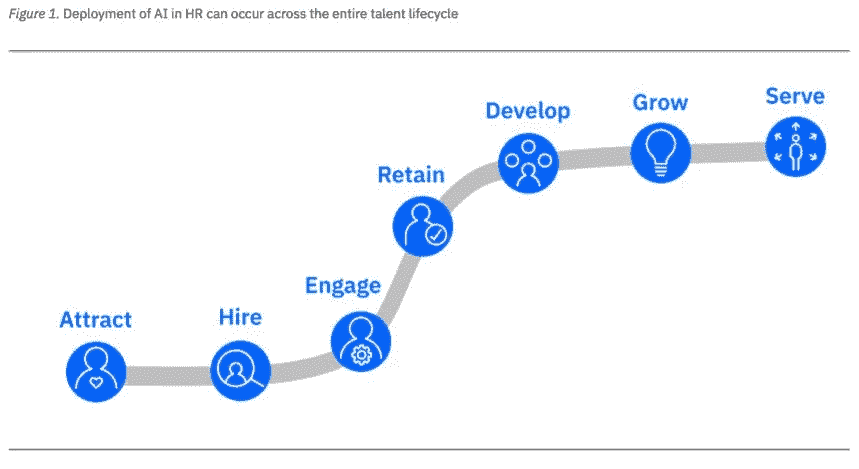

# IBM 在 HR 中使用 AI 的 3 种方式，2017 年节省 1.08 亿美元！

> 原文：<https://medium.datadriveninvestor.com/3-ways-ibm-is-used-ai-in-hr-and-saved-108-million-in-2017-d89309fb4d02?source=collection_archive---------11----------------------->

IBM 通过将该技术应用到他们的人力资源部门开始了他们的人工智能之旅。最近，Nigel Guenole 博士和 Sheri Feinzig 博士发表了一份关于 IBM 如何在他们的人力资源部门使用 AI 以及这些项目的影响的报告；[人工智能在人力资源领域的商业案例](https://public.dhe.ibm.com/common/ssi/ecm/81/en/81019981usen/81019981-usen-00_81019981USEN.pdf)。

通过使用内部案例研究，该报告研究了人工智能如何在员工生命周期中实施以及这些项目的结果。报告中一个有趣的方面是人工智能如何改变传统的人力资源流程，包括一些意想不到的好处。

**报告中 3 个案例研究的重点:**

**吸引:**在找工作时，大部分(如果不是全部的话)求职者会在谷歌、求职板和雇主网站上使用关键词搜索。在 IBM，他们的招聘聊天机器人通过寻找与他们的技能相匹配的角色来帮助候选人，而不是传统的关键匹配搜索。候选人上传他们的简历或与聊天机器人进行简短的聊天，聊天机器人会开发他们的技能档案并建议合适的角色。这提高了工作申请的质量和资格。

开发:人工智能也在帮助 IBM 开发所需的技能。IBM 的学习市场 Your Learning 通过个性化的点播内容帮助员工找到适合他们的培训材料。学习结果被汇总以确定整个组织的技能。使用仪表板，人力资源可以识别技能差距，并提高学习成果，以实时填补这些差距。

没有使用沃森聊天机器人，任何 IBM 人工智能战略都是不完整的。IBM 的聊天机器人通过回答问题提供 24/7 的支持。他们的候选人聊天机器人是最忙的，每天回答 700 个问题。他们的下一个最受欢迎的聊天机器人帮助新雇员在大型组织中导航新员工的生活。聊天机器人的目标是快速提供高质量的回复，减轻人力资源部门的负担。这使得人力资源部门可以将时间集中在提供更高价值的工作上，例如回答复杂的问题和提供必要的人文交流。

“总体而言，仅在 2017 年的人力资源方面，IBM 就因人工智能实现了 1.07 亿美元的节约。”此外，该报告强调了使用人工智能的意想不到的好处，例如，虽然缩短了雇佣时间，但也提高了整体绩效。

我们在 CognitionX 的研究两年多来一直在监测人工智能在人力资源领域的发展。我们的系列报道考察了人工智能正在产生的影响，新兴技术是如何使用的，并描绘了市场。要了解我们报告的更多信息，[点击此处](https://info.cognitionx.com/impact-of-ai-in-hr)。

关于在您的组织中使用人工智能，您有什么具体的问题吗？在我们的专家网络上咨询专家——这是免费的！[点击这里提出你的问题！](https://cognitionx.com/expert-network)