# 在 macOS 终端、JupyterLab 和 Colab 上对大语料库文本应用潜在语义分析的 3 种方法

> 原文：<https://medium.datadriveninvestor.com/3-ways-to-apply-latent-semantic-analysis-on-large-corpus-text-on-macos-terminal-jupyterlab-colab-7b4dc3e1622?source=collection_archive---------1----------------------->

潜在语义分析在大规模数据集上工作以生成表示，从而通过自然语言处理来发现洞察力。有不同的方法在多个层次上执行潜在语义分析，例如文档层次、短语层次和句子层次。语义分析主要可以归纳为词汇语义和将单个单词组合成段落或句子的研究。词汇语义学对词汇进行分类和分解。运用词汇语义结构有不同的语境来识别词语之间的异同。段落或句子中的通用术语是上下位关系，上下位关系提供了上下位关系实例之间的意义。同音异义词包含相似的语法或相似的拼写，具有相似的结构，但意义不同。同音异义词互不相关。书是同音异义词的一个例子。它可以表示某人阅读某物或以相似的拼写、形式和句法进行预订的行为。但是，定义不同。一词多义是单词的另一种现象，其中一个单词可能与多个相关的意义和不同的含义相关联。一词多义是一个希腊词，意思是许多迹象。Python 提供了 NLTK 库，通过将较大块中的单词分割成短语或有意义的字符串来执行单词的标记化。通过标记化处理单词产生标记。单词词汇化将单词从当前的屈折形式转换成基本形式。

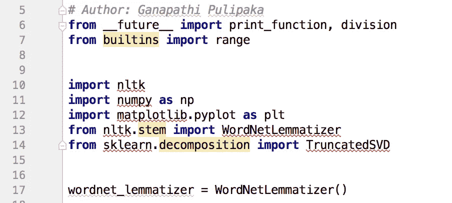

Figure 1\. Code snippet for word lemmatization.

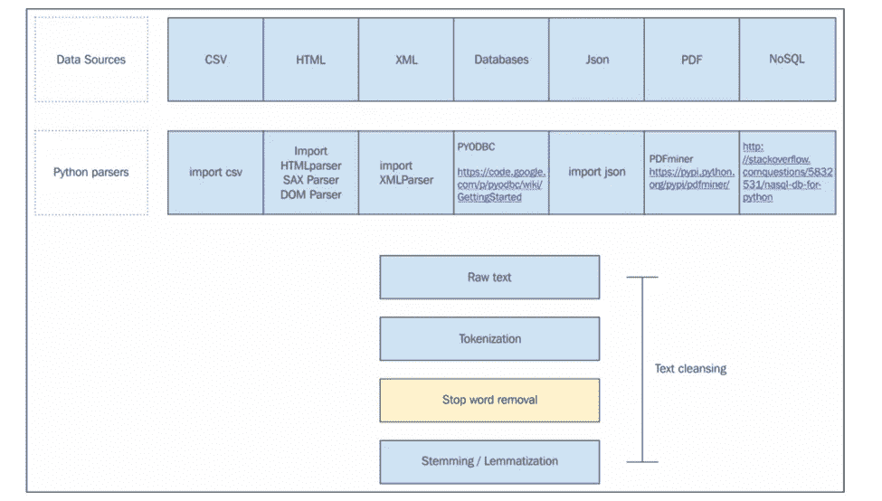

Figure 2\. Different data sources for natural language processing with Python.

**潜在语义分析**

对文本和文档的大型数据集应用潜在语义分析通过大型文本语料库上的数学和统计计算方法来表示上下文含义。很多时候，潜在语义分析超越了人类的分数和人类进行的主题测试。潜在语义分析的准确性很高，因为它在网络范围内阅读机器可读的文档和文本。潜在语义分析是一种应用奇异值分解和主成分分析(PCA)的技术。文档可以用 Z x Y 矩阵 A 表示，矩阵的行表示集合中的文档。矩阵 A 可以代表典型的大型语料库文本文档中的数十万行和列。应用奇异值分解发展了一套称为矩阵分解的运算。具有 NLTK 库的 Python 中的自然语言处理将低秩近似应用于术语-文档矩阵。后来，低等级近似通过聚集文档中的单词数量来帮助索引和检索文档，这被称为潜在语义索引。

**线性代数概述**

A with Z x Y 矩阵包含术语-文档矩阵的具有非负值的实值条目。确定矩阵的秩伴随着矩阵中线性无关的列或行的数量。A ≤ {Z，Y}的秩。表示为对角矩阵的正方形 *c* x *c* ，其中非对角条目为零。考察矩阵，若所有的 *c* 对角矩阵为一，则 Ic 表示的维数 *c* 的单位矩阵。对于平方 Z x Z 矩阵，A 带有一个向量 *k* ，对于λ，k 不全是零。矩阵分解应用于从特征向量分解成矩阵乘积的方阵。这允许将单词的维度从多维降低到二维，以便在图上查看。主成分分析和奇异值分解的降维技术在自然语言处理中具有重要的意义。文档中单词频率的 Zipfian 性质使得在静态阶段很难确定单词的相似性。因此，特征分解是奇异值分解的副产品，因为文档的输入是高度不对称的。潜在语义分析是一种在语义空间中的特殊技术，用于解析文档并使用 NLKT 库识别多义词。像 *punkt* 和 *wordnet* 这样的资源必须从 NLTK 下载。

**使用谷歌 Colab 笔记本进行大规模深度学习**

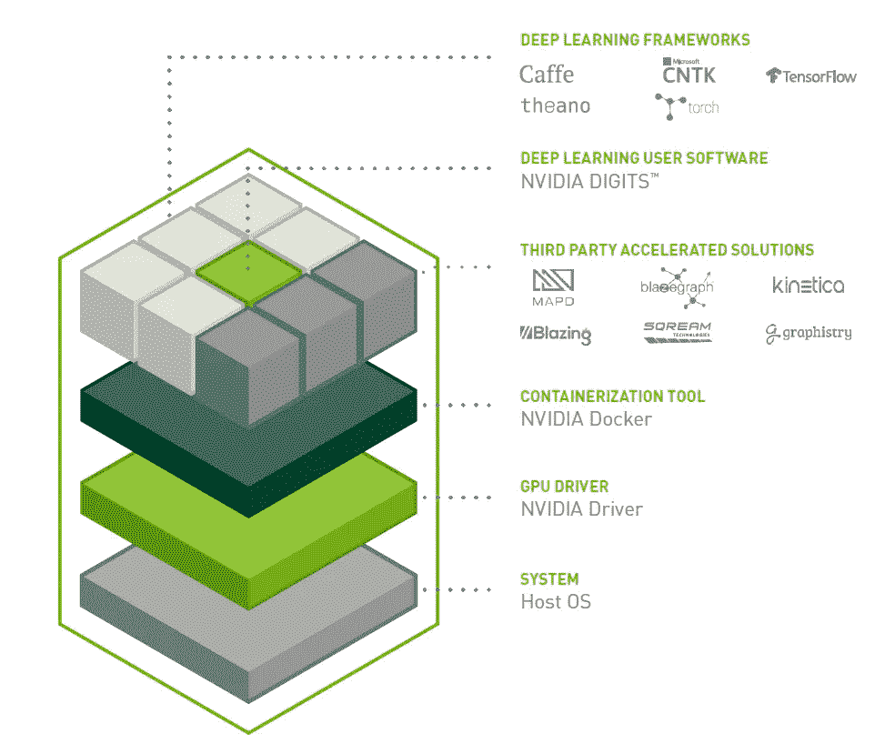

Figure 3\. NVIDIA Deep Learning stack with GPUs.

在 CPU 上训练机器学习或深度学习模型可能需要几个小时，并且在编程语言效率以及计算机资源的时间和能量方面可能非常昂贵。Google 为研发目的构建了 Colab 笔记本环境。它完全在云上运行，不需要为每台机器安装任何额外的硬件或软件。它完全相当于一个 Jupyter 笔记本，通过存储在 Google drive 上来帮助数据科学家共享 colab 笔记本，就像协作环境中的任何其他 Google 工作表或文档一样。在运行时启用 GPU 进行运行时加速不会产生额外的成本。将数据上传到 Colab 有一些挑战，不像 Jupyter notebook 可以直接从机器的本地目录访问数据。在 Colab 中，有多种从本地文件系统上传文件的选项，或者可以安装一个驱动器，通过驱动器保险丝包装器加载数据。

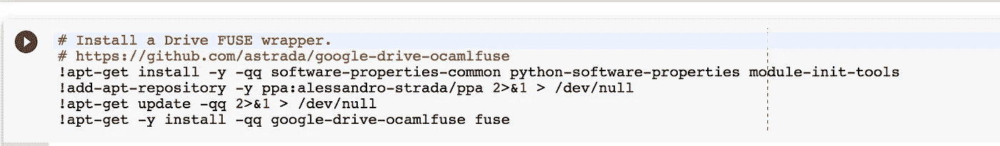

Figure 4\. Installing a drive FUSE wrapper.

一旦该步骤完成，它将显示以下日志，并且没有错误:

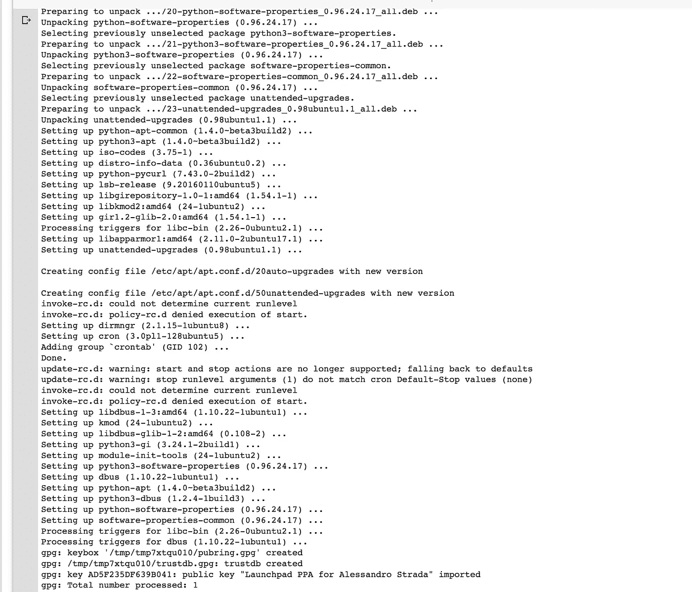

Figure 5\. Installation log on macOS that shows the installation

下一步是生成认证令牌来认证驱动器和 Colab 的 Google 凭证

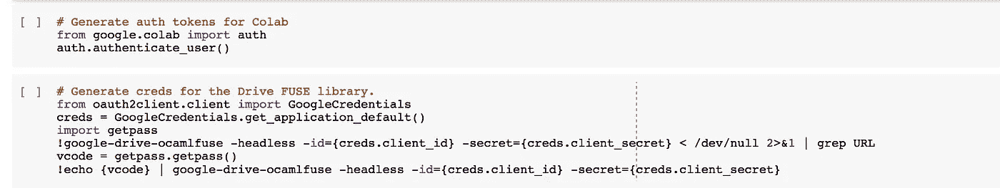

Figure 6\. Authenticate the credentials.

如果它显示成功检索了访问令牌，那么 Colab 就设置好了。

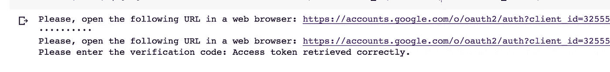

Figure 7\. Access token verification.

在此阶段，驱动器尚未安装，当访问文本文件的内容时，它将显示 false。

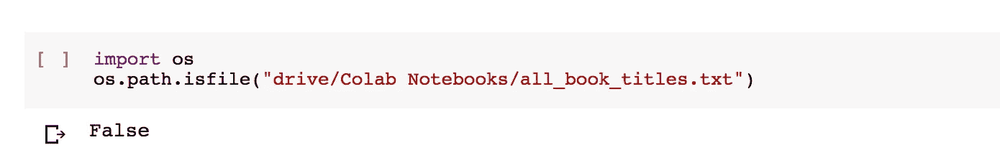

Figure 8\. Verifying the access to Google drive Colab notebook uploaded files.

一旦安装了驱动器，Colab 就可以从 Google drive 访问数据集。

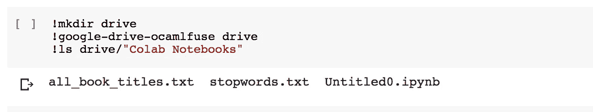

Figure 9\. Type your caption here.

一旦可以访问这些文件，就可以像在 Jupyter 环境中一样执行 Python。Colab notebook 也显示类似于我们在 Jupyter notebook 上看到的结果。

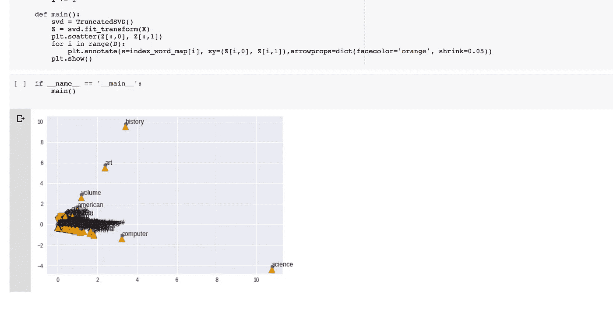

Figure 10\. Results from the program.

**PyCharm IDE**

该程序可以在 PyCharm IDE 环境下编译运行，也可以在 PyCharm 上运行，或者从 OSX 终端执行。

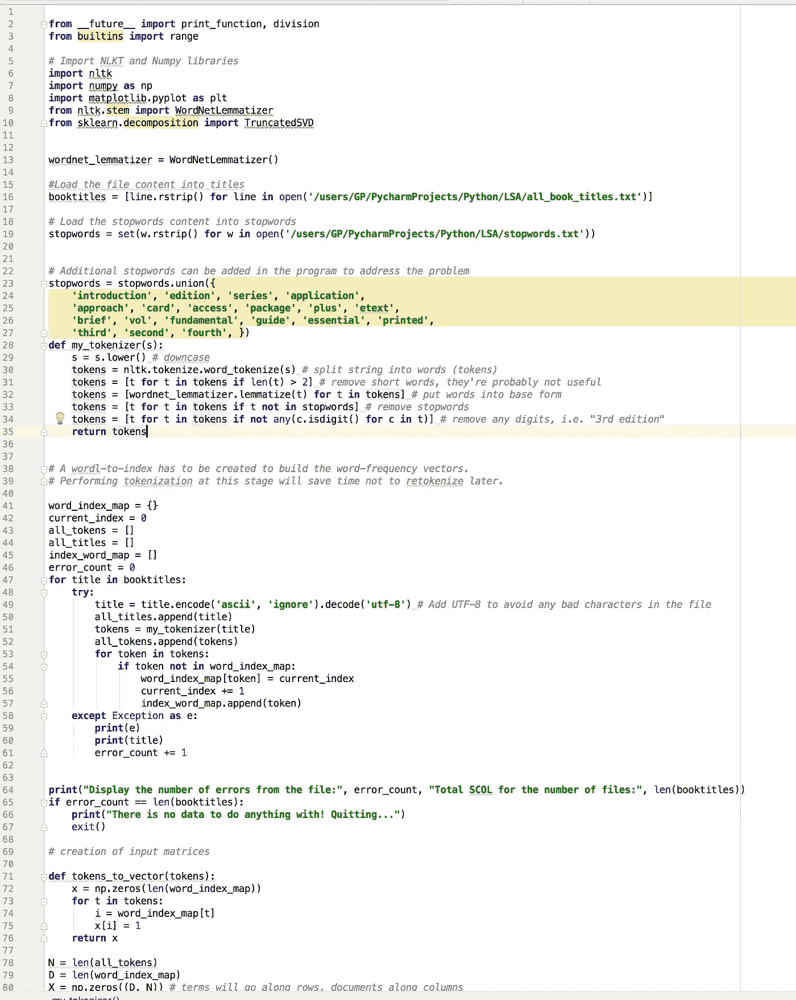

Figure 11\. LSA analysis in Python natural language processing in PyCharm IDE.

来自 OSX 终端的结果

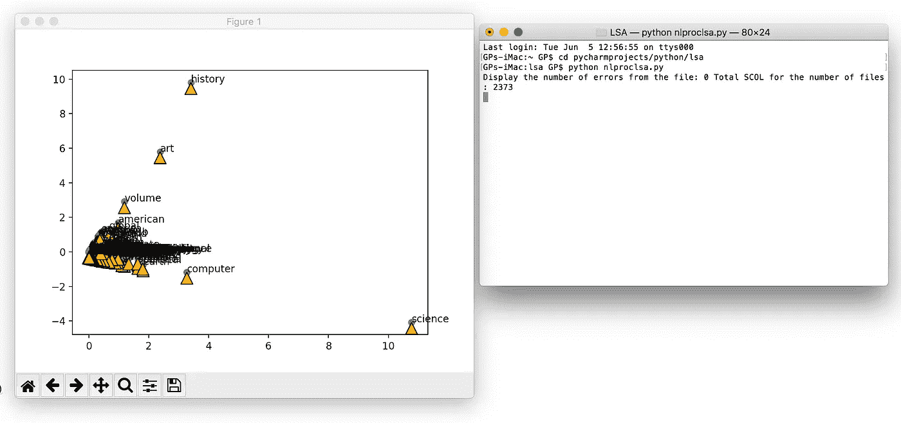

Figure 12\. Results from OSX Terminal.

独立机器上的 Jupyter 笔记本

Jupyter Notebook 给出了在本地机器上运行潜在语义分析的类似输出:

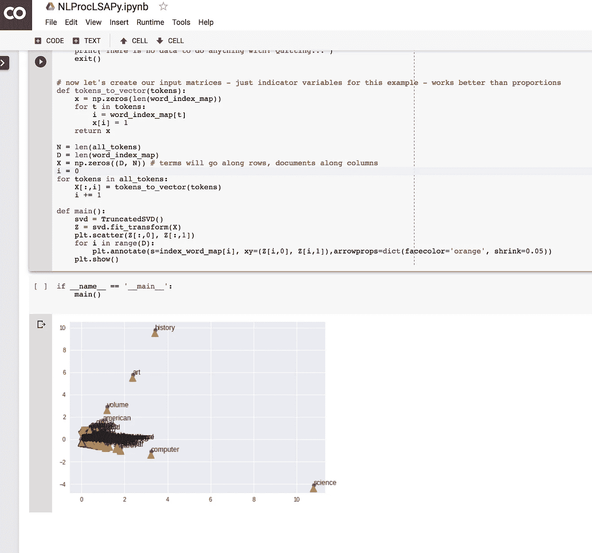

Figure 13\. Running the latent semantic analysis on Jupyter notebook.

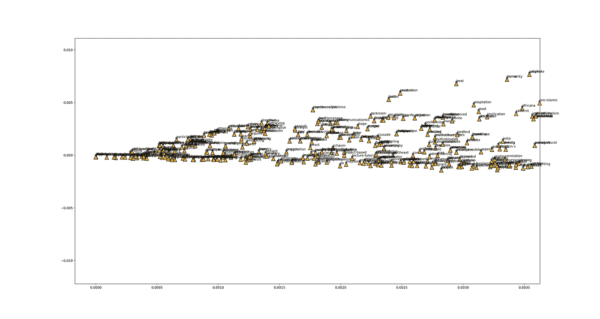

Figure 14\. Results.

参考

Gorrell，G. (2006 年)。自然语言处理中增量奇异值分解的广义 Hebbian 算法。从 https://www.aclweb.org/anthology/E06-1013[取回](https://www.aclweb.org/anthology/E06-1013)

哈登尼亚，N. (2016)。*自然语言处理:Python 和 NLTK* 。英格兰伯明翰:Packt 出版公司。

兰道尔，T. K .，福尔茨，P. W .，拉哈姆，d .，&科罗拉多大学博尔德分校(1998)。潜在语义分析导论。从 http://lsa.colorado.edu/papers/dp1.LSAintro.pdf[取回](http://lsa.colorado.edu/papers/dp1.LSAintro.pdf)

Stackoverflow (2018)。在谷歌 Colab 上安装谷歌驱动。检索自[https://stack overflow . com/questions/50168315/mounting-Google-drive-on-Google-colab](https://stackoverflow.com/questions/50168315/mounting-google-drive-on-google-colab)

斯坦福大学(2009 年)。矩阵分解和潜在语义索引。检索自[https://NLP . Stanford . edu/IR-book/html/html edition/matrix-decompositions-and-latent-semantic-indexing-1 . html](https://nlp.stanford.edu/IR-book/html/htmledition/matrix-decompositions-and-latent-semantic-indexing-1.html)

