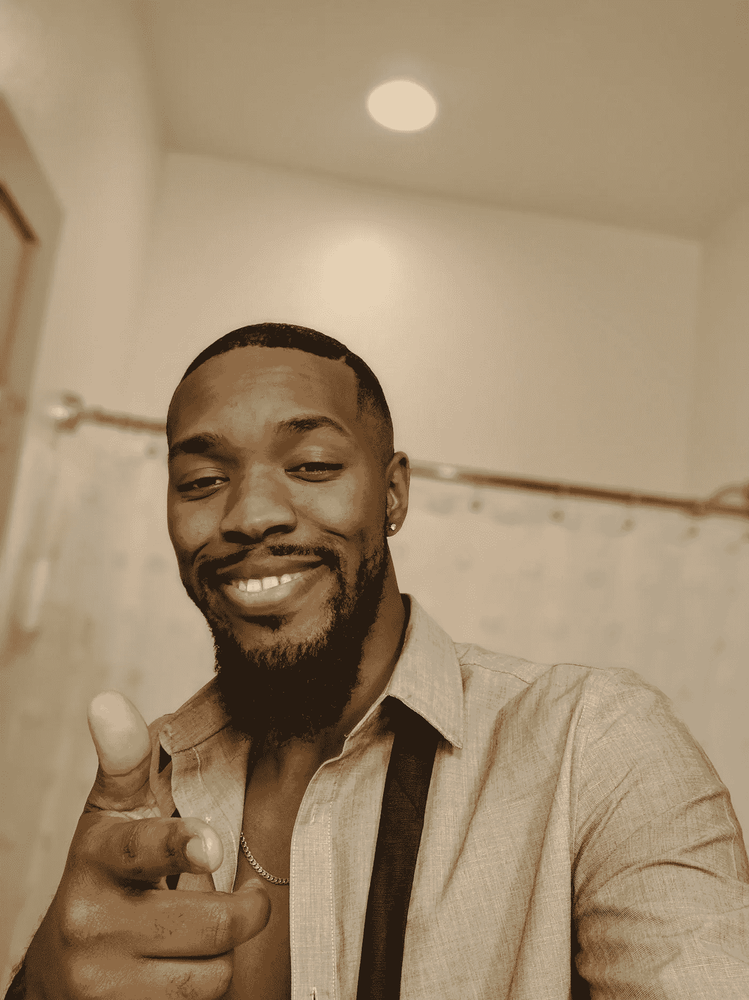

# 阐明你真实的个人品牌的 3 种方法，以及你为什么需要这样做

> 原文：<https://medium.datadriveninvestor.com/3-ways-to-clarify-your-authentic-personal-brand-and-why-you-need-to-5101263582dc?source=collection_archive---------16----------------------->

“真实”不仅仅是一个好主意，而且对你的健康、精神状态甚至寿命都有巨大的影响。

Photo by [Markel Hall](https://unsplash.com/photos/vF3zmHBFQjw?utm_source=unsplash&utm_medium=referral&utm_content=creditCopyText) on [Unsplash](https://unsplash.com/search/photos/true-self?utm_source=unsplash&utm_medium=referral&utm_content=creditCopyText)

除此之外，培养一种强烈的自我品牌意识会让你以一种奇妙的新方式走向世界。也就是说，如果你做对了。

有人说，如果你在呼吸，你就是在品牌化。在这个社交媒体平台和虚拟现实的时代，明确如何用一句话来描述自己无疑会有所帮助。

然而，这里的品牌不是指传统的营销定义，而是一个整体的个人定义。这是一种包括你整个人的品牌，而不是向目标受众推销产品或服务。这是关于真实性，正如我们现在所知道的，“自由做自己”实际上是一种[人类的基本需求](https://www.youtube.com/watch?v=pUGGNPAK6uw)，没有它我们会经历创伤和不健康。

做真实的自己是我们可能会用一生去接近的事情。这是一个有价值的目标，一个也许永远无法完全实现，也无法衡量或清晰可见的目标，而是基于我们内心的一种感觉，一种将要*经历的东西。*

几年来，个人品牌的想法一直在悄悄地发展。可供选择的课程很少，但[个人品牌教练](http://www.alenaturley.com/projects)正成为你的从业团队的宝贵财富。这些从业者不只是看你如何推销自己，而是采取一种更全面的方法，帮助你理清障碍，帮助你开启一种在工作和家庭中都可以自由做自己的生活。掌握了这些技巧，你就能学会展望未来的生活，让你成为真正的自己，而不会害怕暴露真实的自己。

在这种真实的水平上生活和工作，让我们能够无所顾忌地茁壮成长，在职业和个人关系中更充分地联系，并在没有相同程度的恐惧和脆弱的情况下前进，当我们过去对自己的某些部分感到羞愧时，我们可能会经历这种恐惧和脆弱。

这三个概念巩固了阐明你个人品牌的过程。

**1 —凭感觉工作**

只需要少量的练习去感受我们的感官和进入我们的身体，我们就可以开始发展出一种感觉，当我们没有说出我们的真相或从我们的整个自我行动时。这可能是我们声音音色的一个小变化，一个绷紧的内脏，甚至是一个身体语言习惯(比如挠鼻子)，这表明我们正在偏离轨道。习惯自己的指标，开始在自己感觉不舒服的情况下观察自己，开始从完全做自己的状态中退缩。如果你想摆脱羞愧和恐惧，这些是开始考虑的好地方。瑜伽、武术、身体疗法、创伤释放练习——这些都是很好的练习，可以帮助你调整你的身体，帮助你克服紧张和羞耻。

**2 —书写或讲述你的故事**

我们经常围绕自己的部分历史发展街区。在一个安全的、没有偏见的空间里，和一个值得信任的听众或读者一起，讲述我们的故事，并开始理解何时何地我们可能决定隐藏自己的一部分是有帮助的。也许我们有一个阿姨，她告诉我们声音太大了，所以我们更小声地说话来取悦她。也许我们为了取悦某人而穿了我们不想穿的衣服。这些小事中的任何一件都可能训练我们收起自己的一部分。当我们变得真实时，我们释放了自己的这些方面，并允许别人看到我们自己。这可能是对抗，如果你过去经历过痛苦或创伤，可能需要受过训练的治疗师的帮助。即使你过去做过治疗，看看你的故事，确定你可以从你现在的角度调整的“隐藏”的关键时刻在哪里，现在把它公之于众也是很好的。

**3 —建立信任**

对于让我们自己完全真实和可见，一个常见的疑虑是，“但是人们会怎么想？”对这个问题的最佳回答因人而异，但一些真正好的答案是:我们永远无法真正知道另一个人可能在想什么，也可能不在想什么；如果另一个人认为或不认为某事真的有什么区别；当然，如果另一个人认为我们不好，世界真的结束了吗？也许这个问题中的力量来自于信任和同情的机会。我们必须锻炼我们的信任肌肉，并考虑将同样温和的慈悲之光应用于那些我们不知道会应用于我们信任的人身上。让我们假设人们通常是善良的，他们会很高兴看到你把你的光芒照耀在这个世界上，即使他们不是，这和你又有什么关系呢？从这个角度来看，我们为自己和整个人类建立信任。

有了这些实践和想法，当我们面对在网上和现实生活中变得更加引人注目的挑战时，我们能够感到更加完整。通过在更深层次上接受我们是谁，我们可以毫无畏惧地步入一个更公开的自我版本。这减少了压力和焦虑，甚至节省了我们在健康时尚或趋势上浪费的时间，因为我们更能够调整到什么对我们有用，什么没有用。当我们知道什么是“是”的时候，说“不”就容易多了。

这就是一个好的个人品牌教练能做的:让你更充分地活在自己的“是”中。从那里开始，你的机会就向你敞开了，为了更好的健康，更好的机会，以及与你自己和他人更真诚的联系。

*通过打造您的品牌电子课程创建您自己的个人品牌，* [*点击此处*](https://mailchi.mp/1bd3a4b6a56b/buildyourbrand) *。*

[*阿莱娜·特利*](http://www.alenaturley.com/projects) *是一位* [*作家*](http://www.soulmammablog.com/) *、教育家、伦理社会创意和个人品牌教练。她是三个孩子的母亲，住在澳大利亚悉尼，热衷于将人们与真实的自己和彼此联系起来。
在*[*insta gram*](https://www.instagram.com/soul_mamma_)*[*脸书*](https://www.facebook.com/alenaturleyatwork/)*[*Pinterest*](https://www.pinterest.com/alenaturley/)*和*[*Twitter*](https://twitter.com/soul_mamma_)*上找到她。***