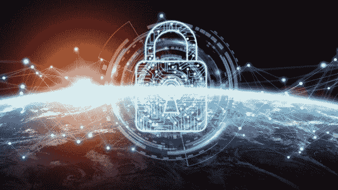

# 防范中间人攻击的 3 种方法

> 原文：<https://medium.datadriveninvestor.com/3-ways-to-protect-against-man-in-the-middle-attacks-cbd35f3200a7?source=collection_archive---------23----------------------->

中间人攻击是指客户端和服务器都是受害者的攻击。攻击者实际上位于双方之间，并截取双方之间的通信。因此，从一端传递到另一端的所有信息都可以被攻击者访问并受其支配。例如，攻击者可能决定发送回一个虚假的回复，传递一个修改过的消息，或者出于其他目的操纵信息。那么，当你甚至不确定自己是否是受害者时，你如何抵御攻击呢？在这种情况下，最好的防御应该是强有力的进攻。假设您是中间人攻击的目标，您应该采取安全措施。

# (1)网络安全

您应该将此作为第一个安全措施来实施的一个核心原因是，它对所有类型的中间人攻击都有效。单独使用，VPN 和 Tor 都是出色的安全工具，各有所长。然而，它们都有缺点，使得不可能释放和利用它们的全部潜力。当[使用 Tor over VPN](http://www.libertybellpress.com/why-you-should-use-tor-over-vpn.html) 时，你克服了这些缺点，享受到了好处。Tor over VPN 提供了 VPN 提供的最佳网络加密和隐私保护，以及 Tor 提供的匿名保护。最大限度地减少您的暴露和保护您的在线数据是防范中间人攻击的最佳方式之一。

# (2)加密

一旦你加密了一个系统，它就以这样一种方式被编码，只有那些有访问密钥的人才能解码信息。当[防范中间人攻击](https://www.expressvpn.com/blog/man-in-the-middle-attacks/)时，您需要利用各种类型的加密来实现全面的安全覆盖。您应该注意的一些加密包括:

**端到端加密**

端到端加密主要是一种通信加密系统，最能抵御电子邮件劫持和类似类型的中间人攻击。加密使得除了发件人和收件人之外的其他人无法阅读邮件。有许多电子邮件和聊天客户端都有端对端加密，所以你不必亲自配置。然而，仍然存在一个挑战，攻击者可能伪装成接收者来接收密钥或拦截身份验证消息。

**设备加密**

尽管端到端加密覆盖了通信信道，但在端点仍存在安全挑战。设备加密覆盖了端点安全弱点，并针对中间人攻击提供了更强大的安全性。

**TLS/SSL 加密**

TSL/SSL 加密保护 HTTP 网络连接，从而防止 HTTP 拦截和依赖 web 的中间人攻击。TSL/SSL 加密使得拦截客户端和服务器之间的通信更加困难。

**无线加密**

一个开放的 Wi-Fi 网络对黑客来说是一个很好的自助餐邀请，尤其是在 Wi-Fi 窃听攻击方面。Wi-Fi 加密是防止黑客通过网络获取任何信息的最佳方式。即便如此，你也不应该过于相信这一点，因为 [Wi-Fi 加密也有其缺陷](https://www.pcworld.com/article/3233308/security/krack-wi-fi-security-flaw-faq-tips.html)。

# (3)恶意软件防护

尽管有足够的加密层，您仍然需要投资恶意软件防护。黑客依赖恶意软件做任何事情，包括破解或绕过大多数加密。防止这种情况的最好方法是安装一个杀毒软件，用来检测和清除你设备上的任何恶意软件。大多数防病毒软件还提供额外的网络安全和防火墙保护，这将进一步加强对攻击的保护。

# 底线

虽然网络安全、加密和恶意软件防护作为防范中间人攻击的安全措施应该非常有用，但它们不是您可以实施的唯一措施。更关键的是，你需要拓宽你的视野，寻求关于这个话题的更深入的信息。网络攻击的本质是它们一直在进化，所以今天的安全措施可能是明天的权宜之计，或者更糟，是一个弱点。

*原载于 2018 年 11 月 30 日*[*www.datadriveninvestor.com*](https://www.datadriveninvestor.com/2018/11/30/3-ways-to-protect-against-man-in-the-middle-attacks/)*。*