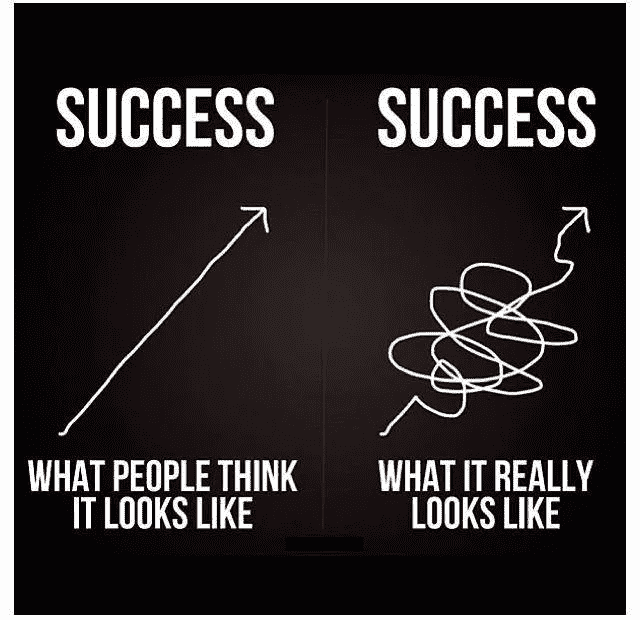
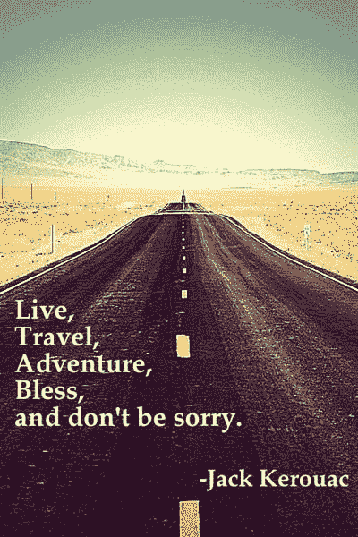
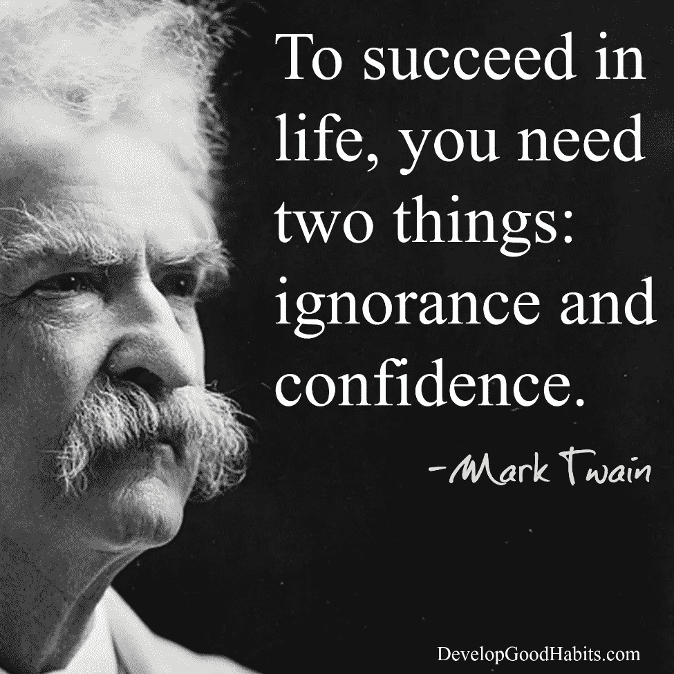

# 2019 年提升生活品质的 3 种方式

> 原文：<https://medium.datadriveninvestor.com/3-ways-to-raise-your-life-in-2019-dc3b94656029?source=collection_archive---------7----------------------->

## 职业运动员如何运用学习、成长心态和冒险旅行来充实生活

Photo by [Christopher Burns](https://unsplash.com/@christopher__burns?utm_source=medium&utm_medium=referral) on [Unsplash](https://unsplash.com?utm_source=medium&utm_medium=referral)

> 选择不被伤害，你就不会感到被伤害。不要觉得受到了伤害，你也没有受到伤害。”马库斯·奥勒留

“你长大后打算做什么？”

“一个职业篮球运动员，”我说。我 14 岁，充满了尿，派头，固执和醋。

“真的没有。说真的。你想成为什么？”我最好的朋友约翰尼问我。

“不，我是认真的——一个职业篮球运动员。你笑什么？”

“那么，你打算怎么做？”

“我有一个计划。每日计划。我会每天都做。风雨无阻。我爸爸总是说要控制可控制的东西。他说一个人最大的成就是他每天通过有意的行动创造的杰作。”

“那是什么意思，伙计？”

“这意味着我可以创作出杰作。练习、投篮、运球、学习、研究电影、阅读如何变得更好，所有这些都是工作——做日常工作是杰作，我控制着这个过程——你明白吗？”

“我想是的——但是你又矮又白，而且住在一个 1000 人的村子里。很可能你不会成功。你知道吗？”

“真的。但我宁愿向星星射击，登上月球，不管我周围发生了什么，我可以控制一件事…

我今天打篮球的频率和努力程度。"

Photo source: twitter kadelgirish

> *“亚历山大大帝和他的骡夫都死了，同样的事情也发生在他们身上。”马库斯·奥勒留*

# 1.如果我们都以同样的方式死去，我们活着还有什么意义？

我从来不明白为什么会发生自杀、死亡或抑郁，直到有一天我不再打职业篮球，我的生活发生了天翻地覆的变化。我失去了我是什么和我是谁的感觉。我失去了我的部落。我的身份。我的激情。我的目的。我一直在想，当我们不是我们以为的*时，我们是谁？*

*我很难过。挨打。伤心欲绝。焦虑。充满了恐慌。在我放弃一切之前，我倾听了我内心最深处的声音，我想切断与美国中部的联系，去探索。旅行。把世界看成一个人。不是篮球运动员。不是工人。只是个观察者。很快，(经过几个月的准备)，我决定学习如何冒险地度过我生命中的每一刻。*

*于是，我收拾行装，卖掉了所有的家当，乘坐一艘价值 3000 美元的名为“淑女拖鞋”的帆船，来到了加勒比海。这被证明是一个改变人生的事件，我会试着再做一次(一次又一次)。*

> *我的冒险旅行告诉我，在我们不同的文化中，我们都是人，我们所有人的一个共同点是我们都有能力改变——每天努力实现自我(或者不实现)。*

**

*photo source: jack kerouac “a road less traveled”*

*人类几乎可以在任何环境下生活和生存。美国人比以往任何时候都拥有更多的信息、便利和技术，但是，美国人是地球上最肥胖、最注意力不集中和最依赖药物的社会。*

*然而，我们生活在太空中。在冰上。在沙漠里。水下。但是，如果我们人类仍然有呼吸和意识，就像你和我一样，那么我们仍然能够以任何我们喜欢的方式成长、改变、生存、学习、欢笑、旅行、爱、建设、帮助、创造和冒险。*

*如果活着对我们如此重要，那么我们必须问自己最重要的问题。不仅仅是我们的激情所在。或者我们的目的是什么。或者我们下一步会变成什么。不，这些史诗般的问题很少改变我们。是真正的顿悟和简单的选择改变了我们。如果我们所有的心脏都停止以同样的方式向我们的大脑、身体和意识输送血液，问题是:在我们留在地球上的短暂时间里，我们想做什么？*

> *“死者的数量是生者的 14 倍，如果我们忽视这么多人类积累的经验，那我们就危险了。”—尼亚尔·费格森*

*我们世界上最伟大的领袖、思想家、创造者和艺术家都会像你我一样死去。他们并没有因为无知而变得更快乐、更有生产力、更有才华或更自信。他们只是通过专注于做这件事而做到了这一点(这也是我认为吐温在下面想说的)。不是病态，但承认死亡的发生可以帮助我们反思并获得关于我们实际上是多么渺小和不特别的观点。从柏拉图的观点来看，从平流层或太空来看，有数十亿人，死亡，出生，工作，癌症，奇迹，汽车，房子，事物，选择，职业，然而，这些都没有真正关系到我们如何生活。*

**

*photo source: developgoodhabits.com*

# *2.对事物、声音、恐惧、挑战、问题、写作、工作、借口、抱怨、工作、创业、研究、女孩、男孩的自我意识；一切都是这样。*

*马库斯·奥勒留是这样描述的:*

> *“行动的障碍推动行动。挡在路上的就成了路。”*

*如果要由我们来找出如何缩小我们认为我们需要的欲望和如何到达那里的知识之间的差距，那么在我们这样做之后，无论是什么阻碍都应该成为到达那里的方法。这总是从自我意识开始，质疑你是谁，你想用你的时间做什么，或者理解你为什么这样做。*

***我们大多数人未能应用改变我们生活所需的知识。***

*不管是健身。或者投资。或者做一个更好的搭档。你是如何创造你的日常杰作的？你意识到了吗？我们如何开始无中生有？什么是尚未实现的命运？*

# *3.通过创造来预测你的未来。*

*这是你抓住公牛的角，然后跳上去骑它的时候。*

*放下手机，意识到生活不是工作，做一个更好的父母。通过挑战你的团队，让他们做更多他们擅长的事情(并接受他们不擅长的事情)，成为一个更好的老板。期待你的朋友、同事和爱人不辜负他们的好名声。这里有一个简单的:*

*多微笑。它为你自己创造了一个更加快乐的未来——这是一个自我实现的预言。*

*这种应用的自我意识是我们必须努力创造的杰作。这是我们必须采取行动和做的障碍，无论是我们必须进行的冒险旅行，我们必须分享的秘密，还是我们旨在吸引的表现。这是日常工作，或者把你的生活提高到更高的标准，把柠檬变成柠檬水，把硬核变成美味的电影爆米花，把恐惧变成勇气，或者把骡夫变成解放的骡夫，微笑着享受国王的陪伴。*

*T[revor Huffman](https://medium.com/@Trevor_Huffman)*为 TrevorHuffman.com Grand Stand Central 撰稿，是两支 NBA 球队中最后一个被裁掉的人，在欧洲打了 12 年职业篮球，赢得了四次欧洲冠军，两次 MVP。他在芝加哥经营一家健身初创公司(Swish House)，通过他的“职业运动员学校”教授孩子们和人类培养习惯、自我意识、成长思维和领导力的制胜工具，该学校将他在篮球比赛中的团队运动经验提炼出来，供好奇的人学习。哦，他喜欢好吃的拉面。**