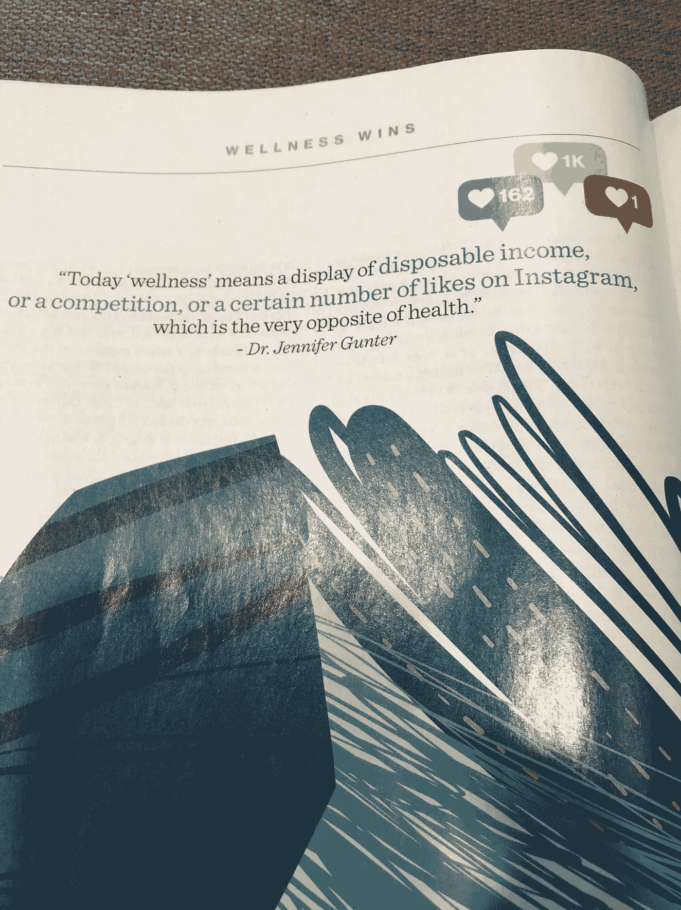

# 提醒自己健康必胜的 3 种方法

> 原文：<https://medium.datadriveninvestor.com/3-ways-to-remind-yourself-that-wellness-wins-d609e67b62ee?source=collection_archive---------19----------------------->

1.  **花一点时间停下来反思:**
    你内心的感受如何？你在拿自己和别人比较吗？如果是这样，我的一个朋友最近问我，“你衡量幸福/成功的标准是什么？你专注于你的旅程和你为生活付出的努力了吗？”将自己的旅程与他人外在的成功相比较是如此诱人。不断问自己以下问题:

> *“什么对你来说很重要？”*
> 
> “你如何庆祝你的胜利？”
> 
> “你怎样才能集中精力让自己感觉良好？”

**2。记住你的健康目标:** 你的健康目标是什么？减少生活中的压力？从精神上和身体上对自己的身体感觉良好？为你的生活创造更多的快乐？如果你的电话和/或社交媒体引起了焦虑/压力，休息一下，认识到你首先需要照顾好自己是公平的。你定义的是你的自我价值，而不是你得到的“赞”的数量。在所有的噪音中，记住什么让你感觉良好，不管你周围发生了什么。专注于如何让你每一天都感觉越来越好。

我发现“噪音”让我更清楚地意识到要分清主次，听从我的直觉。这给了我更多的动力去倾听内心真实的声音。

**3。阐明健康对您的意义:**

健康对你来说最重要的是什么？跑来跑去带孩子是不是感觉精力充沛？根据对你重要的东西来定义健康。如果你正在寻找平衡，并通过洗舒缓的澡、长距离散步或吃巧克力/冰淇淋找到了平衡，那么就去做吧。关注那些让你自我感觉良好的事情，即使这对其他人来说毫无意义。

本周给你一个很好的提醒——像对待你最好的朋友一样对待自己。那会是什么样子？