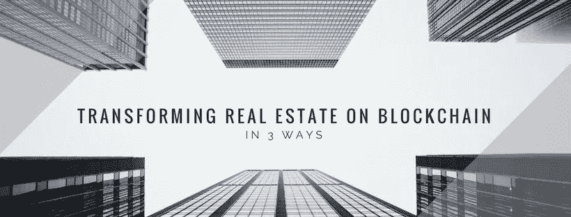
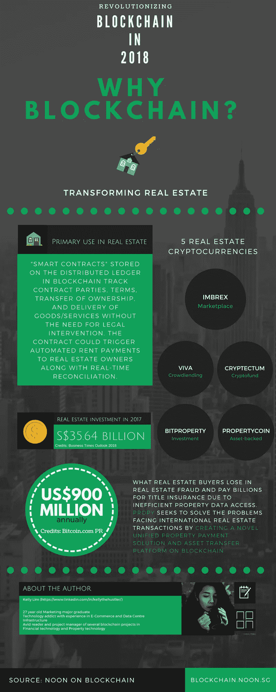

# 使用区块链革新房地产的 3 种方式

> 原文：<https://medium.datadriveninvestor.com/3-ways-to-revolutionize-real-estate-using-blockchain-44afeaa521a9?source=collection_archive---------7----------------------->

Credit: [NOON Capital](http://noon.sg/)

今天的超互联和数字世界要求每个行业都需要创新，包括房地产。区块链技术肯定会在金融服务行业大受欢迎，但我们能在房地产领域使用区块链吗？区块链技术是一种数字化的分布式账本，它不变地记录和共享信息，旨在解决业务运营方面的低效问题并减少欺诈/错误。

在这里，我们着眼于区块链技术的采用将如何简化房地产的 3 个要点。

# 谎言

传统租赁合同可以在区块链平台上转变为智能租赁合同，租赁条款和交易以更加透明的方式实现。该合同可以使用 fiat 或 tokens 向房地产所有者、物业经理和其他利益相关者进行近乎实时的自动支付。

# 实时数据

许多系统上存储的信息分散在不同的点上，导致数据冗余、记录重复和不透明。为所有相关方开放和共享的数据库将增强实时数据，并防止同一组数据的多个副本。这还可能导致及时的欺诈检测以及提高合规性和安全性。

# 尽职调查

财务和法律审查文件主要是在尽职调查过程中离线起草的，这已被证明是耗时的和纸面驱动的。这些文件包括支持所有权、租户和维修/维护活动的历史。手动验证过程容易丢失信息和出错，尤其是经常需要第三方服务提供商，这可能会增加在转移过程中错放文档的风险。区块链技术可以部分或完全自动化流程，并在减少低效和不准确方面产生巨大影响。在线记录将大大缩短起草租赁信息协议的时间，最终将简化尽职调查流程。

(所有信息改编自[德勤:商业地产中的区块链](https://www2.deloitte.com/content/dam/Deloitte/us/Documents/financial-services/us-fsi-rec-blockchain-in-commercial-real-estate.pdf))

> *为什么房地产要用区块链？*

NOON on Blockchain (http://blockchain.noon.sg)