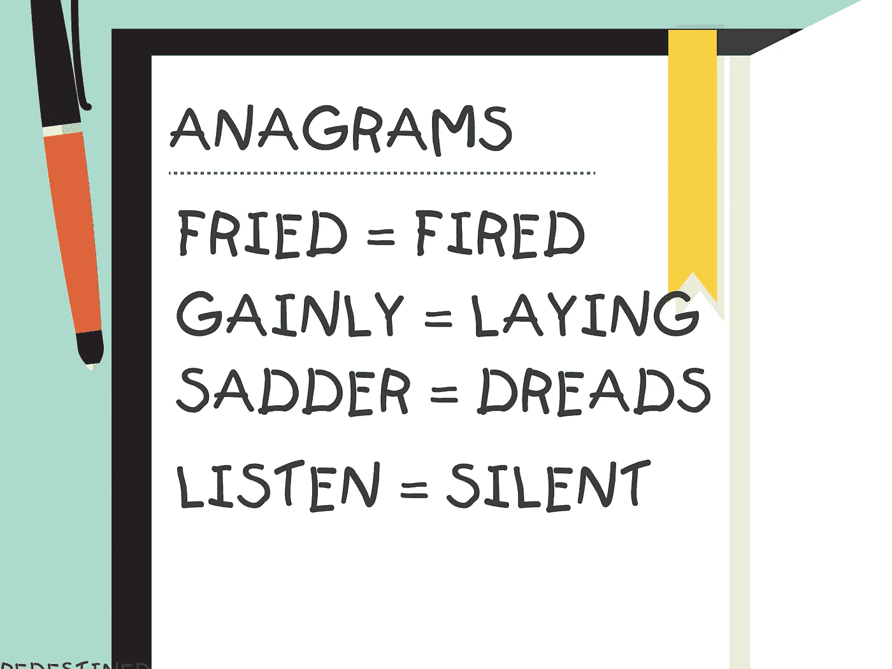

# 解决字谜算法问题的 3 种方法

> 原文：<https://medium.datadriveninvestor.com/3-ways-to-solve-the-anagram-algorithm-problem-61c2ba20b79e?source=collection_archive---------0----------------------->



在研究算法的时候，我发现了一个特别有趣而且具有欺骗性的算法。这看起来很容易，但我在试图找到解决方案的过程中绊倒了很多次。让我试着解释一下这个问题，并希望提供一些解决方案，帮助你从不同的角度思考算法。

## 什么是变位词？

> 由另一个单词的字母重新组合而成的单词、短语或名字，如 *cinema* ，由 *iceman* 组成。

变位算法是一种简单的算法。创建一个函数，比较两个字符串，并检查它们是否是彼此的变位组合。字符串可以包含任何类型的字符，如“嗨，你好！”和“你好，你好！1!！！1".该函数应该能够筛选所有的字符，并确认如果两个给定的字符串是对方的变位。

下面，我想给出 3 个解决方案。第一个解决方案是我能想到的解决方案，接下来的两个是我发现的其他解决方案，它们提供了更好、更简洁的解决方法。我通过这个工程师 [**遇到了另外两个，Stephen Grider**](https://www.udemy.com/user/sgslo/) **，**和他的解决方案帮助我明白了如何更好地编写可读、高效的代码。

# 第一种解决方案:

```
const anagrams = (stringA, stringB) => {
  const newStringA = stringA.replace(/[^\w]/g, '').toLowerCase()
  const newStringB = stringB.replace(/[^\w]/g, '').toLowerCase()if (newStringA.length !== newStringB.length) { return false }//create a hash map for both new words
  const objA = {},
        objB = {}newStringA.split('')
  .forEach( char => {
    if(!objA[char]){
      objA[char] = 1
    } else {
      objA[char] += 1
    }
  })newStringB.split('')
  .forEach( char => {
    if(!objB[char]){
      objB[char] = 1
    } else {
      objB[char] += 1
    }
  })let result;//compare both maps and see if keys values are equal
  for (let charA in objA){
    if(Object.keys(objB).includes(charA)){
      objA[charA] === objB[charA] ? result = true : result = false
    } else {
      result = false
    }
  }return result
}
```

我首先知道我必须删除所有不是字母的字符，然后将它们转换成相同的字母大小写，这样我就可以正确地比较两个字符串。我使用了一些正则表达式魔法来得到我需要的字符。

然后，我想到了自动返回函数，如果字符串长度不相等，就不执行其余的函数。如果它们不相等，那么我肯定知道彼此的变位。

[](https://www.datadriveninvestor.com/2019/02/21/best-coding-languages-to-learn-in-2019/) [## 2019 年最值得学习的编码语言|数据驱动的投资者

### 在我读大学的那几年，我跳过了很多次夜游去学习 Java，希望有一天它能帮助我在…

www.datadriveninvestor.com](https://www.datadriveninvestor.com/2019/02/21/best-coding-languages-to-learn-in-2019/) 

稍微复杂的部分是创建两个字符串的散列映射，并使每个字母的键值对与它们相应的计数相匹配。这里的目标是比较两个对象的计数，如果是，则返回 true，否则返回 false。

## 这个解决方案有什么问题？

这个解决方案的问题是它非常冗长，而且有些东西是重复的。字符串和哈希映射的创建都是重复的。我在创建一个结果变量时也太露骨了。此外，在检查值的数量时，检查两个哈希映射是否有相同的关键字字母也可以合并在一起。

# 第二种解决方案:

```
const anagrams = (stringA, stringB) => {
  //build helper function to create specific maps
  //build a map per string
  //return false automatically if string lengths don't match
  //iterate through one map and check if the key value pairs match
  //if every test passes, return true at the end const aCharMap = buildCharMap(stringA);
  const bCharMap = buildCharMap(stringB); if (Object.keys(aCharMap).length !== Object.keys(bCharMap).length)     {return false} for (const char in aCharMap){
    if (aCharMap[char] !== bCharMap[char]){
      return false;
    }
   }  return true;
}function buildCharMap(str){
  //create empty char map
  //iterate through each regex'd string. 
  //increment each key by one const charMap = {} for (let char of str.replace(/[^\w]/g, '').toLowerCase()){
    charMap[char] = charMap[char] + 1 || 1
  } return charMap
}
```

在这个解决方案中，作者创建了一个 [**辅助函数**](https://teamtreehouse.com/community/what-is-a-helper-function) 来创建字符映射表，并用字母替换每个字符串，并将每个字符串转换成小写字母。辅助函数非常棒，因为它们降低了主算法的复杂性，并有助于使事情变得更加*可重用*和*可读*！

创建辅助函数后，他在主函数内部调用它，为每个函数创建一个散列图。

最后，他在循环中创建了一个 for 并比较了每个对象。如果它们不相等，该函数将返回 false。如果条件函数失败，函数将继续执行并返回 true。

# 第三种解决方案:

```
function anagrams(stringA, stringB)
  // create helper function to clean up string
  // use function per string and compare them return cleanString(stringA) === cleanString(stringB)
}function cleanString(str){
  return str.replace(/[^\w]/g, '').toLowerCase().split('').sort().join('');
}
```

这是所有解决方案中最短的一个。它创建了一个辅助函数，执行相同的替换并更改字母大小写。不同之处在于，它创建一个包含字母的数组，对该数组进行排序，然后将其转换回字符串，这样就可以检查两个字符串是否完全相等。

这很短。这是干净的。这可以理解。

这是一个很棒的解决方案，但问题是它使用的排序方法 [**增加了算法**](https://adrianmejia.com/most-popular-algorithms-time-complexity-every-programmer-should-know-free-online-tutorial-course/) 的时间复杂度。简短、清晰、易懂在算法中有它的位置，但它并不总是最好的解决方案。

# 结论

对我来说，**第二个解决方案是我的选择**，因为它的效率和可读性。变位算法是一个有趣的算法，我希望我能够引入一些主题，帮助您更好地编写可读、高效的代码！