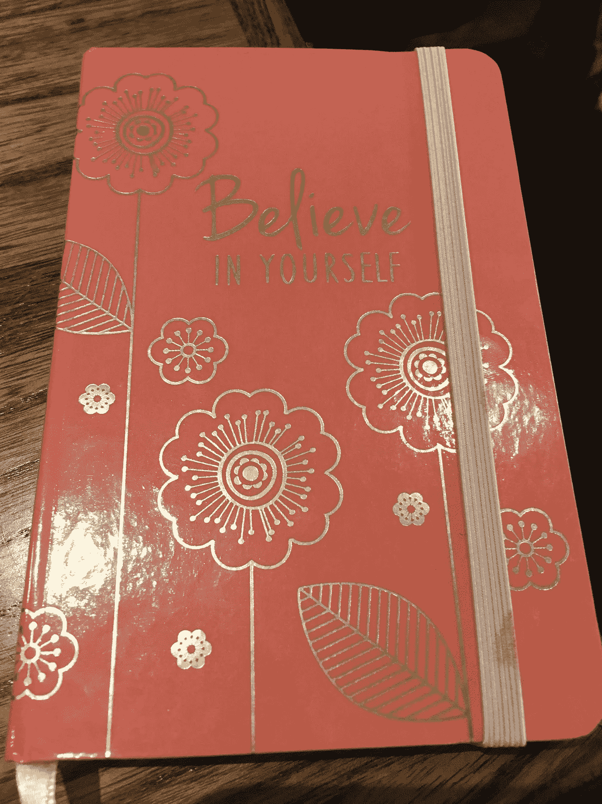

# 帮助你为自己说话的 3 个技巧

> 原文：<https://medium.datadriveninvestor.com/3-ways-to-speak-up-for-yourself-and-augment-your-growth-in-the-process-7c65363b6347?source=collection_archive---------6----------------------->

An inspirational quote from the [SF Kiip office.](http://www.kiip.me/) © 2018 Carolyn Lowe

# 并在这个过程中促进你的成长！)

## 我们当中有多少人因为害怕而不敢说出真相？

根据 T2 领导力研究合作伙伴的调查，在正常的商务会议中，女性比男性更难找到自己的声音。此外，[会议期间 75%的发言通常由男性完成。一个原因可能是因为如果女性说出来，她们会被认为是什么样的。对被认为“太强势”或“太咄咄逼人”的真正恐惧可能会阻止女性真正诚实地表达自己的观点。](http://www.dailymail.co.uk/sciencetech/article-2205502/The-great-gender-debate-Men-dominate-75-conversation-conference-meetings-study-suggests.html)

## 我们头脑中的真实想法可能听起来像下面这样:

> “如果对方生气了或者不喜欢我要说的话怎么办？”
> 
> “对方不同意怎么办？会不会让我的感觉失效，让我因为说出来而感觉更糟？”
> 
> “如果这让我看起来很蠢或很傻怎么办？”

我们的恐惧存在于我们的头脑中，大多数时候，它们并不是真的。我在几周前的一次演讲中听说，大多数女性不说话是因为她们认为自己的观点不重要。我们当中有多少人因为害怕别人不同意我们的观点而不敢说出自己的真实想法？

这里有三种方法来对抗你内心的声音，并引导你的直觉力量大声说出来:

1。 **抓紧时间写日记。**

I love beautiful journals. Credit: A friend’s journal. © 2018 Carolyn Lowe

写下你的真实感受，不加编辑，不加评判。我喜欢《艺术家之路》这本书，它可以帮助我在早上进行一次大脑清理，让我的想法和感觉都出来。

有时我用纸和笔完成这个过程，有时我用打字机打出来。这个想法是保持写 3 页(或者更多，如果你喜欢)任何东西。即使你一遍又一遍地写“我不知道该写什么”，这个想法也是在不停地将你头脑中的想法冲洗出来，几乎就像大脑转储一样。

写下你的想法和情绪，就像没有人在评判你的话一样。花点时间，看看那是什么感觉。

我们是自己最糟糕的批评家，有时候，写出来释放压力可以帮助我们前进，大声说出来！

2。 **质疑自己的恐惧。**

根据[关于“用灭绝训练抹去恐惧记忆”的研究，](https://www.ncbi.nlm.nih.gov/pubmed/21068303)制造恐惧的新记忆在短时间框架内是不稳定的。在此期间，如果恐惧记忆不稳定，它可以被成功征服。虽然听起来很奇怪，但走向你的恐惧实际上有助于克服恐惧。关键是不断采取行动，打破你旧的恐惧模式。

> “你想要的一切都在恐惧的另一边”——杰克·坎菲尔德

当消极的自我对话和怀疑出现时，问自己以下问题:

“这种恐惧的目的是什么？”

“这真的是事实吗？”

"你是否因为过去的负面经历而停止说话？"

"你是在把以前的经历投射到你现在的处境中吗？"

"对这种情况还有别的看法吗？"

3。 **找一个你觉得安全的支持网络。**

与值得信赖的支持团体分享你的挑战和挣扎。你可能会惊讶地发现，其他人*也*正经历着与你相似的感受。

找到一个共同的纽带可以产生共鸣，放下戒备，真正地分享经验。也许可以是一个小团体，在那里你可以分享你的挑战，并习惯于与一个团体讨论事情的想法。也许是一对一的聊天，你可以找到一个值得信赖的同事或朋友来合作和集思广益。关键是找到适合你的方法。

最好的消息是，你知道的可能比你认为你知道的要多，所以相信你的直觉，知道你有别人想听的独特想法。

以下是硅谷科技团队中一些令人兴奋的女性:

[**【国际技术界女性】**](https://www.witi.com/)

从 Witi 的网站上看，她们的“使命是通过技术、领导力和经济繁荣，赋予全球女性实现无法想象的可能性和变革的权力。”

Canadian Women Network (CWN) Launch Event with Connection Silicon Valley. © 2018 Carolyn Lowe

[**连接硅谷**](http://www.connectionsiliconvalley.com/) **:**

Connection SV 由 Joanne Fedeyko 领导，她是一位超级联系人，热衷于支持科技领域的女性。他们可以促进正确的联系以发展你的公司，联系你的初创公司以建立关系，如果你是学院/大学，启动你的合作项目，或者建立和连接一个外籍人士社区。

[**女技师:**](https://www.womentechmakers.com/)

来自女性科技创客网站，“谷歌的女性科技创客项目为科技领域的女性提供了知名度、社区和资源。”

哪些团队为你工作过？我很想在下面的评论中听到你的想法！