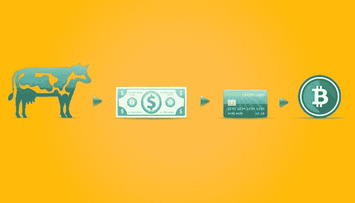
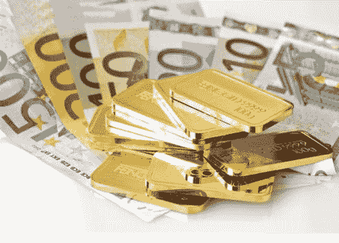
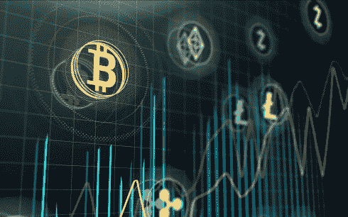

# 3.钱是什么？

> 原文：<https://medium.datadriveninvestor.com/3-what-is-mone-923ade1f41e8?source=collection_archive---------28----------------------->

读: [1。为什么是区块链？](https://medium.com/@arvindvairavan/1-why-blockchain-a00012d328a7)

[2。什么是区块链？](https://medium.com/@arvindvairavan/2-what-is-blockchain-87e7a8932394)

为了理解加密货币如何推动区块链技术，我们需要理解什么是货币，为什么我们的经济依赖于货币，以及货币的价值在一段时间内是如何表现的。

**钱是什么？**

"一种交换媒介，为那些想持有它的人提供，直到他们想为他们提供给别人的东西买一个等价物"。从这个意义上说，货币是最有市场的商品，是作为价值储存手段的最好的商品，是一种冻结的、可交易的时间。

货币的起源有它的故事。不是每个人都可以根据自己的需要制造或创造工具或原料。我可以创造一些，你可以创造一些，我们可以交换。

**易货系统:**

你有我需要的东西，我也有你需要的东西。匹配需求的双重重合。我们交换了。但是这有严重的局限性。
1。如果我没有找到我需要的东西或者相反怎么办？
2。如果数量/质量有差异呢？还是需要改变？
3。如果我的产品是长期持有的，而你的产品必须立即消费，该怎么办？
你如何评价每件相关商品的价值？

商品货币:由于没有共同的媒介，换句话说，没有货币，所以很难估计贸易中的价值。这使得定义“价值”、收集“债务”以及创造财富变得困难。为了满足日益增长的需求和供应，商品货币是必要的。最初，人们决定用贵金属来代替。金子

它们的特点包括:
经久耐用
便于携带、
卓越的互换性(一克黄金可以替换任何其他克黄金)
易于赋值等

通过需求和供给，人类是赋予事物价值的人。任何东西，即使是黄金，本身都没有“价值”。如果黄金只用于珠宝而不是作为商品货币，它的价值会低得多。最终，由于黄金的开采和储备受到限制，它被纸币所取代。直到第二次世界大战前后，纸币的价值等同于存放在银行储物柜中的黄金。然后，美元成了所有货币的比价对象。但当大量美元注入金融体系，超过黄金供应量时，出现了一个转折点，这导致了通胀。此后，美国和其他国家决定不基于替代价值储存而是基于特定货币本身来印刷货币。换句话说，“法定货币”诞生了，也就是说，一种仅仅因为我们这么说而存在的货币。没有对等物。虽然听起来很奇怪，但信任是维系世界和运行经济的力量。

法定货币:
法定货币是基于我们这个社会一直持有的信任。我们每天花费的美元、卢比和欧元。
货币历史的最大教训是，任何代表他人管理货币的人，或者经营垄断的人，最终都会从中获利。银行、公司、对冲基金、政府。你说吧。

**服务金钱还是加密经济:**
在区块链这个全新的世界里，技术都是开源的。区块链项目背后的软件是用开放的代码编写的，可以被研究甚至复制！与过去软件程序作为服务出售不同，这里的软件可供任何人访问。作为回报，软件背后的程序员发行一个加密令牌(钱)。随着对软件的更多需求被请求，令牌被提供。随着对特定货币需求的增加，其相对于其他货币的价值也会增加。随着价值的增加，参与和贡献服务的回报也会增加。自然地，越来越多的人会作为投资者、程序员或其他贡献者加入进来。

比特币货币是一种加密货币。这是一种有价证券。那些致力于支持这项服务的人，也就是让他们的计算能力支持网络，会得到一些钱，比如几个比特币作为回报。如果市场对这些比特币的需求很高，它们相对于其他货币(比如美元)的价值就会上升。所以一个比特币以美元计价的价值上升，比特币持有者的比特币报酬就会有越来越大的购买力。这笔钱要求的越多，它就越值钱，报酬就越好。

随着对系统的信任被打破，例如，当像中国或印度这样的国家决定禁止加密交易或当诈骗发生时，加密令牌的价值下降。随着未来越来越多有用的应用程序的发布，加密令牌的价值将会上升。这导致了更多的财富创造。

[4。区块链是如何运作的？](https://medium.com/@arvindvairavan/4-how-blockchain-works-947dc8124e35)

[5。区块链面临的挑战是什么？](https://medium.com/@arvindvairavan/5-what-are-the-challenges-with-blockchain-6b9e51cec4a4)

【earn.com/dnivrav 

*image credits*:[coin desk](http://www.personal.psu.edu/users/b/r/brc5246/Essay.html)， [busy](https://busy.org/@money-world/brief-history-of-money-from-barter-to-bitcoin) ， [CommodityTradeMantra](https://www.commoditytrademantra.com/forex-currency-trading/gold-up-11-in-euros-this-year-as-currency-wars-intensify/) ， [InsightsDice](https://insights.dice.com/2018/11/21/cryptocurrency-trouble-blockchain-fine/)