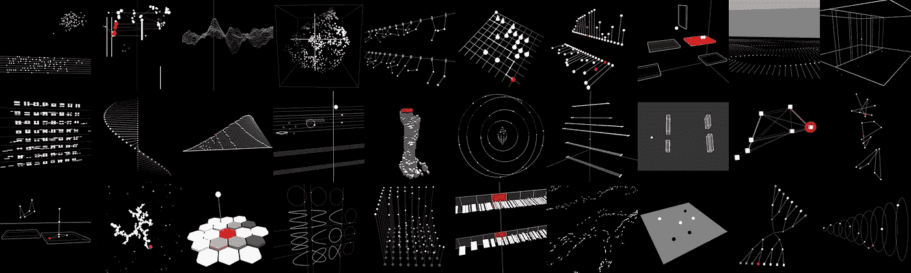
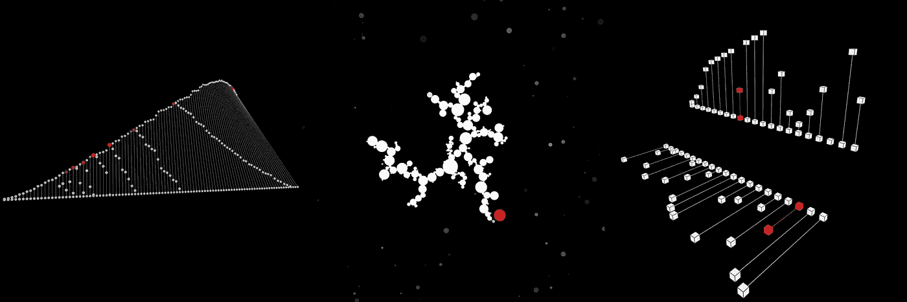
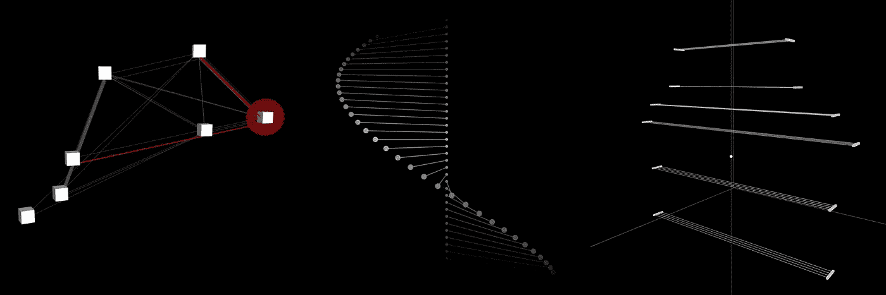
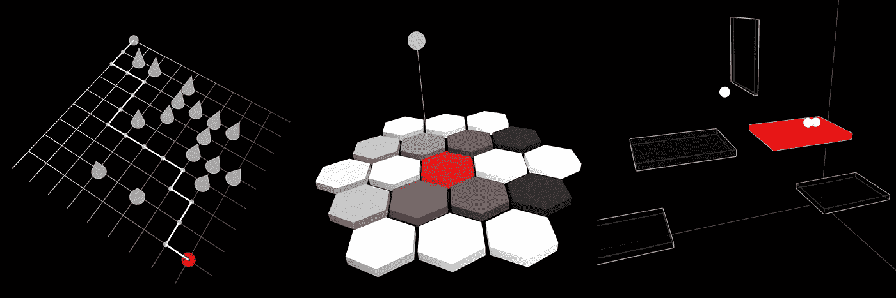

# 30 天的编码练习

> 原文：<https://medium.datadriveninvestor.com/30-days-of-coding-practice-3004d51a02e7?source=collection_archive---------9----------------------->

这篇文章简要总结了我在一个月的时间里每天编写一个小的视听小品所学到的东西。

# 动机

我提到的这些草图是日常编码实践的结果，称为“Hackpact”。Hackpact 本身源于音乐人的现场编码活动，但近年来已经扩展到不同的方向。你可以在艺术史中找到一些先驱，特别是在基于教学和算法的艺术领域。此外，还有一些艺术家、技术专家和爱好者参与了这种形式的开发。

最初，[弗雷德里克·奥洛夫松](https://www.fredrikolofsson.com/f0blog/?q=node/490)和 Click Nilson 发起了“契约”的想法，他们在这里分享[现场编码练习](https://toplap.org/)和彼此之间的音乐想法。很快，越来越多的现场程序员延续了这一传统，包括加博·帕普、亚历克斯·麦克莱恩和丹尼尔·琼斯。最近，在一段时间内每天编码的想法引起了更广泛受众的兴趣。

[code 11 月](http://codevember.xyz/)基本上对于前端开发人员来说是一个挑战，而 [100 天的代码](https://www.100daysofcode.com/)对于一个更大的编码社区来说是一个更长的挑战。我在 [XORXOR](https://xorxor.hu/) 的朋友也完成了几次[挑战](https://xorxor.hu/projects/research/codevember_2016.html)。当时在伦敦，戴夫·格里菲斯和亚历克斯向我介绍了(视听)现场编码领域，他们也开发了自己的工具来创建实时艺术，包括基于 lisp 的伟大的 [Fluxus](http://www.pawfal.org/fluxus/) 环境，时髦的游戏引擎 [Al Jazari](http://www.pawfal.org/dave/blog/2013/02/al-jazari-2-minecraft-meets-fluxus/) ，或者最近的 [Tidal Cycles](https://tidalcycles.org/) 现场编码环境。托尔·马格努松的 IXI 软件也是制作视觉音乐和现场编码的灵感源泉。

也有来自其他非音乐领域的艺术家。例如，[扎克·利伯曼](http://thesystemis.com/)，一位来自布鲁克林的艺术家，创意编码工具 [OpenFrameworks](https://openframeworks.cc/) 的开发者之一，多年来一直在制作他的日常草图，他还就他的实验[这里](https://medium.com/@zachlieberman/daily-sketches-2016-28586d8f008e)和[这里](https://medium.com/@zachlieberman/daily-sketches-in-2017-1b4234b0615d)写了很棒的文章和总结。

# 显示

这个过程是关于

*   *努力寻找自己的声音*(包括灵感、兴趣、方法、形式、视觉语言、声音合成等。)
*   *逃离舒适区*:在空间(3d)而不是 2d 画布中思考。这是使用透明的、当前基于 web 的技术完成的，如 WebGL、WebAudio & ES6 调试和构建环境。
*   *问题框架*而不是问题解决(后面会详细介绍)
*   *可塑性*:声音应该总是影响图形和/或反之亦然

我想让事情变得简单，所以我用了一些方便的框架来画草图: [p5js](https://p5js.org/) ， [tonejs](https://tonejs.github.io/) 和 [webpack](https://webpack.js.org/) 。由于 hackpact 的最初目标是实践和知识转移，因此共享可以由任何人随意重用的源代码是至关重要的。想法比技术解决方案更重要，所以任何人都应该提出自己的想法，并使用现有的技术方法来实现它们。想法是不断变化的，它们不是凭空而来的。我们显然站在巨人的肩膀上。因此，整个过程的最后一个也是最重要的方面是突出任何灵感:说出影响作品的来源和影响。这对于合理的知识共享至关重要。

# 我学到的东西

虽然看起来很明显，但每一天都不同。有一天很难继续，有一天会更容易。简单有助于你在艰难的日子里保持正轨，在轻松的日子里专注于这个想法。所以，简单，首先。

关于焦点，与扎克的日常素描相比，我认为我对流动有不同类型的兴趣。虽然他关注的是迭代而不是新想法(作为无意识探索的工具，这很棒)，但我的方法更多的是关于'*问题框架'*。这种兴趣与解决问题相反:虽然可计算算法和传统设计思维是关于(创造性的)解决问题，但我认为人类创造力的未来(尤其是与人工思维机器融合时)在于创造性的“问题框架”。找到需要覆盖的区域。找出困难的地方。就我而言:找到你真正的兴趣。

通过这些实验，我的目标是找出什么类型的想法对我来说是重要的，并且仍然可以符合我的限制。当一个人需要创造力时，限制是强有力的帮手。

毕竟，在我看来，主要有三个方向引起了我的兴趣。

# 1.算法和自然过程的声音

Sonificating Algorithms: Prime Number Distribution (left), Diffusion Limited Aggregation (middle), Bubble & Linear Sorting (right)

一个真正有趣的计算领域是理解算法。几十年前，人们确实在听它们。计算机科学家可以通过听机器的声音来判断一个过程是否运行良好。当然，今天的计算机要快得多，人类的耳朵听不到潜在的过程。所以，事实证明，发音算法是一个特殊的领域，时间必须减慢，以便让算法在一个听得见的范围内折叠。这个话题可以是一个很好的开始来讨论常规例程的速度、节奏和周期，今天的算法实践，突出奇怪的和半合法的活动，例如[高频交易](https://en.wikipedia.org/wiki/High-frequency_trading)。

在制作这些草图的过程中，我们发现这些人工的、二进制的数字算法与我们在自然界中发现的模式非常相似。[细胞自动机](http://mathworld.wolfram.com/CellularAutomaton.html)、[自然排序算法](https://twitter.com/MrPrudence/status/1069643452877586437)和其他抽象的自然数据过程是非常有趣的玩法。关于这条道路，丹·希夫曼的代码的[本质是一个典型的参考。此外，Paul Prudence 的](https://natureofcode.com/)[数据就是自然](http://www.dataisnature.com/)在处理这些话题时，是一个高度密集的灵感来源。

# 2.视觉符号

Visual notations: Realtime trainable Markov Chain (left), Shepard Tone (middle), Hungarian Folk Song (right)

笼子、机会操作和不同的 T2 符号是当今实时数字艺术实践的先驱。一幅可以转换成声音的图画，一个可以添加到符号中的事件，一个可以基于几个基于文本的指令重复和展开的图案都参与到这个游戏中。随意的构图、随机的人工制品、留下艺术决定的意愿，都是 20 世纪艺术运动留下的伟大遗产的例子。一方面，它们是一个可能世界的指示器，在这个世界中，非人的、陌生的或外星的公司和智能正在塑造人类、植物、真菌或动物之间的创造力流动。

另一方面，视觉音乐符号不仅仅是图形美，它们也是功能性的，它们必须被解释和实现，就像简单的计算机代码一样。

# 3.玩游戏

Game-like environments: Path finding (left), Hexagonal music interface (middle), Gravity as musician (right)

如果你读过伊恩·博格斯特的[“玩任何东西”](http://bogost.com/books/play-anything/)，毫无疑问，如果规则设置得当，简单的石头也可以成为复杂的游乐场。玩耍是让事物运动的自然需要，玩耍是我们与现实互动和实验的方法。棋盘游戏是对更复杂宇宙的模拟。博弈是最终的抽象层，有无限复杂的规则、方法、战术和求解机制。游戏既有挑战性又令人愉快，成年人喜欢忘记他们在我们日常生活中的角色的重要性。

我喜欢把今天音乐的文化背景看作(有意义的和智能的)游戏环境的背景。声音和当代音乐需要观众的积极参与，探索和表达他们自己和他们的兴趣的意愿。游戏的认知和心理方面是非常有趣的领域，需要进一步的研究和实验。新的乐器、电脑游戏、抽象和沉浸式环境也是需要从社会文化和心理两方面进行深入调查的领域。

*所有草图都是实时的&可以在* [*代码库中试用*](https://stc.github.io/HackPact/) *(请注意，它们是不完整的粗糙网络应用，每个都是在几个小时内制作的，因此它们没有针对手机、智能门铃或其他花哨的物联网设备进行优化)*