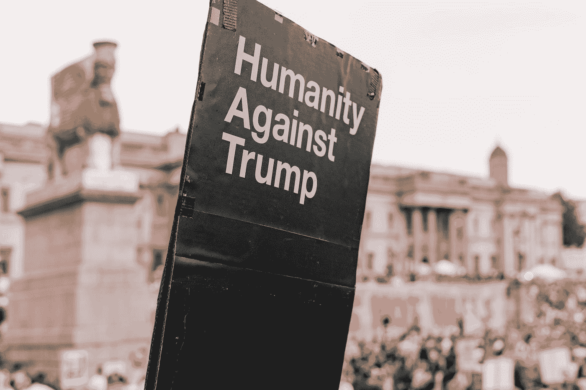
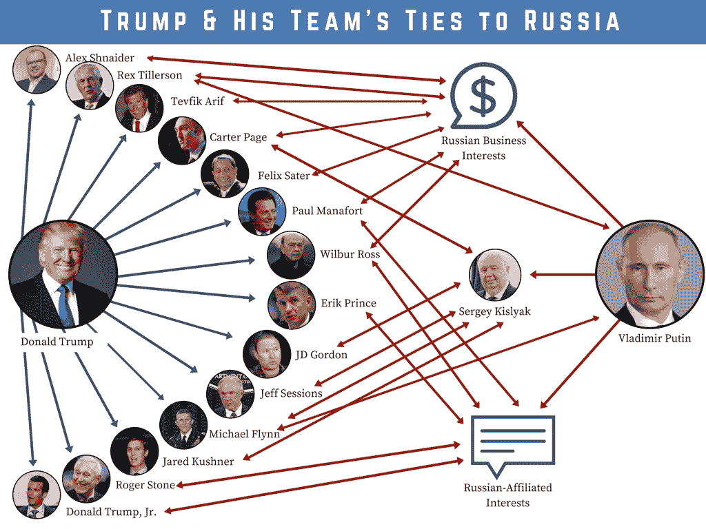

# 特朗普不适合当总统的 36 个理由

> 原文：<https://medium.datadriveninvestor.com/36-reasons-trump-is-not-fit-to-be-president-bf151aadd0d0?source=collection_archive---------0----------------------->

希望这份名单能够说服一些犹豫不决的人，并引起一些特朗普支持者的思考。

Photo by [M. B. M.](https://unsplash.com/@m_b_m?utm_source=medium&utm_medium=referral) on [Unsplash](https://unsplash.com?utm_source=medium&utm_medium=referral)

It 不可能把一个通情达理的人不会支持川普的所有理由都集合起来。原因实在太多了。为了保持一个浓缩的短篇小说而不是一本书，我将尽可能简短地陈述这些理由。也许其他的故事会更深入地讲述这些缺陷。

内特·怀特在 Quora 上说得好:“如果弗兰肯斯坦决定制造一个完全由人类缺陷组装而成的怪物——他会制造一个特朗普。”怀特先生的声明全文可以在*博客*的[链接](https://obliviots.net/2019/02/15/why-do-british-people-not-like-donald-trump/)找到。

 [## 保护主义、政治和经济动荡|数据驱动的投资者

### 美国股市昨日出现 400 多点的大幅反转，为未来的事情发出了警告信号。市场…

www.datadriveninvestor.com](https://www.datadriveninvestor.com/2018/06/28/protectionism-politics-economic-turmoil/) 

# 特朗普的反美行动

1.  罗伯特·穆勒被任命为特别顾问，负责调查俄罗斯对 2016 年大选的干预，以及俄罗斯政府与特朗普竞选团队之间的联系。罗德罗森斯坦写的实际订单可以在[这里](https://upload.wikimedia.org/wikipedia/commons/7/73/Appointment_of_Special_Counsel_to_Investigate_Russian_Interference_with_the_2016_Presidential_Election_and_Related_Matters.pdf)找到。

关于穆勒调查的更多信息，包括下面的引用，可以在维基百科的这篇文章中找到。

> 报告写道，调查“发现了俄罗斯政府与特朗普竞选团队之间的许多联系”，发现俄罗斯“认为自己将从特朗普当选总统中受益”，2016 年特朗普总统竞选团队“预计自己将从俄罗斯黑客行动中受益”。然而，最终“调查没有确定特朗普竞选团队的成员在选举干预活动中与俄罗斯政府合谋或协调”。由于加密、删除或未保存的通信以及虚假、不完整或被拒绝的证词，证据不一定完整。

该报告进一步指出了特朗普妨碍司法公正的几起事件，但这些事件不能被起诉，因为特朗普是总统。如果调查能证明他无罪，特朗普为什么要阻挠调查？显然，有特朗普不想让特别顾问发现的信息。如果特别顾问能够获得所有信息，很可能会有确凿的证据显示特朗普与俄罗斯政府协调，成为美国总统。让最后那句话真正深入人心。这种情况已经持续了很长时间，以至于我们中的许多人已经对这个发人深省的事实麻木了。

**2。特朗普在竞选期间受益于与外国政府的商业利益，并在竞选期间感谢外国政府。请看[为什么一座未建成的莫斯科特朗普大厦引起了穆勒的注意](https://www.reuters.com/article/us-usa-trump-russia-tower-explainer/why-an-unbuilt-moscow-trump-tower-caught-muellers-attention-idUSKCN1QZ159)来自*路透社*和[特朗普顾问在 2016 年将能源演讲草稿交给阿联酋编辑](https://theweek.com/speedreads/855703/trump-adviser-2016-gave-draft-energy-speech-uae-edits)来自*那周*。当选后，特朗普从外国政要和入住他的酒店中获利。**

**3。特朗普不断攻击我们的自由媒体。他为什么这么做？据莱斯利·斯塔尔(Leslie Stahl)称，特朗普告诉她，他攻击媒体是为了“贬低你，诋毁你，这样就没有人会相信关于我的负面报道。”见[川普总统告诉莱斯利·斯塔尔，他抨击媒体“贬低你，诋毁你……没人会相信”美国消费者新闻与商业频道网站上关于他的负面报道](https://www.cnbc.com/2018/05/22/trump-told-lesley-stahl-he-bashes-press-to-discredit-negative-stories.html)。换句话说，特朗普有很多事情要隐瞒，所以他试图在媒体报道关于他的新负面故事之前抹黑媒体。**

**4。特朗普只雇佣最优秀的人。**这些“最优秀的人”包括他的私人律师迈克尔·科恩(现已入狱)、他的竞选经理保罗·马纳福特(现已入狱)、他的第一任国家安全顾问迈克尔·弗林(有罪，等待宣判)。在家庭暴力方面，有以下前白宫工作人员，罗伯·波特，大卫·索伦森，史蒂夫·班农，以及内阁提名人和“代理”内阁成员安德鲁·普兹纳和帕特里克·沙纳汉。我们不要忘记，特朗普的第一任妻子指控他强奸。参见 [Patrick Shanahan 在 Trump White House](https://www.thecut.com/2019/06/patrick-shanahan-wouldve-fit-right-in-the-trump-white-house-domestic-violence.html) 来自 *The New Yorker* 。

特朗普还被 E. Jean Carroll 指控犯有强奸罪。见[作家 E. Jean Carroll 指控特朗普强奸。为什么我们如此不愿意谈论它？](https://www.usatoday.com/story/news/nation/2019/06/24/trump-rape-accusation-e-jean-carroll-new-book/1550441001/)来自*今日美国。*差点忘了提特朗普性侵案的其他 23 名指控者。当然，还有所有与俄罗斯有联系的人，正如国会议员埃里克·斯瓦尔韦尔网站上的这张图片所示:

在议员 Swalwell 的网站上看到这个故事。

不受欢迎的人的名单很长，这些只是其中的几个。我有特朗普白宫人力资源部门在[这个链接](https://youtu.be/bcokL59jeqU)进行工作面试的独家视频。我建议每个人都看那个视频。这是我在这个严肃而悲伤的故事中的一次喜剧性尝试。

**5。特朗普在竞选期间表示，一旦“例行审计”结束，他将公布自己的纳税申报单。当选后，他说他不会公布他的纳税申报单。**由于可信的洗钱嫌疑和未披露的俄罗斯关系，民主党领导的国会正在寻求这些回报，特朗普正在利用他的武器库中的一切工具阻止这些回报的发布。特朗普在隐瞒什么？

**6。特朗普有“骨刺”。**特朗普的父亲似乎让一位足科医生朋友诊断唐纳德患有骨刺，这样特朗普就可以避免征兵。特朗普喜欢扮演硬汉的角色，但在为自己的国家服务时，他的“强硬”无处可寻。见[足病医生的女儿在*今日美国上说骨刺诊断帮助川普避免了越战征兵是“有利的”*](https://www.usatoday.com/story/news/politics/onpolitics/2018/12/27/trump-vietnam-war-bone-spur-diagnosis/2420475002/)。

**7。特朗普喜欢侮辱美国英雄约翰·麦凯恩**。特朗普说他不喜欢被抓的人；他们不是英雄。他说这话的时候是在特朗普竞选的早期。这是让我想起道格拉斯·麦克阿瑟的两件事情中的第一件。麦克阿瑟不想让温赖特将军接受荣誉勋章，因为温赖特已经被俘。这是特朗普智力低下的绝佳例子。虽然特朗普想效仿美国历史上的一位伟大将军，但他没有分析能力。温赖特将军带着一支军队投降了。约翰·麦凯恩在敌后被击落，落在一个湖里，被村民拉出来打成肉酱。麦凯恩没有能力决定他是否投降。温赖特确实有能力投降或不投降。我会注意到麦克阿瑟将军后来改变了主意，并支持温赖特将军被授予勋章。

另一个试图效仿麦克阿瑟的例子是麦克阿瑟愿意在朝鲜使用核武器。参见维基百科上的这篇文章，讨论了麦克阿瑟对使用核武器的兴趣。2016 年，在一次外交政策简报会上，特朗普反复询问为什么美国不能使用核武器。见[以下是唐纳德·特朗普在*时代杂志上关于核武器的言论。*](https://time.com/4437089/donald-trump-nuclear-weapons-nukes/)

道格拉斯·麦克阿瑟是一位非常聪明的将军。他绝不会像特朗普对麦凯恩那样，发表贬低一名在敌后被击落的飞行员的言论。如果麦克阿瑟在 2019 年活着，我无法想象他会在我们目前拥有关于这些武器的信息的情况下考虑使用核武器——这些信息在朝鲜战争期间我们没有。当特朗普试图效仿麦克阿瑟这样的伟人时，他只是一个无知的小丑。

最后，麦凯恩是一个英雄。他本可以早点出狱，但却选择了不放。麦凯恩忠于他的战友。这样的忠诚和勇敢是川普永远无法理解的。特朗普宁愿依靠他的‘骨刺’。

**8。特朗普更喜欢像普京这样的独裁者的话，而不是正在努力保护我们国家的美国情报机构。此外，特朗普宁愿相信沙特王储穆罕默德·本·萨蒙的话，而不是我们的情报部门关于美国居民和《华盛顿邮报》雇员贾迈勒·哈肖吉(Jamal Khashoggi)的骨锯之死。**

# 特朗普无能

**9。特朗普完全没有能力管理或领导人们**。他既不能让人们为他工作，也不能留住员工。特朗普内阁就是一个例子。特朗普已经有 9 名内阁成员离职。在里根、老布什、克林顿、小布什和奥巴马的第一任期内，内阁更替率分别为 6、8、4、2、3。特朗普的第一个任期还有大约 18 个月，他已经有 9 名内阁成员离职。请看[这篇来自布鲁金斯学会的关于川普政府内部人员变动的报道](https://www.brookings.edu/research/tracking-turnover-in-the-trump-administration/)。为了减缓内阁成员的正式更替，特朗普已经诉诸于“代理”内阁成员。很难说特朗普身边有多少办公室在“行动”，因为局势一直在变化。特朗普的顾问们不尊重他。想想有报道称雷克斯·蒂勒森称总统为“白痴”这似乎是一个合乎逻辑的观察。参见[“白痴”、“笨蛋”、“低能儿”:特朗普的助手如何侮辱来自*政治*的老板](https://www.politico.com/story/2018/09/04/trumps-insults-idiot-woodward-806455)，了解特朗普的员工对他们老板的“尊重”。有没有为他工作的人不嘲笑他？

10。特朗普不知道一些日常政治术语是什么意思。一个如此无知的人怎么会知道如何管理一个国家。这就好比一个出租车司机不知道汽车方向盘在哪里。特朗普对西式自由主义的理解见本文:[特朗普认为普京对‘西式自由主义’的攻击是关于加州](http://nymag.com/intelligencer/2019/06/trump-thinks-western-style-liberalism-is-about-california.html)来自 *New York Magazine* 。参见这篇文章，了解特朗普对这个术语的理解，[一如既往的沉默寡言的特朗普认为，巴士是关于运输的](https://www.rollingstone.com/politics/politics-news/trump-busing-853745/)来自*滚石*。

# 特朗普的政策无助于美国或其盟友

**11。特朗普让美国退出巴黎协定**。关于这个还有什么需要说的吗？

**12。特朗普对美国石油天然气行业与俄罗斯竞争的吹捧表明，特朗普对经济学一无所知。特朗普实际上是这么说的，‘俄罗斯不喜欢我正在做的事情，因为我正在扩大美国的石油&天然气行业。俄罗斯不喜欢这样，因为我正在创造更多的供应，从而给价格带来下行压力。俄罗斯经济需要高油价才能运转。在一个单一变量的世界里，这是有意义的。然而，你运气不好，总统先生，你应该在经济学 101 的第二天做笔记。普京确实想要更高的能源价格，但他意识到“需求”也是等式的一部分。如果创造世界上最大需求的国家，美国，通过放弃化石燃料来减少需求，俄罗斯的石油和天然气收入将会减少更多。石油输出国组织和俄国的目标是从他们能开采的最后一桶石油中获得最高的美元价值。就像快克经销商一样，这些国家想让美国继续沉迷于石油。为了让美国上瘾，这些国家将承受一些短期损失。短期内扩大美国生产是让美国上瘾的一种方式。当然，这些国家也不想加入巴黎协定。他们签署了协议，并保持良好的公共关系。通过将美国排除在巴黎协定之外，这给了这些国家一些借口，可以不那么严肃地对待该协定。**

13。特朗普单方面破坏伊朗核条约。伊朗履行了自己的承诺。伊朗远非完美，当然也不是美国的盟友，但它遵守了这一协议。如果你站在什叶派伊朗政权的立场上，你就会明白他们为什么想要核武器。在过去十年的大部分时间里，美国军队驻扎在邻国伊拉克和阿富汗，逊尼派核大国巴基斯坦位于另一个边界，而好战的沙特阿拉伯就在海湾对面，人们可以看到一个国家会多么想要核武器。我要指出的是，伊朗的石油重返世界市场(更大的供应)确实在一段时间内降低了汽油价格。

**14。特朗普的外交政策让我们的盟友一直处于困惑状态**。这家伙是想留在北约还是离开？这个家伙真的想对欧洲人、日本人、韩国人、墨西哥人和加拿大人征收关税吗？难道他不明白我们两国之间的互利贸易关系吗？美国不需要任何盟友吗？特朗普让我们完全不受我们的盟友的尊重，他们认为我们选举了一个白痴。我们的敌人不仅相信我们选了一个白痴，他们还知道我们选了一个白痴。中国人和俄罗斯人喜欢特朗普。朝鲜人认为特朗普是个白痴。他们甚至有胆量把一名被打得半死的美国人质送回家。这种事在奥巴马、老布什 43、克林顿、老布什 41、里根、卡特治下都没有发生过。但是，当然，特朗普爱上了这位朝鲜领导人。他们是笔友。

**15。特朗普要禁止穆斯林**。关于这件事有什么需要说的吗？显然，根据第一修正案，一个宗教的成员不应该仅仅因为他们信奉他们的宗教而受到歧视。特朗普决定禁止来自少数穆斯林占多数的国家的移民。那是无法通过法庭的。于是特朗普修改了名单，把朝鲜和委内瑞拉加了进去。我们有很多来自朝鲜或委内瑞拉的移民吗？现在有大批人离开委内瑞拉，但是他们会来这里吗？基督徒应该做的似乎是帮助来自委内瑞拉和利比亚、也门和叙利亚战区的难民。来自这些国家的 99%的难民不会有成为恐怖分子的危险。剩下的 1%可能会被排除在外，不允许进入这个国家。美国人似乎比那些试图逃离战争恐怖的人更有可能遭受欧洲裔白人男性的恐怖袭击。我国绝大多数大屠杀者的种族是什么？

16。特朗普与小杰里·福尔韦尔串通一气，企图“特朗普化”基督教。点击此链接查看[《我的故事》](https://medium.com/swlh/in-my-study-of-the-right-wing-cult-of-trump-i-came-across-a-movie-called-the-trump-prophecy-54623c90bda0),了解更多关于川普及其支持者的罪行。

**17。特朗普签署了一项税收改革法案，创造了又一次财富从穷人和中产阶级向最富有的美国人的转移。因此，美国没有足够的税收来资助许多主要惠及穷人和中产阶级的项目。雪上加霜的是，特朗普以关税的形式提高了税收，对中产阶级造成了不成比例的影响。**

18。凭借减税形式的巨额支出，特朗普带领美国重返创纪录的赤字。陷入更深的债务来刺激一个不需要刺激的经济对经济没有好处。我们的经济还能承受多少还有待观察。

# 特朗普不知道如何像正常人一样行事

**19。从特朗普宣布竞选总统的那一刻起，他就一直在攻击拉美裔移民**。他称墨西哥人为杀人犯、强奸犯等。当特朗普宣布参选时，非法移民人数处于多年来的最低水平。自特朗普上任以来，非法越境增加了一倍多。特朗普想要建造一堵荒谬的墙，这将毫无用处。特朗普实施了一项非常残酷的政策，原因无非是为了刺激他的基础。在特朗普发表了关于拉丁美洲人的评论后，人们称他为种族主义者有什么奇怪的吗？

**20。特朗普在推特上发布了他对伊莱贾·卡明斯的房子被闯入的喜悦。这是在对巴尔的摩的卡明斯选区以及卡明斯本人进行了一周的有辱人格的评论之后。特朗普为什么生气？因为卡明斯在履行他作为众议院监督委员会主席的职责。**

**21。特朗普是种族主义者**。见上文第 19 项。在 YouTube 上的这段视频中，你可以看到特朗普在他的集会上享受“送她回来”的口号。特朗普是种族主义者的英雄。如果种族主义者认为他是种族主义者，那么他就是种族主义者。也许这一项应该列入反美部分。

**22。据特朗普自己承认，他喜欢从事性侵犯**。在 YouTube 上看 CNN 的这个视频。唐纳德·特朗普被 23-24 名女性指控性侵犯和/或强奸。他的第一任妻子指控他强奸。

**23。由于唐纳德·特朗普不能像他喜欢吹牛那样轻易得到女人，他喜欢和色情明星发生婚外情**。他后来付钱给这些女人，让她们不要把这件事泄露出去。听起来像是对卖淫指控的有力辩护。警官，我不是付钱让她上床，而是付钱让她保持沉默。一个人在妻子在家怀孕的时候吹嘘自己有外遇，大家应该怎么看待这个人的性格？

**24。特朗普保持的公司说了很多关于他的事情。**在美国国家广播公司在 YouTube 上的视频中，唐纳德似乎和杰弗里·爱泼斯坦是非常好的朋友。杰弗里·爱泼斯坦是 Mar-A-Lago 的常客。一家以性工作者闻名的连锁按摩店的老板也是 Mar-A-Lago 的成员。那个店主几年前卖掉了这些店。同样的店铺也因贩卖人口而遭到搜查。另一名 Mar-A-Lago 成员 Bob Kraft 也在其中一家按摩院被捕。见[纽约时报*的按摩院老板和 Mar-a-Lago*](https://www.nytimes.com/2019/03/11/opinion/cindy-yang-trump-corruption.html) 了解更多。这是个什么样的地方？根据一个人交的朋友来判断一个人并不总是准确的，但在唐纳德·特朗普的案例中，这一点似乎非常准确。

**25。唐纳德·特朗普被称为自恋者。这种疾病是以希腊悲剧中的一个人物命名的，他爱上了自己的倒影。我不知道这对特朗普来说是否正确，但我相信许多专家会用这个词来描述特朗普。至于我，我看到一个非常清楚自己是个彻头彻尾的骗子的人。他知道自己从未真正取得过任何成就。他在自己周围建立了这个大的形象，但是他知道他永远也不可能真正实现这个形象。他非常不自信人们会发现他实际上有多渺小。这让特朗普非常焦虑。对特朗普来说，避免暴露自己的实际弱点始终是一场与自我的斗争。他知道自己不适合当总统，因此他现在比以往任何时候都更焦虑。情报机构和媒体总是紧追不舍，这一事实快把他逼疯了。对特朗普来说不幸的是，他很快就会意识到，他永远不会有任何解脱。即使给我世界上所有的钱，我也不会和特朗普交换位置。**

**26。特朗普是骗子**。截至 2019 年 6 月 7 日，特朗普已经说了 10796 个谎言。参见[川普总统在 869 天内](https://www.washingtonpost.com/politics/2019/06/10/president-trump-has-made-false-or-misleading-claims-over-days/)从*华盛顿邮报发表了 10796 次虚假或误导性的声明。特朗普的奇怪之处在于，他在不需要的时候撒谎。他只是为了撒谎而撒谎。如果这个人真的说了实话，他似乎会突然融化。特朗普是否已经撒了太多谎，以至于不再分清楚现实和幻想？这是你想要的总统吗？*

27。特朗普声称自己是白手起家的亿万富翁。自制的部分显然不真实。我们不知道他是不是亿万富翁。也许如果我们看到他的纳税申报单，我们就会有主意了。20 世纪 80 年代初，特朗普谎称自己是亿万富翁，试图跻身福布斯 400 强。参见[特朗普据称谎报了自己的财富，以便在 20 世纪 80 年代登上《财富》杂志*的*](https://fortune.com/2018/04/20/trump-lied-wealth-forbes-400-list/)福布斯 400 强榜单。

28。特朗普抱怨说，奥巴马总统在旅行上花了太多纳税人的钱，休假太多，但特朗普花费更多，休假更多。奥巴马总统每年都去他长大的夏威夷过圣诞节。八年来，奥巴马的旅行花费了纳税人 1 . 05 亿美元。特朗普仅在前两年就花费了纳税人 1.1 亿美元。参见[特朗普高尔夫花费高达 1.1 亿美元——超过《赫芬顿邮报》对奥巴马全部行程的估计。特朗普前往他的高尔夫俱乐部，这些俱乐部位于难以保护的地区，而不是利用戴维营。特朗普的俱乐部和酒店向特勤局收取他们使用的房间的费用，因此，纳税人支付特朗普本人，为特朗普的安全提供一个住宿的地方，以便他们可以保护特朗普。参见](https://www.huffpost.com/entry/trump-obama-golf_n_5d45c72de4b0acb57fcd4eb8?guccounter=1&guce_referrer=aHR0cHM6Ly93d3cuZ29vZ2xlLmNvbS8&guce_referrer_sig=AQAAAMakS-uVGj2OhAPp0xFkMhDH0aEq5mr51yhmsC7_EZ_3td3Uba0Tz8HpUVZs4QBAio_oHR4572-KW925fKQYDwkRDSoNQ5PQO9Ghn45ka_2-pW8UtUW84SD28echZpffYUZWEDkL56aGyHVX89zxf0jC0Zd3-9cX6Mz2liHFUm6M)[政府监察机构:川普从 NPR 到佛罗里达州的旅行花费了纳税人数百万](https://www.npr.org/2019/02/05/691684859/government-watchdog-trumps-trips-to-florida-costing-taxpayers-millions)。怎么会有人认为他们应该有这样的权利呢？

**29。特朗普以在推特上侮辱人为乐**。很多时候，这些人是努力工作的美国人，试图保护美国免受特朗普的伤害。你知道，像约翰·麦凯恩和罗伯特·穆勒这样的人。

**30。特朗普喜欢揍非公众人物**。他是个恶霸。想想[在伊战中阵亡的胡马云汗上尉的父母](https://en.wikipedia.org/wiki/Khizr_and_Ghazala_Khan)。特朗普无缘无故地侮辱这些人。特朗普本该做的是向一个为保护我们的国家而牺牲的家庭表示敬意。我想这种对美国的忠诚是特朗普无法理解的，因为他的家人没有向军队承诺任何人。或许骨刺在特朗普家族中流传。

31。川普在含蓄地宣扬 [**Q-Anon**](https://en.wikipedia.org/wiki/QAnon) 的消息。这位总统不仅拒绝反驳阴谋论，还宣扬阴谋论。只需在谷歌上查询特朗普推广这个群体的许多例子:“特朗普推广 Q-Anon 消息。”有太多的链接要提及，保持这个项目简短。特朗普宣扬这种愚蠢，尽管他有过与他的追随者一起宣传“[披萨门阴谋](https://en.wikipedia.org/wiki/Pizzagate_conspiracy_theory)”的经历，该阴谋导致一名男子在华盛顿特区的一家披萨店开枪。由于特朗普喜欢将自己的缺点投射到他的对手身上，人们不得不怀疑他对 Q-Anon 的支持对他自己意味着什么。

**32。特朗普没有幽默感**。你知道，当一个人不能自嘲的时候，他是非常没有安全感的。我不记得还有哪位总统不参加白宫记者的晚宴。我不记得有哪位总统批评过周六夜现场的讽刺小品。这种不安全感是心理问题的证据，应该取消一个人当美国总统的资格。我们不需要头脑发热的人来掌管核密码。

33。特朗普俗气。看[那是谁的风格？路易十四还是唐纳德·特朗普？在*博客上给新总裁*](https://www.curbly.com/trump-is-a-living-mcmansion)的室内设计指南。特朗普很自豪能住在一套看起来像贝弗利乡巴佬会住的公寓里。特朗普认为是 1419 年，而不是 2019 年吗？看起来他是一个刚刚赢得强力球彩票的无家可归者。这个人对黄金有一种不健康的迷恋。特朗普显然不是“老钱”。弗兰·勒波维茨很好地描述了川普，她说:

> “唐纳德·特朗普是穷人心目中的富人。”这是一个非常简单的系统，真的:黄金=丰富。专栏=有钱，因为银行有专栏。吊灯=富有，因为它们又大又闪亮。

34。特朗普不知道如何举止得体。Mar-A-Lago 由 Marjorie Merriweather Post 建造。特朗普需要熟悉另一个“职位”:[艾米丽·波斯特](https://en.wikipedia.org/wiki/Emily_Post)，著名的礼仪专家。或许一点礼仪培训可以帮助特朗普在访问前不犯像侮辱英国王室这样的失礼行为。见[*政治*](https://www.politico.com/story/2019/06/01/trump-meghan-markle-nasty-1349480)英国之行前，川普对梅根汗·马克尔的批评引发了“肮脏”的争论。如果特朗普小时候就学会了举止得体，也许他不会仍然被曼哈顿的“上流社会”所排斥。参见《旧金山纪事报》的*将唐纳德·特朗普归咎于纽约。*

**35。特朗普没有宠物**。这可能是因为特朗普甚至找不到一只会喜欢他的狗。狗会喜欢任何关心它们的人。甚至希特勒也能养狗。另一方面，特朗普可能不喜欢狗。这是不喜欢特朗普的另一个原因。怎么会有人不喜欢狗和/或猫呢？上一次我们的总统没有宠物是什么时候？

36。特朗普操纵意志薄弱的人。在特朗普所有这些糟糕的事情中，有一件事很突出。这是特朗普学会的一种‘绝地心计’。他已经学会了这个技巧，这一事实证明他确实有一定的智力。诀窍是这样的:首先，对每个人都是一个彻头彻尾的混蛋，其次，私下和以前的敌人或任何人交谈，对他们非常友好并表示歉意。这会让这个人觉得自己很特别。这个人认为我一定很特别，因为特朗普对每个人都很糟糕，除了我。就以前的敌人而言，敌人会觉得攻击只是政治运动的一部分。我们已经看到这种行为在本·卡森、特德·克鲁兹、米特罗姆尼和其他人身上奏效。令人震惊的是，那些相信这种行为“改变”的人是多么的意志薄弱。

我对这最后一个缺陷的担忧是:在选举前的几个月里，特朗普将改变他的政策，以试图赢得选举。他的基础不会喜欢它，但他们太投入于“特朗普主义”了，不能在这一点上退缩。那些被他的改变所左右的人会宽容地说，‘看，特朗普正在成为一个好人。’不要被愚弄。底层的人不会有变化。特朗普会尽一切努力继续掌权，因为他知道一旦他离开白宫，很可能会被判入狱。如果特朗普赢得另一场选举，他会立即变回真实的自己，我们将不得不至少再忍受四年漫长的国家噩梦。

# 结论

这个故事是对美国总统的准确描述，描述很恶心。很难不对这位总统的行为视而不见。不要看别处。观看这一切，分析这个人，并根据这个人的行为形成不偏不倚的观点，这是每个美国人的爱国义务。这真的很重要。必须采取措施减少这样一个可怕的人再次当选领导我们国家的机会。

过去，人们一直关注犯罪剧，例如辛普森案件。我没有浪费任何时间去看那个案子，因为那个案子对我影响很小。在唐纳德·j·特朗普这件事上，结果对每个美国人都有影响。我们必须保持警惕。

我渴望有一天，政治节目可以再次充满对政策的理性讨论，这些政策可以使美国成为一个更伟大的国家。我渴望有一天我不再觉得有义务通读无聊透顶的穆勒报告。我渴望有一天，我们不再需要听到“白痴首领”的最新愚蠢推文。

我很抱歉省略了许多可能影响了许多人的不支持特朗普的理由。欢迎你在下面的评论中添加到列表中。清单 36 对任何一个人来说都足够了。

我艰难地读完了这些“特朗普不适合当总统的 36 个理由”。这是一次令人沮丧和可怕的考验。明天，我将不得不休息一下，写一写我的一只猫。一个人只能连续处理这么多令人沮丧的故事，而不需要写至少一个令人振奋的故事。既然我已经完成了这个故事所要求的在“特朗普主义”的粪坑里打滚，我想我要去洗个澡了。