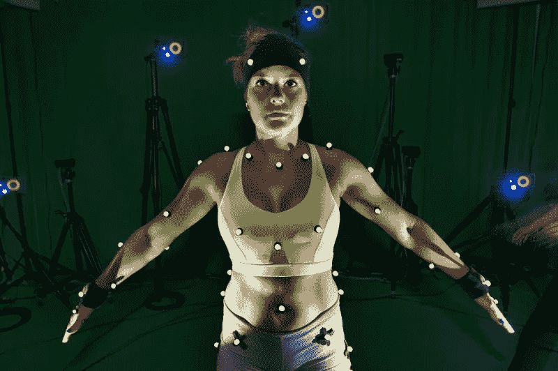
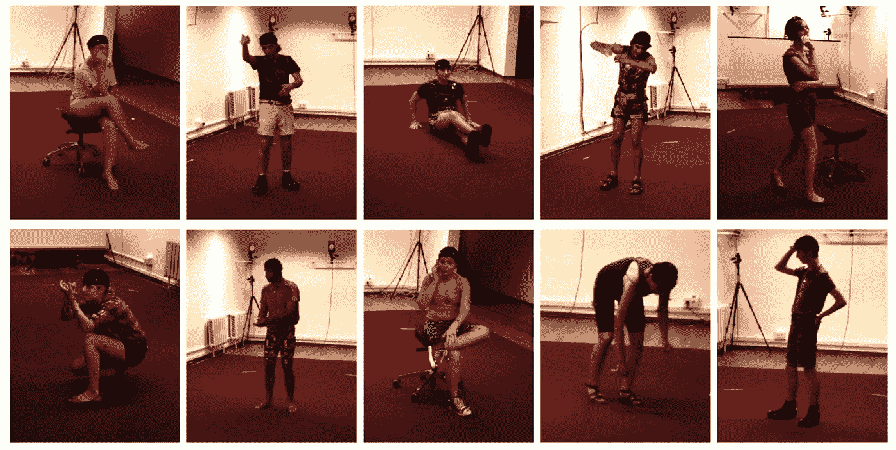
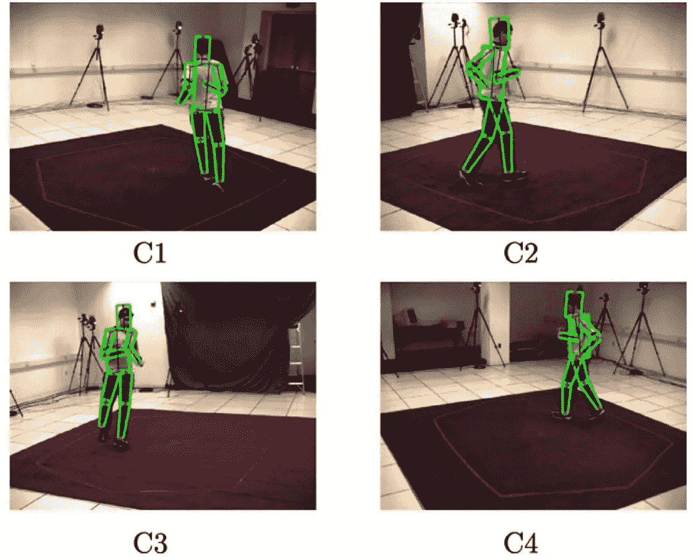
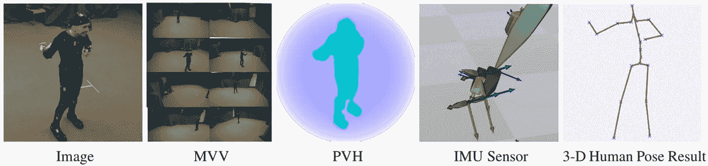
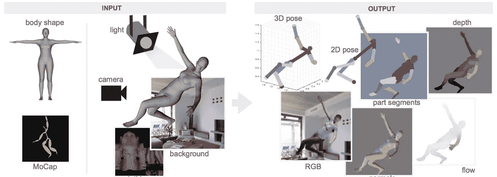
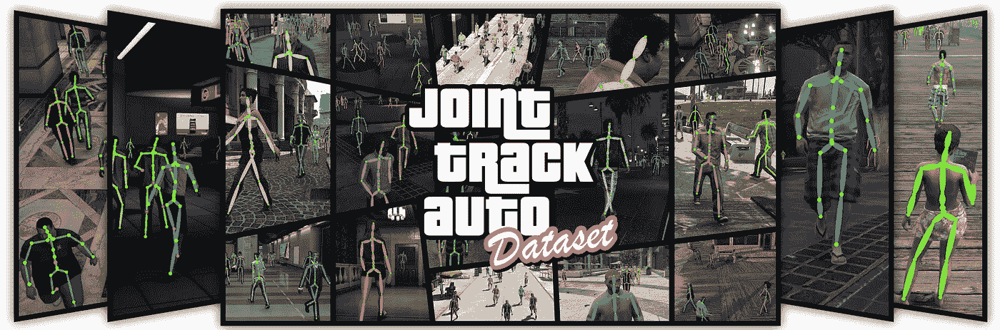
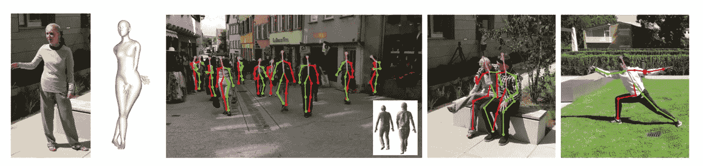

# 3D 姿态估计数据集

> 原文：<https://medium.datadriveninvestor.com/3d-pose-estimation-datasets-cd786e50491?source=collection_archive---------1----------------------->

## 从 2d 图像进行 3d 姿态估计的最新模拟、地面真实和近似标记数据集的概述。

# 概观

2D 姿态估计在过去几年里有了很大的改进，部分是因为注释任何 RGB 视频的便利性带来了大量的数据。3D 姿态注释要困难得多，因为精确的 3D 姿态注释需要在室内人工设置中使用运动捕捉。

*Mocap requires artificial settings and unnatural clothing, as shown in the* [*Max Plank*](https://ps.is.tuebingen.mpg.de/pages/motion-capture) *lab*

地面真实 vicon 数据集可以使用不同的身体形状、背景等用合成姿势来扩充。但是仍然受到原始收集数据的限制。或者，可以使用合成数据集来增加多样性。此外，一些人使用 RGB 相机和辅助测量来估计野外的 3D 姿态。

一些有希望的数据集是[野外 3D 姿势](http://openaccess.thecvf.com/content_ECCV_2018/papers/Timo_von_Marcard_Recovering_Accurate_3D_ECCV_2018_paper.pdf)用于野外姿势， [JTA](https://arxiv.org/pdf/1803.08319.pdf) 用于模拟数据，以及[人类 3.6 米](https://ieeexplore.ieee.org/stamp/stamp.jsp?tp=&arnumber=6682899)和[总捕获](https://cvssp.org/projects/totalcapture/TotalCapture/TrumbleBMVC2017.pdf)用于带有地面真实标签的受控环境。

# 地面真实数据集

这些数据集包括地面实况，包括使用 mocap 的完整 3d 骨架，其具有可忽略的测量误差。局限性在于，mocap 往往只能在受控环境中工作，因此在这些数据集上训练的模型可能难以推广。

或者，合成数据可以基于人类数据生成，如在《超现实》中，或者完全使用游戏引擎合成，如在《JTA》中。两者都允许高质量的注释，但是因为计算机渲染的图形而不是真正的自然图像而受到限制。

## Human3.6m:自然环境中三维人体感知的大规模数据集和预测方法(2014)

这是 3d 姿态估计中的标准。11 个人在室内环境中做 17 个常见姿势的数据集，总共产生了 360 万帧。包括以下测量值:

*   RGB 视图:4 个标准视图，一个深度视图
*   来自 mocap 的精确 3D 关节位置
*   数据子集的像素级身体部位标签
*   演员的 3D 激光扫描(一次完成，不是整个视频)

这个数据集主要包括日常姿势，而不是任何特定的运动。自然场景，但没有具体的运动等。

它们还包括数据集的一些混合现实增强。详情可参见 [Human3.6m:自然环境中 3d 人体感知的大规模数据集和预测方法](https://ieeexplore.ieee.org/stamp/stamp.jsp?tp=&arnumber=6682899)

*Example poses from Human3.6m*

## HumanEva (2009 年)

类似于 3.6m 数据集，但更有限。它实际上由两个数据集组成，HumanEva I 和 HumanEva II，都是在受控的室内环境中。

HumanEva I 数据集包括:

*   RGB 视图:3 个标准视图
*   来自 mocap 的 60 Hz 3D 关节位置

HumanEva II 与此类似，但增加了另一个摄像头，以及多动作场景，包括绕着一个环运行执行动作。

这些数据集有更自然的衣服，但这伴随着移动传感器的成本，以及更不准确的 mocap 数据。详情请见 [HumanEva](http://humaneva.is.tue.mpg.de)

*Examples from HumanEva II*

## 全捕捉:融合视频和惯性传感器的三维人体姿态估计

[总捕获](https://cvssp.org/projects/totalcapture/TotalCapture/TrumbleBMVC2017.pdf)数据集包含室内多视角视频、IMU 和 1.9M 帧的 vicon mocap。非常受限的环境。

该数据集有助于比较使用 IMU 和多视图相机进行的 3d 姿态估计与使用 mocap 进行的地面实况，但同样受到受控环境的限制。

*Different data types contained in Total Capture*

## 向人造人学习(2017)

超现实(真实任务的合成人)数据集包含从运动捕捉数据的 3D 序列渲染的合成生成的数据。原始数据来自 Human3.6M。

这个想法是，你可以随机采样这个人的姿势、外貌、灯光、相机位置和背景，从几个带注释的模型中创建一个大规模的数据集。SMPL 模型用于将身体分解为姿势和形状参数，因此我们可以对这些参数进行独立采样以生成图像。为了生成逼真的形状，他们使用凯撒数据集来训练 SMPL，然后随机选择一名参与者，并稍微扰动形状组件。

一旦从随机的形状和姿态参数中生成了人，就可以对相机、纹理、光线和背景进行采样，以获得完整的场景。细节可以在[向人造人学习](https://arxiv.org/abs/1701.01370)中找到

*Surreal pipeline for generating data*

## JTA 数据集(2018 年)

*GTA V*

从《侠盗猎车手 v》创建的大规模模拟数据集由大约 500，00 0 帧组成，其中近 1，000 万个身体姿势标有完整的 3D 注释。

细节可以在[学习在虚拟世界中检测和跟踪可见和遮挡的身体关节](https://arxiv.org/pdf/1803.08319.pdf)中找到

# 在野外

不使用地面实况 mocap 注释，而是对注释进行估计，以便在野外获得更广泛的各种动作，而不是用 mocap 局限于室内设置。地面实况可以使用辅助测量来估计，例如:

*   惯性测量单元
*   多视角摄像机
*   RGBD 摄像机

## 野外数据集中的 3D 姿态

60 在野生视频与 2D 和 3D 姿势注释，包括相机姿势和不同服装变化的扫描模型。使用 IMU 和手持 2d 视频来估计姿态。这是 wild 数据集中唯一有前途的 3d 姿态。

*Actual in the wild images with 3d poses*

在 TotalCapture 数据集上，这得到 26 毫米的误差，并且优于他们不使用多视图的方法。这是准确性的最佳情况，因为它是在一个受控的环境中，所以我们应该预计这个数据集的误差大于 26 毫米。然而，这对于绝对精度不重要的情况非常有用，我们希望推广到野外。他们论文的更多细节。

## 使用改进的 CNN 监督在野外进行单目 3D 人体姿态估计(2016)

使用多摄像机无标记系统，在绿屏中记录 3D 姿态以改变背景。8 个演员，8 个摄像机，> 1.3 米的画面。这仍然是在一个相对受控的环境中的室内，所以它不是真正的在野外，并且他们的地面真相有多准确可能有一些不确定性。更多信息在他们的[论文](https://arxiv.org/pdf/1611.09813.pdf)

## 团结人民:闭合 3D 和 2D 人体图像之间的回路(2017)

在[United the People](https://arxiv.org/abs/1701.02468)中，他们使用基于 CNN 的 RGB 到 3D 估计，并手动移除一些不良结果，并且没有不确定性估计。他们在 3.6 米的人体模型上测试了他们的模型，平均误差为 80 毫米。这可能是最好的情况错误，所以对大多数应用程序来说没有用。