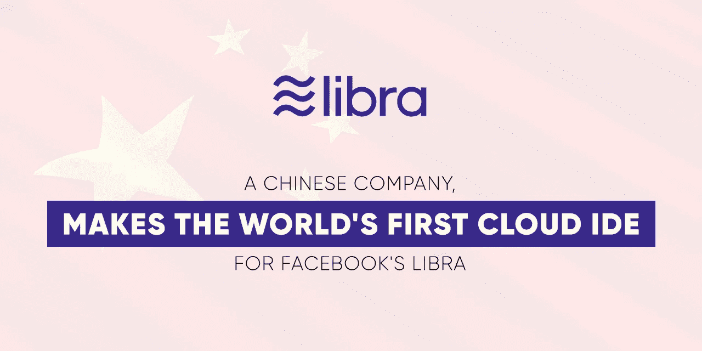
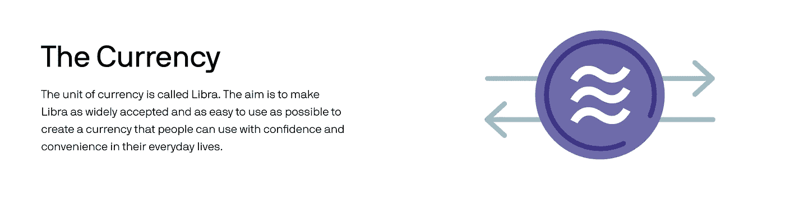
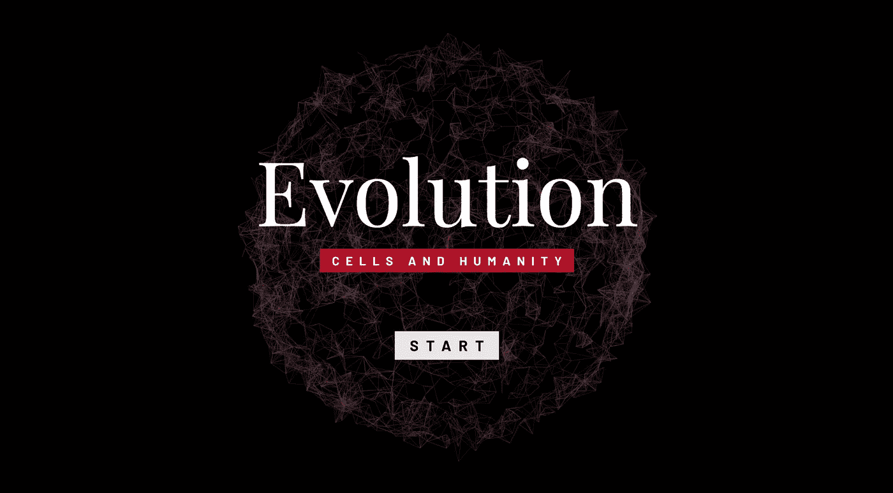
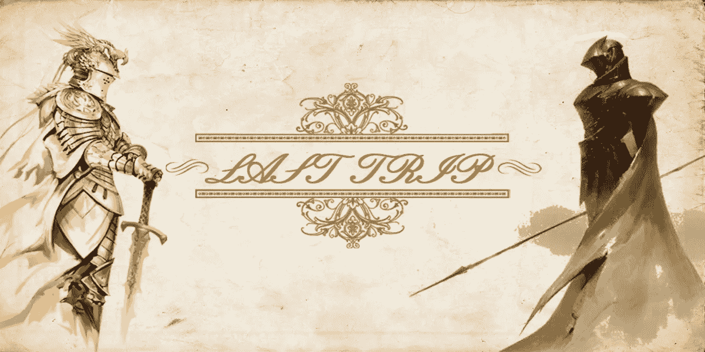
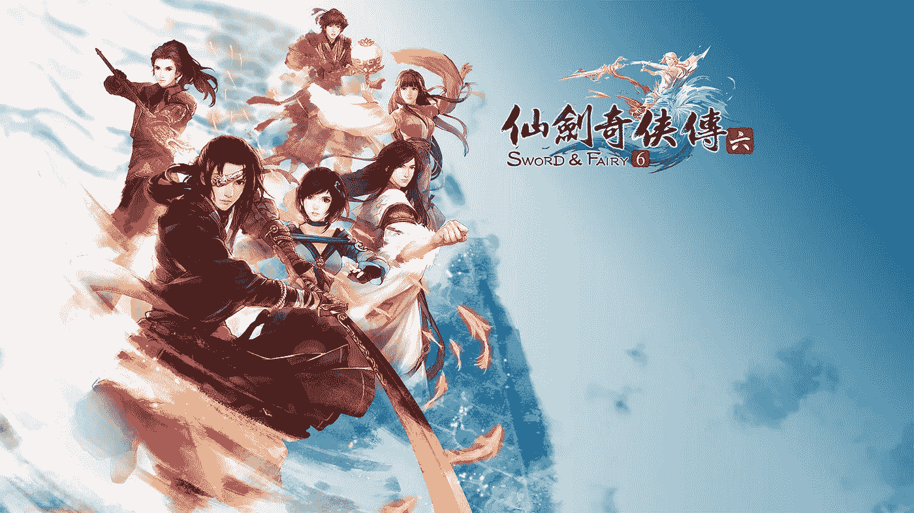

# 第三次 Sparks 访谈:吴晓 Libra 项目的全球首个基于云的 IDE

> 原文：<https://medium.datadriveninvestor.com/3rd-sparks-interview-wu-xiao-worlds-first-cloud-based-ide-for-project-libra-a8907826e5ed?source=collection_archive---------9----------------------->

**白色矩阵**的创始人吴晓和他的团队推出了全球**第一个基于云的 IDE** (集成开发环境)来访问 Libra Move，以支持脸书的新编程语言**【Move】**用于**项目 Libra。**

Asiacryptotoday.com

# **嘉宾介绍**

吴晓是区块链星云上“*细胞进化*”(星云奖励计划第一季冠军 DApp)和“*最后一次旅行*”的开发者。

 [## 你对智能凭证、J-Coin & c-lightning |数据驱动投资者了解多少

### 无数区块链/加密项目在我们周围涌现，承诺不同的真实世界用例。正在搜索…

www.datadriveninvestor.com](https://www.datadriveninvestor.com/2019/03/06/what-do-you-know-about-smart-credentials-j-coin-c-lightning/) 

他毕业于加拿大阿尔伯塔大学计算机科学专业，是中国计算机联合会分会的执行委员和主任。他的论文“*跨多个游戏和区块链的可互操作的化身框架*”发表在 INFOCOM 2019 期间，这是一个著名的计算机网络学术会议。他还获得了首届 NEO 游戏开发大赛的游戏创意奖。

# 天秤座代表了脸书的野心

问:**你觉得天秤座和其他语言有区别吗？**

以太坊的坚固性语言之后一直没有巨大的创新。

1.  EOS 使用 C++和另外 21 个节点。
2.  Tron 复制了 Solidity 并参照 EOS 设置了 27 个节点。
3.  IOST 使用 JavaScript。

在此之前，没有人想到为区块链的发展创造一种新的语言。

> 脸书愿意从它的基础上重建一种语言，这一事实强烈地表明脸书确实想涉足这一领域。

“Move”语言有一些 C 语言的特性，比如指针和类。它的一些指令还包括复制和移动，这为区块链优化了智能合约，允许您编写递归语句。

CoinTelegraph

问:**如果只看在天秤座上开发游戏，你觉得会不会更方便？**

脸书拥有先发优势，因为它是第一家备受赞誉的全球央行。

> *我们可以看到，Libra 在 Github 上的收视率仅一天就超过了 IBM Hyperledger 三年的收视率。*

它有可能接触到比所有公共链加起来还多的用户和开发者。这主要是由于其庞大网络的实力和开源性，它通过让开发者帮助维护和编写代码来众包世界的智能。我们团队还帮他们修复了几个 bug，并提交了。

> 它可能会比我们现在所有的公共区块链都要快。

脸书拥有世界领先的技术能力，所以在很多方面(即底层技术、生态等。)天秤座将轻松超越任何其他现有的公共区块链。相比之下，以太坊有超过 10000 个节点(vs 天秤座的 100 个 over 节点)，这使得它非常分散，但非常慢。以前，所有这些都是以分散的方式完成的，没有适当的团队系统地工作。因此，我认为脸书可以建设一个比以前更好的区块链。

> 更重要的是，凭借其网络，它可以吸引普通用户。

**问:脸书发行《天秤座》的确切目标是什么？**

这就是我认为脸书雄心勃勃的地方。第一批在天秤座上发行货币的人当然会有优势。

gitconnected

> *关键是稳定用户，获得流量。*

以前的开发者通常是一些早期的从业者，占主流程序员的 0.1%。这次被吸引到这里的人是那 99.9%。他们以前可能认为区块链是欺诈性的或不可行的。随着脸书入侵区块链，这种心态可能已经改变。

> *随着程序员的涌入，整体的总和将大于其部分。*

Libra 拥有相对较少但强大的节点，这些节点本身是像 Visa 和优步这样的大公司，它们提供免费的服务器和智能。可以说，脸书创造的东西把整个区块链工业向前推进了一步。

**问:截至目前，你打算在天秤座上做什么？**

> 我们现在打算做的是在智能合约的所有领域统一 ide。我们认为，未来 99%的连锁店将不复存在，大多数开发商将聚集到剩下的 1%。

只要我们现在能接触到这 1%，那么我们所积累的一切，以及我们所有的合同和开发商都可以转让过来。

大多数连锁店愿意合作，因为我们通过‘移动’在天秤座上有流量。此后，我们应该创建访问用户流量，以及调试工具。我们还会有一些教程，比如如何用‘移动’来写作，我们会通过基于游戏的方式来教授。

# **区块链游戏创新**

**问:你的团队过去是做游戏的，但现在你正在慢慢转变成一家为开发者服务的公司，有点类似于 SaaS？**

我们还是做游戏，今年会有三款游戏发布。

我们做 IDE 是因为它有用，能为开发者节省时间。目前国内根本没有天秤智能合约。而在其他国家，脸书太骄傲了，不支持 Windows 环境。

问:**为什么《细胞进化》中的 DNA 是在细胞死亡后才上传的？**

*Cell Evolution 是第一款基于区块链的去中心化策略和沙盒游戏应用。*

在细胞进化中，每个参与者都是一个生物细胞，必须平衡适应性、生存能力和繁殖能力才能生长和生存。细胞的生长和数据依赖于周围的环境，包括游戏中其他细胞的进化，并相应地上传到星云区块链。整个细胞世界的命运是由所有玩家的数据决定的。如果细胞群体的平衡被打破，整个生态系统都会受到影响，无法进化。【引用 [Nebulas.io](https://nebulas.io/)

这是一款社交游戏，有些玩家就像灭霸一样，只想炸掉这个世界。一些玩家希望以尽可能平衡的方式发展。

我们开发的游戏《最后的旅行》也是如此。游戏本身就像翻书一样。你可以不断地向前或向后翻转。它的一个创新点是，你死后可以成为书中的人物，你的故事会被写进书里。

想象一下，原著只有 300 页，但是经过很多玩家的选择影响了剧情，这本书日益变得内容非常丰富。这是区块链技术的思维过程。

Dapp.com

**问:游戏逻辑很难完全实现吗？**

游戏本身还是需要打磨的。然而，与预先设计好情节的游戏相比，这个想法相对更具创新性。

> 我们强调一个玩家可以发展自己的社交游戏。游戏设计不完全在于剧情和媒体；但在如何建立一个开放的世界，合理地允许每个人参与，并走到一起，以确定世界的道路和游戏的内容。

我觉得这些创新很重要，比如‘不断增加’的概念。我还受到区块链的启发，不断添加内容，这些内容也可以链接到后面的内容。

# **区块链打破游戏边界**

问:**那么没有区块链有可能创作出这个游戏吗？**

如果你的意思是不使用区块链技术，那么这是可能的。然而，区块链的一个优势是，你可以将不同的游戏连接成通用的角色数据。你可能在一个游戏中建造了很多建筑，但在其他游戏中很难使用，因为这是一个封闭的系统。但是在我们的游戏‘最后的旅行’中，你在创中的角色可以用来对抗以太坊中的其他角色。有点像‘Ready Player One’，把某些角色属性和公共事件联系起来。

Ready Player One

我们来思考一下互联网背后的一些生态逻辑是否正确。腾讯游戏中的一个角色是否有可能被网易分享，反之亦然？

在《一号玩家》中，一个星球上的小型摩托车模型可以被拿出来改装成另一个世界的马车。此时，你会发现数据连接、透明性和移动性非常重要。腾讯和网易永远做不到这一点。

让我们假设我们有两个游戏，我希望它们能够连接起来。这一点只要你在中间写一个智能契约就很容易做到，它允许你在一个游戏中得到的物品在另一个游戏中被取回，但属性相同。

> 然而，我认为区块链与游戏的结合还没有完全被发现。这很大程度上取决于我们的想象力。

可能是因为基础设施不足，也可能是因为用户规模不够大，无法让更多的开发者专注于做这件事。

**问:很多时候，游戏中的物品或人物必须放在特定的场景中才能发挥其最大价值。也就是说，在两个跨链游戏中，在更大的世界中，他们的背景至少必须是相同的。然而，他们有一些非常基本的规则是不同的。你如何解决这个问题？**

就像《预备玩家一》中不同的星系有不同的规则一样，不同的星系有统一的规则。可以想象在单人游戏中做到这一点有多有趣。例如，在《仙剑奇侠传》中，第一代中的人物与第二代没有任何联系。

The Nerd Stash

然而，如果同样的第一代角色出现在第二代游戏中，你会感觉很棒，并与过去的“你”联系在一起。比如保存‘剑仙传说 I’的文件，用‘剑仙传说 II’中同样的武器召唤同样的角色。

**问:最后一个问题，你为什么会选择区块链？**

如果你进入区块链行业的原因只是为了赚点快钱，那就没必要来这里。我认为在区块链工作肯定有一些野心，比如建立一个大企业，想要打败一两个巨头，想要给开发者带来更多价值等等。

> 我认为，为了愿意在区块链工作，一个人至少必须具备一些这样的远见。