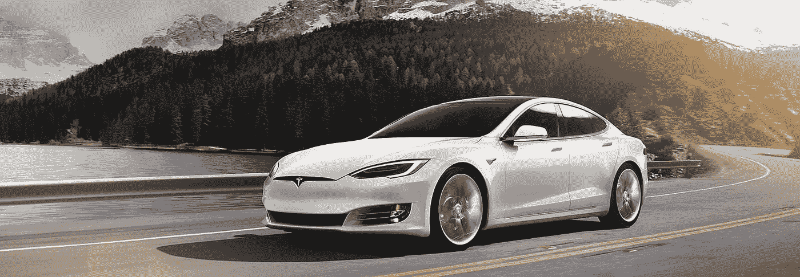
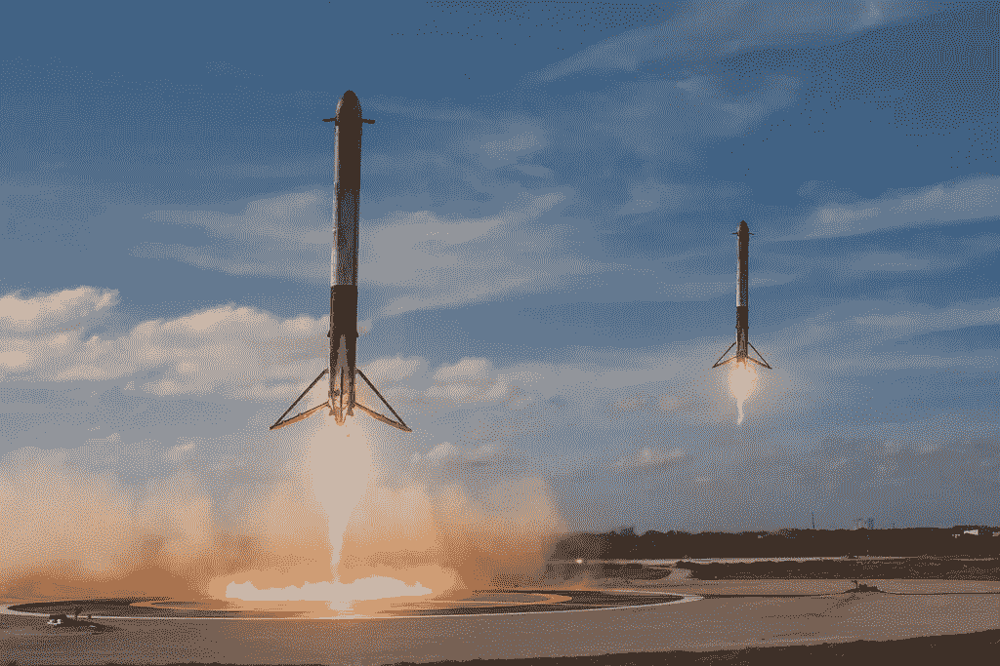
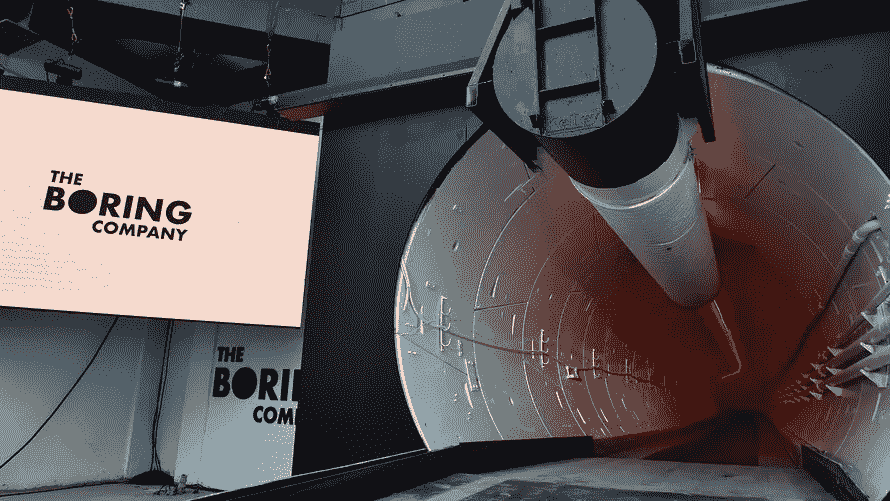

# 4.1 维度 4 —埃隆·马斯克

> 原文：<https://medium.datadriveninvestor.com/4-1-dimension-4-elon-musk-cd749da806b4?source=collection_archive---------4----------------------->

***回顾:*** *这是一个中型系列，着眼于在理解巨型科技独角兽如何形成中发挥作用的不同因素(以维度表示)。你可以在这里找到* [*简介*](https://medium.com/datadriveninvestor/intro-tech-startup-unicorns-be40ed9ff9c9) *。*

*我们之前谈到了如何创造新的价值机会层(表示为* [*维度 1*](https://medium.com/datadriveninvestor/dimension-1-value-creation-opportunity-at-macro-level-b205a8f05561) *)。我们介绍了微观层面的颠覆机会和增长机会是如何出现的(表示为* [*维度 2*](https://medium.com/datadriveninvestor/dimension-2-disruption-opportunity-at-micro-level-and-growth-e37f078544eb) *)。*

 [## 睁大眼睛冲破多样性壁垒——数据驱动的投资者

### “科技女性”是蒂芙尼·霍兰的激情之一，最初她在 Twitter 上主持“科技女性”聊天。她也是一个…

www.datadriveninvestor.com](https://www.datadriveninvestor.com/2019/03/20/hurtle-diversity-barriers-with-eyes-wide-open/) 

[*维度 3*](https://medium.com/datadriveninvestor/3-1-dimension-3-luck-and-timing-2240c222bed6) *讲了对创业独角兽成功起塑造作用的外部因素。*

***维度重述:*** [*维度 4*](https://medium.com/@arvindvairavan/dimension-4-role-of-tech-startup-ecosystems-6ee1c632718c) *讲述了科技创业生态系统的作用。这篇文章特别谈到了一个有远见的人，埃隆·马斯克。*

正如永远令人惊叹的蒂姆·厄本在这里漂亮地解释了埃隆·马斯克公司的公式。重新制定。在塑造了两个行业:SpaceX 和 Neuralink 之后，被许多人认为是历史上最伟大的企业家。他通过吸引最聪明的头脑来领导产品创新的能力已经改变了多个行业。

第一步:设定一个推进人类文明的鼓舞人心的目标
第二步:选择一个现有的商业模式作为起点
第三步:组建一个由使命激励的领域内最聪明的头脑组成的团队来建造原型。
第四步:从市场的高端/低端入手/通过新的创新方法创造新的市场
第五步:通过提高性能来大规模颠覆行业

**SolarCity:**

第一步:推进可持续能源
第二步:通过太阳能电池板发电
第三步:用看起来很酷的现代太阳能电池板屋顶取代传统屋顶。
第四步:屋顶光伏太阳能电池板发电
用太阳能取代家庭中通常的电力服务，并收取相同的价格。用太阳能电池板取代普通的屋顶，让房子看起来更先进、更凉爽，以便内部发电。

第五步:被特斯拉整合并收购

**特斯拉:**

第一步:推进可持续能源
第二步:汽车工业
第三步:制造一辆与现有跑车竞争的电动跑车

第四步:正如亚历克斯·丹科所说的“埃隆·马斯克的总体规划:从荒谬的高端开始，然后向下移动，特斯拉能够建立并获得对我们服务不足的更高层次工作的控制:向其他人发出信号，表明我思想进步，但也是一个有很好品味的坏蛋。”

第五步:特斯拉是两个同步革命的一部分:自主+电动汽车。与通常的低端颠覆不同，特斯拉从高端开始，首先让富人与汽车建立个人联系，这种汽车既具有零排放的进步性，又具有定期软件更新的高性能规格，然后，最终在主要市场上占领和竞争。特斯拉成为一家软件汽车公司，可以快速适应变化，从而扰乱汽车市场。

**SpaceX:**

第一步:让人类成为多行星物种
第二步:火箭发射行业
第三步:采取创新的内部制造方法，将运载火箭制造和服务成本降低 10 倍。
第四步:颠覆性计划中使用的技术并不比市场上现成的技术更好；事实上，它通常比现有技术更便宜、更不可靠、更不方便，不是现有玩家想要追求的。这在航空航天领域是真实的，因为大多数文化处理的是提高性能，而不是使其更简单。例如，火箭发动机是由它所能提供的推力和比冲来定义的。人们通常追求比冲，因为它是一个度量单位，如果增加，可以减少结构系数，增加有效载荷比，这是火箭有用性的最终度量。这些指标旨在提高运载火箭的性能，这意味着它可以利用机载燃料储备将有效载荷送入轨道。

相反，SpaceX 的战略旨在建造“最小有用轨道发射器”，猎鹰 1 号。目标是在发展中的小型卫星市场获得立足点。

第五步:2008 年，SpaceX 赢得了为国际空间站提供补给的合同，这是一个新的市场，允许他们改进技术，开发中型发射器猎鹰 9 号。现在猎鹰重型和 BFR，趋势似乎是向上和火星。通过建造可重复使用的重型运载火箭，SpaceX 进一步试图降低发射成本，从而希望使火星计划可行。

**无聊:**

第一步:减少交通拥堵
第二步:高速、无交通拥堵的车道
第三步:通过缩小隧道尺寸和提高隧道掘进速度来降低隧道建设成本。
第四步:挖掘地下多层隧道，将交通流量从 2D 分流到 3D
第五步:在仍然遥远的未来，马斯克认为他可以进一步扩展他的想法，在火星上创建一个自我维持的人类殖民地:“我确实认为擅长挖掘隧道可能对火星真的有帮助。可以肯定的是，火星上将会有大量的冰矿开采，而且通常是为了获取原材料。你可以在火星上用正确的钻探技术建造大量的地下建筑。所以我确实认为在技术开发领域有一些重叠。然后，沿着这条路，建造地下栖息地，在那里你可以得到辐射屏蔽……如果你想，你可以在地下建造整个城市”。

**神经链接:**

第一步:使人-AI 融合成为可能
第二步:脑机接口(身体质量指数)
第三步:开发前沿的 BMIs
第四步:埃隆·马斯克认为人类的输出带宽(发送一个文本；首先思考，转换成手打字的机械动作，纠正错误，然后点击 enter——写这个特殊的句子要花 10 倍的时间来思考同样的问题。)是有限的，与我们大脑思考和计算机处理器工作的速度相比，我认为这部分是正确的。Neuralink 的目标是首先在为残疾人提供接口的市场中，在带宽和植入方面实现突破，并解决他们的挑战。

第五步:然后把它翻译成一般人都能接受的形式。

说起来容易做起来难。然而，没有后知之明，SpaceX、特斯拉和 Paypal 的情况也是如此，但只有这一次，它要可怕得多，也极其困难。

***接下来:*** *你可以在这里* *阅读关于社会资本的* [*。*](https://medium.com/@arvindvairavan/4-2-dimension-4-social-capital-f8c80a46991e)