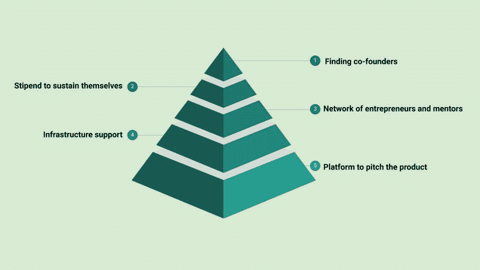

# 4.3 维度 4-企业家第一

> 原文：<https://medium.datadriveninvestor.com/4-3-dimension-4-entrepreneur-first-7a5f1717f43f?source=collection_archive---------8----------------------->

***回顾:*** *这是一个中型系列，着眼于在理解巨型科技独角兽如何形成中发挥作用的不同因素(以维度表示)。你可以在这里找到* [*简介*](https://medium.com/datadriveninvestor/intro-tech-startup-unicorns-be40ed9ff9c9) *。*

*我们之前谈到了如何创造新的价值机会层(表示为* [*维度 1*](https://medium.com/datadriveninvestor/dimension-1-value-creation-opportunity-at-macro-level-b205a8f05561) *)。我们介绍了微观层面的颠覆机会和增长机会是如何出现的(表示为* [*维度 2*](https://medium.com/datadriveninvestor/dimension-2-disruption-opportunity-at-micro-level-and-growth-e37f078544eb) *)。*

 [## 金融科技初创公司正在扰乱世界各地的银行业-数据驱动的投资者

### 传统的实体银行从未真正从金融危机后遭受的重大挫折中恢复过来…

www.datadriveninvestor.com](https://www.datadriveninvestor.com/2018/10/20/fintech-startups-are-disrupting-the-banking-industry-around-the-world/) 

[*维度 3*](https://medium.com/datadriveninvestor/3-1-dimension-3-luck-and-timing-2240c222bed6) *讲了对创业独角兽成功起塑造作用的外部因素。*

***维度重述:*** [*维度 4*](https://medium.com/@arvindvairavan/dimension-4-role-of-tech-startup-ecosystems-6ee1c632718c) *讲述了科技创业生态系统的作用。你可以在这里阅读关于埃隆马斯克***和社会资本* [*在这里*](https://medium.com/@arvindvairavan/4-2-dimension-4-social-capital-f8c80a46991e) *。这篇文章特别谈到了一个公司创建者，首先是企业家。**

*创业者优先是第一个先投资人才后投资创意的公司创建者。它独特的方法论让我着迷。正如联合创始人 Alice [在这里](https://medium.com/entrepreneur-first/ideas-pt-i-where-do-ideas-come-from-58ae761800a)所解释的那样，EF 基于其开发的名为 Edge 的框架工作，以找到个人最有价值的技能，或专业领域，无论是技术还是领域。*

*Edge 是一个可靠的构思模型，适用于那些拥有技术专长(某项技术的高级学位)或深领域专业知识的人。一旦确定了创始人的优势，英孚就能够将两种或两种以上、有时平行、有时相距甚远的技能组合在一起，从而将忠诚、超级聪明的人聚集在一起，产生并实现一个雄心勃勃的想法。*

*在 8 年的时间里，Entrepreneur First 从伦敦扩展到欧洲的巴黎和柏林，以及亚洲的新加坡、香港和班加罗尔。建立一个主要的可持续科技巨头需要时间，几十年，即使是在现代加速发展的世界。*

*为什么我认为英孚可能最终会打造一只科技独角兽:*

***1。英孚与技术无关:***

*当你让技术主播了解他们各自行业当前的技术进步，并结合他们的技能*

*a.建立一个创新的高科技产品和
b .找到一个利基市场，*

*它为颠覆多个行业提供了一个开端。*

***2。英孚提供了一个生态系统，消除了企业家初始阶段每一层的限制，从创意前和团队前开始**:*

**

*领先一步或拥有独特的见解，再加上减少限制，并不能保证成功，但领先幅度更大、从事雄心勃勃想法的人才数量更多，会增加打造科技独角兽的机会。*

*EF 抽象模型如下:*

*第一步:根据优势投资技术人才
第二步:结合优势，可能是互补的优势，产生创意
第三步:建立原型，帮助寻找市场
第四步:推出并投资*

*在我看来，EF 投资组合中有一些很有前途的初创企业:*

***BetaSight Technologies** 将消费类硬件设备(带眼球追踪功能的 VR 头戴式设备)转化为对眼睛健康进行功能测试的系统。*

***Blazar** 利用机器学习预测癌症对免疫疗法的反应。*

***Fabric Nano** 设计的人造细胞产生化学物质的速度快 100 倍。*

*Neoplants 利用合成生物学来设计未来的计划。*

***Nostos Genomics** 利用 CRISPR 开启基于基因组学的医学。*

*Open Cosmos 的目标是通过为小型卫星服务建立一个标准化的供应链来实现进入太空的民主化*

*PetaGene 减少了基因组数据的大小，降低了存储成本和数据传输，而不影响数据质量。*

*Semblr Technologies 使用小型机器人来自动化建筑施工。*

*trans 天体公司正致力于通过太空激光通信建立超高速全球互联网。*

***接下来:** [总结](https://medium.com/@arvindvairavan/summary-tech-startup-unicorns-728e9f0ca976)*