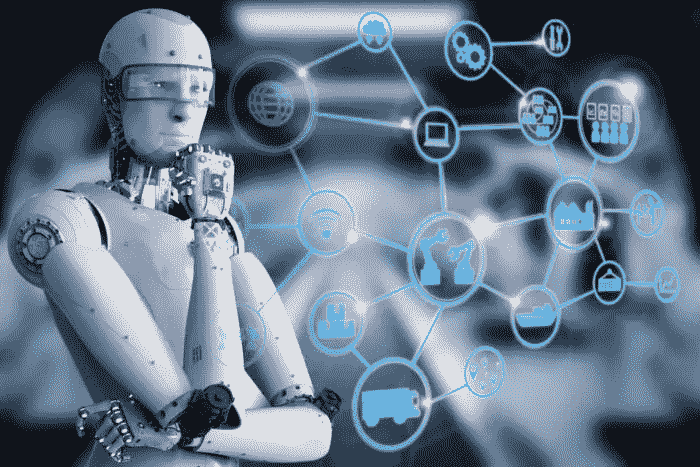
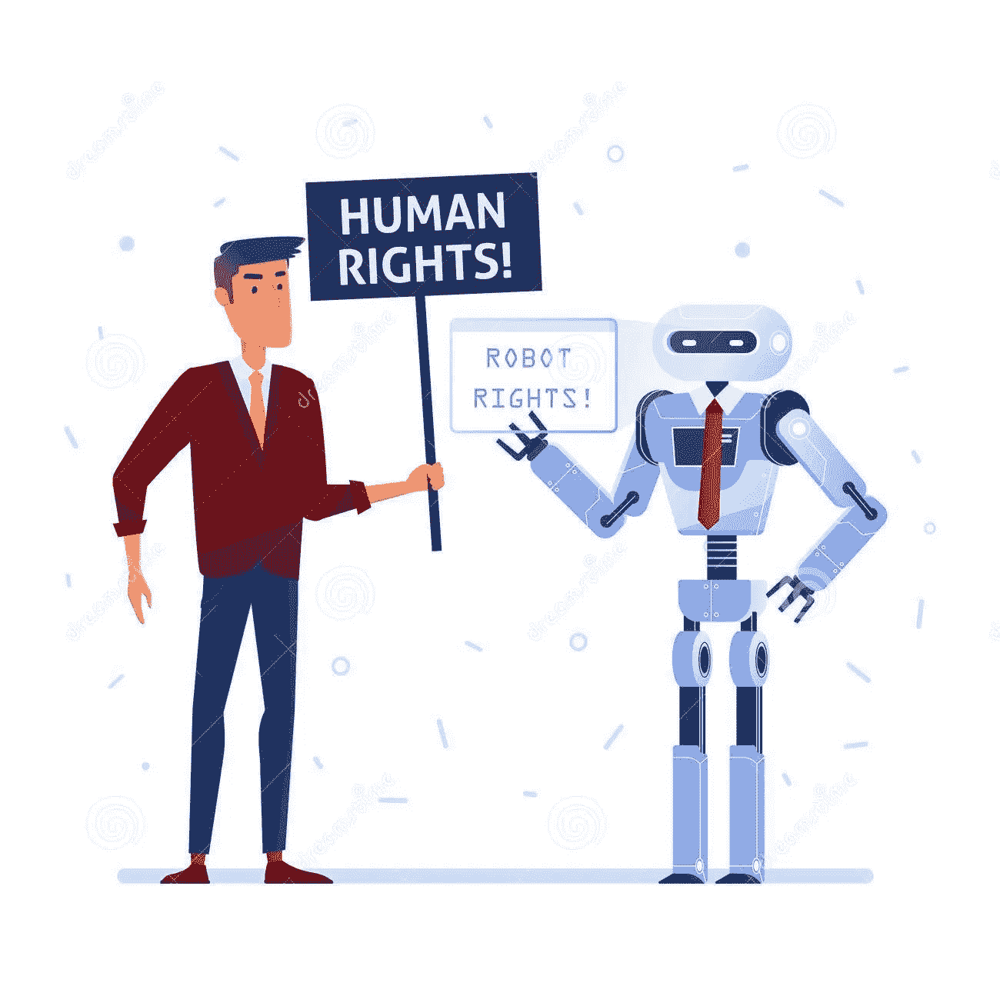
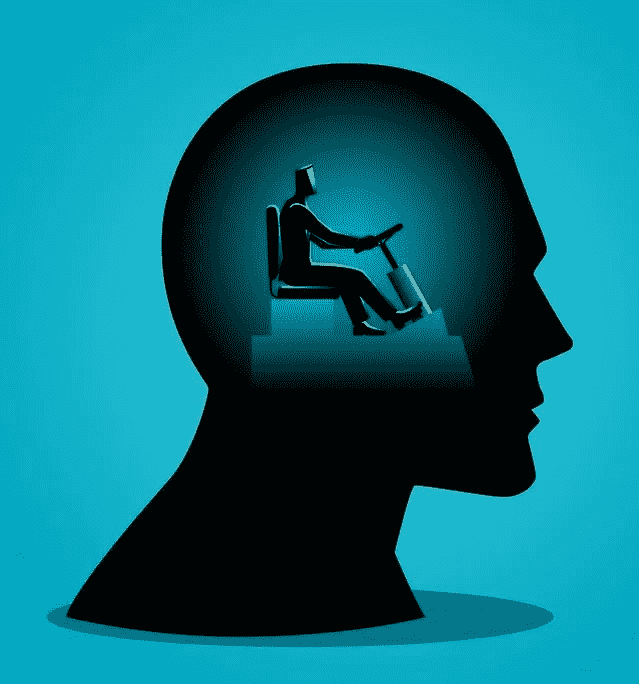
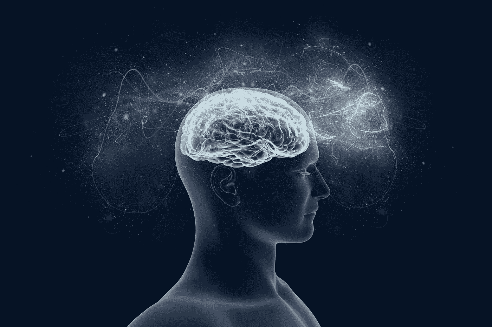

# 4.人类无法理解的人工智能。

> 原文：<https://medium.datadriveninvestor.com/4-ai-beyond-human-comprehension-1ec7125b71b?source=collection_archive---------13----------------------->

阅读:

[1。AI 是什么？](https://medium.com/datadriveninvestor/1-what-is-ai-6f8aff4e15d)

[2。AI 是如何创造价值的？](https://medium.com/datadriveninvestor/2-how-does-ai-create-value-a0f352167c83)

[3。AI vs 人类进化](https://medium.com/datadriveninvestor/3-ai-vs-human-evolution-a778c49896ac)

未来很难预测，但我们可以考虑各种可能性，并努力塑造一个更美好的未来。这也适用于人工智能。集成人工智能有巨大的好处，可以帮助我们做出更好的选择。

**AGI 到阿西**
从阿尼到 AGI 的转换在上一篇文章中已经看到。很难预测从 ANI 到 AGI 的转变需要多长时间，但有一点几乎是肯定的——从 AGI 到 ASI 的转变会快得多，而且对人类来说很难理解。

正如一头大象永远无法理解一个小得多、弱得多的人类物种是如何操纵和控制它的一样，我们可能也缺乏对人工智能的发展以及它如何操纵和控制我们的类似理解。

**AI 会超越人类吗？尽管人类对地球生态造成的破坏比其他任何物种都要大，但人类通过控制其他动物并把它们拒之门外，从而确立了自己作为高级物种的地位。如果人类被我们最初创造的一套算法所压倒，这在根本上造成了一种恐惧。有一种强烈的误解，认为如果 AI 能够发展自由意志和意识，它可能能够压倒我们。**

“一个征服者 AI 会怎么消灭我们？很可能是通过一种我们甚至不会理解的方法，至少在为时已晚之前不会。想象一下 10 万年前的一群大象正在讨论那些最近进化的人类是否有一天会利用他们的智慧杀死他们整个物种。”我们不会威胁人类，那他们为什么要杀我们？“他们可能会怀疑。他们会想到我们会在地球上走私象牙，并把它们雕刻成身份象征出售吗？尽管功能优越的塑料材料要便宜得多。一个征服者 AI 在未来消灭人类的理由在我们看来可能同样不可思议。”他们怎么可能杀死我们，因为他们又小又弱？大象可能会问。他们会猜到我们会发明技术来移除他们的栖息地，在他们的饮用水里下毒，让金属子弹以超音速穿透他们的脑袋吗？”

-马克斯·泰格马克，生活 3.0

**什么是自由意志？**
人类受欲望驱使。快乐，富有，寻找伴侣，健康饮食，保持健康。自由意志被认为是选择我们欲望的能力。不幸的是，我们不能选择我们的欲望，只能选择是否按照我们的欲望行事。我们所说的自由意志，最终是我们身体中数百万个神经元依赖于我们之前的经历(食物的味道，相信谁)和我们生存的概率(包括寻找最佳配偶，选择职业)而引起的一系列电化学反应。

“人类当然有意志——但它不是自由的。你不能决定你有什么欲望。你不决定是内向还是外向，随和还是焦虑，同性恋还是异性恋。人类做出选择——但他们从来都不是独立的选择。每一个选择都取决于很多你自己无法决定的生物、社会和个人条件。我可以选择吃什么，和谁结婚，投票给谁，但这些选择部分是由我的基因、我的生物化学、我的性别、我的家庭背景、我的民族文化等决定的——我没有选择拥有哪些基因或家庭。”尤瓦尔·诺亚·哈拉里

**什么是意识？**
意识，尽管在为什么或如何产生方面很复杂，但它只是简单地把我们所经历的东西放在一起:我们经历了冰淇淋的味道，或经历了狗粪便的味道，或经历了身体亲密的接触，并且我们“意识到”了这些经历。虽然自由意志是一种幻觉，但意识是真实的。

尤瓦尔·诺亚·哈拉里在《霍莫丢斯》中说“只有一股意识流，欲望在这股意识流中生灭，但没有拥有欲望的永恒自我”

但可以肯定的是，尽管人工智能可能不会发展出压倒人类的意识，但它可以根据控制它的人类的需求采取行动，无论是好是坏。话虽如此，由于我们不知道意识是如何在生物中产生的，我们可以不确定地说，人工智能不会发展意识。然而，提高人工智能的计算能力的发展与意识的发展没有直接关系。与其他物种不同，人类体验意识不是因为他们有能力做创造性的事情和在大群体中交流。尽管动物像人类一样进行创造性工作或取得进步的能力较低，但它们自己也能体验到意识。

[5。人工智能的未来——电子人？乔布斯？](https://medium.com/@arvindvairavan/5-future-of-ai-cyborgs-jobs-1b67eeb7400d)

*image credits:*[InfoWorld](https://medium.comhttps://www.infoworld.com/article/3199295/artificial-intelligence/primer-how-to-tell-if-ai-or-machine-learning-is-real.html/meet-mezi/how-to-make-the-leap-from-humans-machines-to-human-like-machines-a9e11206e24d)， [DreamsTime](https://www.dreamstime.com/robot-human-fighting-rights-concept-futuristic-society-where-both-humans-robots-have-civil-rights-artificial-image117843645) ，[奇点科学](https://scienceofsingularity.com/2018/12/08/on-free-will-daniel-dennett-and-gregg-caruso-go-head-to-head/)，[基因扫盲项目](https://geneticliteracyproject.org/2018/05/15/mind-or-matter-how-consciousness-in-the-universe-could-be-eternal/)