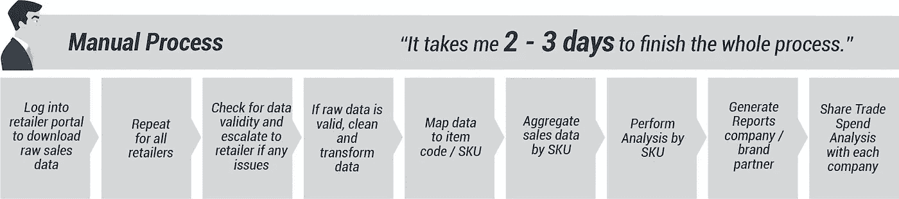
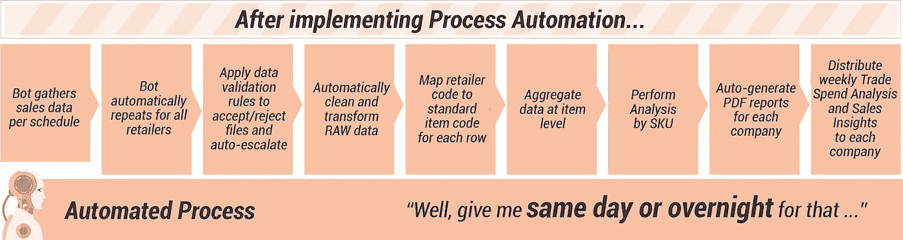
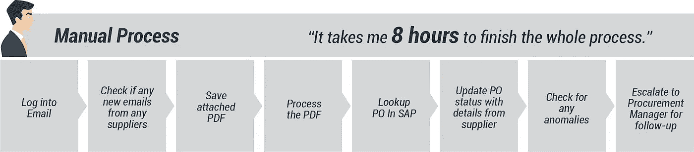
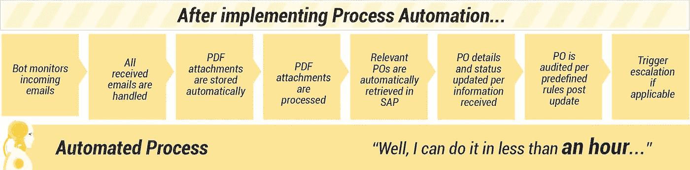
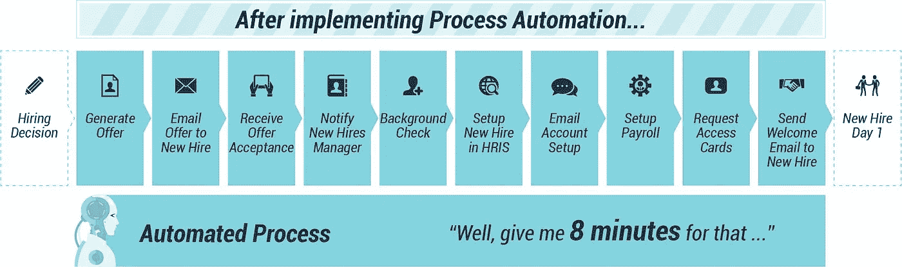
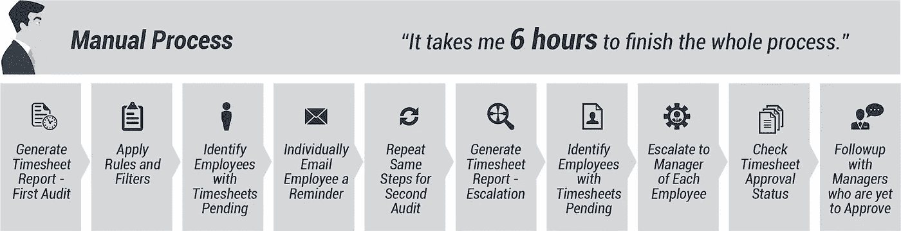
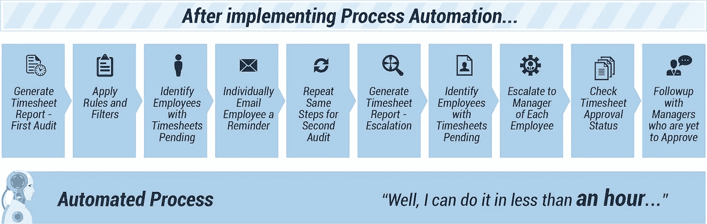

# 4 个案例研究证明为什么你需要将人类和机器人结合起来

> 原文：<https://medium.datadriveninvestor.com/4-case-studies-proving-why-you-need-to-team-up-humans-and-bots-4d3a5b88577d?source=collection_archive---------6----------------------->

你可能已经听说过未来劳动力或智能数字劳动力，这实际上是指机器人流程自动化(RPA)的一种新方式。为了清楚起见，让我们快速定义它，然后继续为什么您需要采用这种破坏性的方法。

RPA 是一种在软件“机器人”的帮助下自动化现有重复、大量和复杂任务的实践这些机器人模仿人类与多个系统的交互，而不改变当前的 IT 环境。

 [## 模式和机器人:一个复杂的现实数据驱动的投资者

### 哈耶克的名著《复杂现象理论》(哈耶克，1964)深入探讨了复杂性的话题，并断言…

www.datadriveninvestor.com](https://www.datadriveninvestor.com/2019/03/04/patterns-and-robotics-a-complex-reality/) 

另一种看法是，当人类专注于为你创造智力价值时；机器人执行日常工作的效率和成本效益都要高得多。最棒的是，您始终能够根据需要控制数字员工的增减。

最初引入时，过程自动化遇到了[阻力](https://perspectives.mobilelive.ca/blog/robotic-process-automation-myths)，然而，从那时起，它已经证明自己是行业不可知的，初始设置成本通常与内部成本降低和显著的投资回报率相比相形见绌。

作为业务数字化的第一步，自动化将带来跨运营的控制、效率和盈利能力，同时您可以专注于实施其他增长战略。记住以上内容，让我们来看看我们的 RPA 成功案例。

# 案例研究 1:贸易支出分析和销售洞察

一家服务于加拿大所有主要零售商的领先 CPG 分销商过去常常手动收集商店层面的每周销售数据。然后数据被清理并映射到产品 SKU。进行贸易支出分析，并与利益相关方分享。

平均而言，手动执行此过程需要 2 到 3 天。

而现在软件机器人几个小时或者当天就搞定了！

经销商的成功:

*   除升级管理之外的全自动工作流程
*   100%的准确性和 50%的时间周期减少
*   财务分析师的带宽增加

# 案例研究 2:采购订单管理

一家电信运营商拥有 200 多家供应商和 1000 多个活跃的 POs，需要管理日常需求，以确保所有订单都得到协调、确认和准确跟踪。

平均而言，手动执行此过程需要 8 个小时。

现在机器人不到一小时就完成了！

公司的成功:

*   接近实时处理 POs，处理时间缩短 90%以上
*   需要时当天上报
*   SAP 中 100%准确的最新采购订单状态

# 案例研究 3:招聘—报价生成、入职和新员工整合

一家快速发展的人才招聘公司经常雇佣大量员工和承包商，他们需要一种方法来简化做出雇佣决定后的流程。

平均而言，手动执行此过程需要 2.5 小时。

现在机器人在 8 分钟内就完成了！

招聘公司的成功:

*   通过取代 80%的手动流程提高了团队能力
*   员工主数据 100%准确
*   通过响应时间显著改善新员工体验

# 案例研究 4:时间和出勤记录跟踪和验证

领先的技术服务提供商(实际上是我们；mobileLIVE)交付了数百个企业级项目，这些项目需要找到一种有效管理其资源的方法；更具体地说，他们需要准确地跟踪花费在项目上的时间，以确保收入和利润保证。

平均而言，手动执行此过程需要 6 个小时。

现在机器人在不到一个小时的时间里就为我们完成了！

我们的成功:

*   完全自动化的工作流程，无需人工干预
*   100%的跟进率，所有通知在几分钟内发出，并在需要时多次发出
*   显著提高人力资源能力，专注于更多增值计划

# 一小步—更高的投资回报率

虽然您可能将流程自动化视为提高盈利能力和效率的一种手段，但实际上，它的作用远不止于此。通过将人类和机器人结合在一起，你可以从耗时、重复但却必不可少的任务中解脱出来。相反，你会发现更多的精力集中在实施增长战略和关键业务决策上。

最初发表于[https://perspectives.mobilelive.ca/blog/rpa-case-studies](https://perspectives.mobilelive.ca/blog/rpa-case-studies)