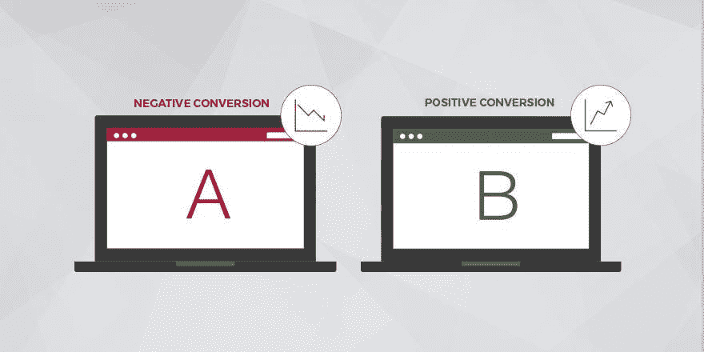
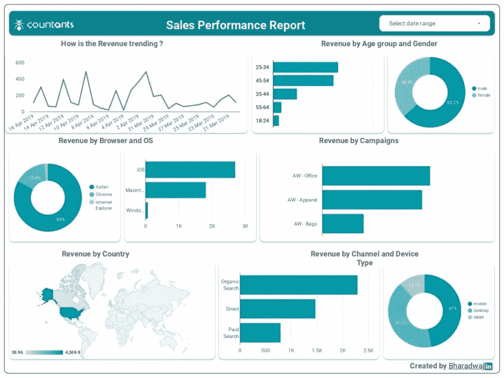

# 业务增长的 4 个关键电子商务报告参数

> 原文：<https://medium.datadriveninvestor.com/4-critical-ecommerce-reporting-parameters-for-business-growth-aa7ece27ed02?source=collection_archive---------0----------------------->

即使在我们接近下一个十年的时候，电子商务行业仍然为一个令人兴奋的未来做好了准备。最新研究估计，到 2021 年，全球电子商务零售额将增长至[4.9 万亿美元。到同一年，电子商务销售额将占全球零售总额的 17.5%。](https://www.statista.com/statistics/379046/worldwide-retail-e-commerce-sales/)

随着电子商务零售业的不断转型，在线购物者也在寻求改善的购物体验和品牌参与度。在这个竞争激烈的环境中，电子商务商店试图通过深入了解购物习惯和偏好来保持相关性。由于这一行业趋势，像电子商务预测建模和电子商务先知报告这样的技术工具正在兴起。

 [## 2019 年值得关注的 20 种数字营销趋势和技术|数据驱动的投资者

### Faisal 在加拿大工作，拥有金融/经济和计算机方面的背景。他一直积极从事外汇交易…

www.datadriveninvestor.com](https://www.datadriveninvestor.com/2019/02/04/20-digital-marketing-trends-techniques-to-watch-out-for-in-2019/) 

通过使用数据分析，电子商务报告和用户跟踪使在线零售商店能够跟踪和监控用户行为和在线活动产生的数据，以制定更好的决策流程。

本文接下来的部分将重点讨论电子商务先知报告(或简单的电子商务报告)如何给企业带来好处。除此之外，我们将着眼于更好的决策工作的电子商务先知参数。

# 什么是增强型电子商务报告？

作为一个电子商务店主，你可以依靠谷歌分析等分析工具提供的电子商务跟踪和报告。例如，您可以使用电子商务转换跟踪将您的在线销售相关数据与以客户为中心的指标相关联，如跳出率、平均会话时间和传入流量。

与传统的电子商务报告相比，增强的电子商务跟踪和报告提供了更广泛的电子商务数据视图，报告内容包括:

*   购物分析(包括购物行为和用户结账行为)
*   营销分析(包括客户对内部促销、产品或订单优惠券以及会员代码的反应)
*   电子商务报告的预测模型，可用于促进在线销售、转化率，甚至基于客户情绪的正确产品定价。

电子商务参与或用户参与(包括购物行为和用户结账行为)

在下一节中，我们将评估电子商务先知报告和跟踪的 4 个最重要的参数。

# 电子商务报告中的 4 个关键参数

那么，电子商务预言家报告中哪些关键参数能够真正为任何在线零售企业提供有价值的见解呢？以下是清单:

*   电子商务转换跟踪
*   高级电子商务报告
*   为有效决策提供智能数据支持
*   假设数据分析

# 现在让我们更详细地讨论它们:

## 转换跟踪

这些是用于跟踪您的电子商务网站上发生的在线活动和交易的关键参数。这通常包括通过谷歌分析以及脸书和 LinkedIn 等社交平台上的商业页面来衡量的转换跟踪。

电子商务转化跟踪报告可以为各种在线活动提供有价值的商业见解，包括:

*   特定时期或持续时间内产生的转换率和收入。
*   与交易相关的数据，表示在线购买的总次数(在给定时间段内)以及平均订单价值(或 AOV)

营销相关数据，包括最畅销的产品(和产生的平均收入)以及与任何营销活动、内部促销和附属关系相关的交易。

## 高级电子商务报告

如前所述，Google Analytics 和 [Google Data Studio](https://datastudio.google.com/) 等分析工具支持高级电子商务报告，可以衡量用户的完整购买旅程。

例如， [Google BigQuery](https://cloud.google.com/bigquery/) 工具可以部署为电子商务数据仓库，可以提供对无限电子商务数据的访问，并执行深度路径分析以获得更大的清晰度。

又如，Google Data Studio 可以将您的所有业务数据整合到一份报告中，并提供以下数据洞察:

*   购物行为分析，衡量与购物相关的参数，如每个购物者在购买漏斗的每个阶段的会话数，或每个漏斗阶段放弃的会话数。
*   结账行为分析，衡量您的在线购物者通过结账流程各阶段的难易程度。此分析显示了已进入(或放弃)结账漏斗的用户数量。

## 为决策提供智能数据支持

有效的数据系统是电子商务行业更好决策的基础。换句话说，一个智能数据支持系统被设计成一个电子商务网络服务器，与公司的其他信息系统相连接。

如上图所示，电子商务系统如 ERP(或企业资源规划)和 CRM(客户关系管理)现在包括高效的决策模块或决策支持系统(或 DSS)。

随着更加重视满足客户需求，电子商务经理需要找到通过高效决策满足客户期望的有效方法。因此，我们逐渐见证了电子商务系统在管理职能中的部署，包括:

*   客户关系管理
*   供应链管理
*   财务资源管理(或 FRM)
*   人力资源管理
*   制造资源计划(MRP)
*   复合产品映射(或 CPM)
*   假设数据分析

电子商务预测报告分析中的 4 个关键参数中的最后一个是基于测试电子商务网站变化的数据驱动假设分析。这能达到什么目的？假设分析可以提高用户转化率，甚至利润。

假设分析的一个例子是基于多个数据源的 A/B 测试，包括鼠标跟踪、实时聊天、客户调查和可用性。

例如，鼠标跟踪数据可用于改进基于以下重点领域的电子商务 KPI 和指标:

*   网上购物者是否正在执行每个网页上的关键指定任务？
*   网站用户是否点击了更多不该点击的网站元素？
*   有哪些网站区域的鼠标点击密度很高？

最后，让我们来看看如何电子商务先知报告有利于业务。

# 电子商务先知报告如何帮助业务增长

对于任何在线零售企业来说，电子商务报告提供了在线商店业绩的快速快照，包括推动在线销售的热门产品和购买趋势。凭借其可操作的数据，电子商务企业主可以利用以下类别的数据洞察改进决策和业务增长:

*   产品洞察，包括对最畅销(和最不畅销)产品或打折产品销售的洞察。产品洞察使零售企业能够做出正确的决定，推广哪些产品或进行促销。
*   客户洞察，提供关于客户需求和期望以及回头客背后驱动力的洞察。有了这些见解，电子商务商店可以专注于如何识别顶级客户，以及如何鼓励他们在购买上花费更多。

此外，电子商务经理可以与产品工程师和其他人员密切合作，用数据启发的产品创意来指导他们。例如，电子商务销售或转换漏斗的优化可以促进产品购买，推动更多的传入流量，并降低购物车放弃率。

*   营销洞察，提供关于推动最大转化率的有效营销渠道的洞察。作为一家电子商务商店，您可以利用这些见解来瞄准正确的渠道，以提高销售线索和客户参与度。

例如，电子商务中有效的 A/B 测试可以提高广告支出的整体回报，降低客户获取成本(或 CAC)，并增加客户终身价值(或 LTV)。

# 结论

总之，电子商务先知报告已经发展成为全球电子商务行业的有效工具，并正在推动更好的决策和在线购买。凭借在[基于云的分析](https://www.countants.com/services/cloud-analytics/?utm_medium=social&utm_source=Medium&utm_campaign=Traffic)和[可视化](https://www.countants.com/services/cloud-visualization/?utm_medium=social&utm_source=Medium&utm_campaign=Traffic)方面的行业经验，Countants 已经与各种电子商务公司合作，使他们能够从其庞大的数据量中获得更多商业意义。

作为数据分析公司，Countants 成功地为在线电子商务零售商提供了基于其特定业务需求的正确的技术驱动型解决方案。

希望利用我们在电子商务行业领域的技术能力？请在下面的部分留下您的宝贵意见，或者今天就[联系我们](https://www.countants.com/contact-us/?utm_medium=social&utm_source=Medium&utm_campaign=Traffic)。