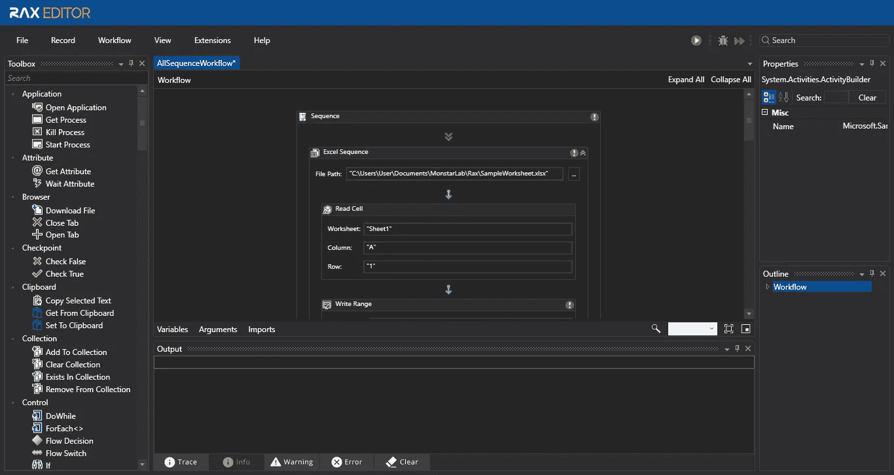
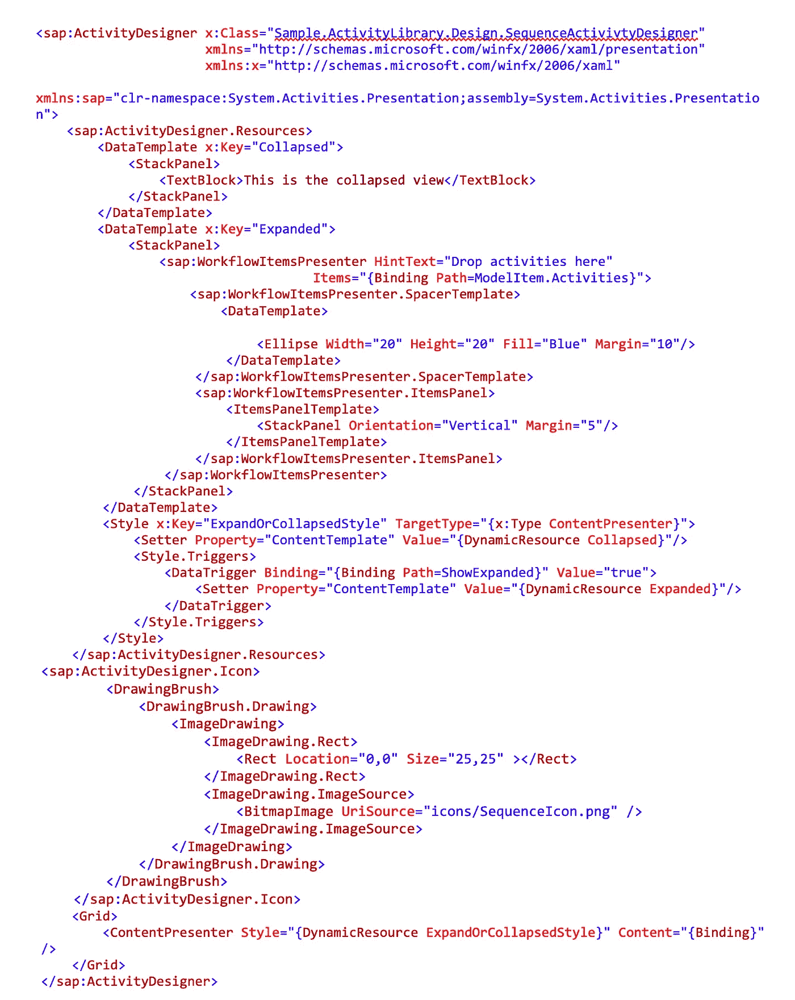
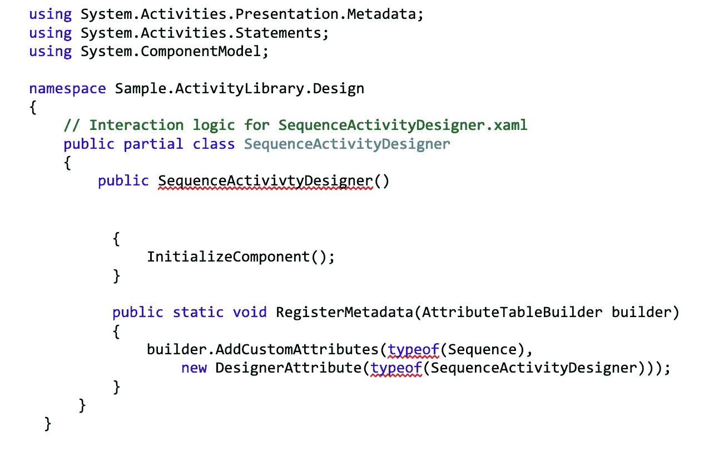
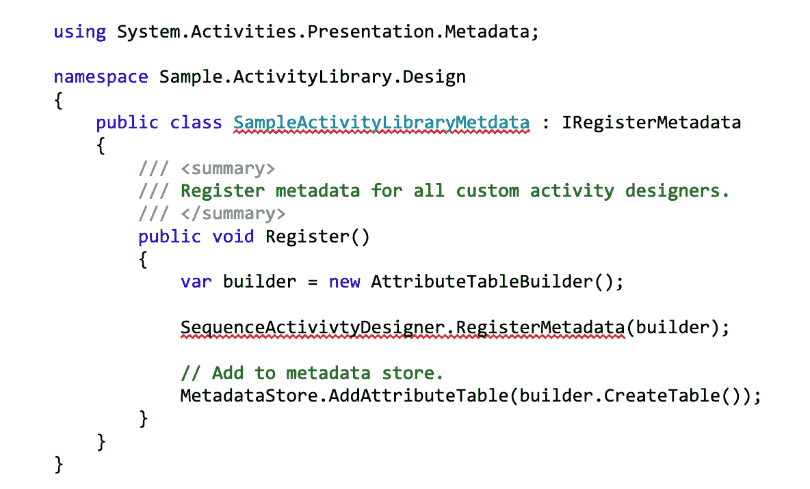
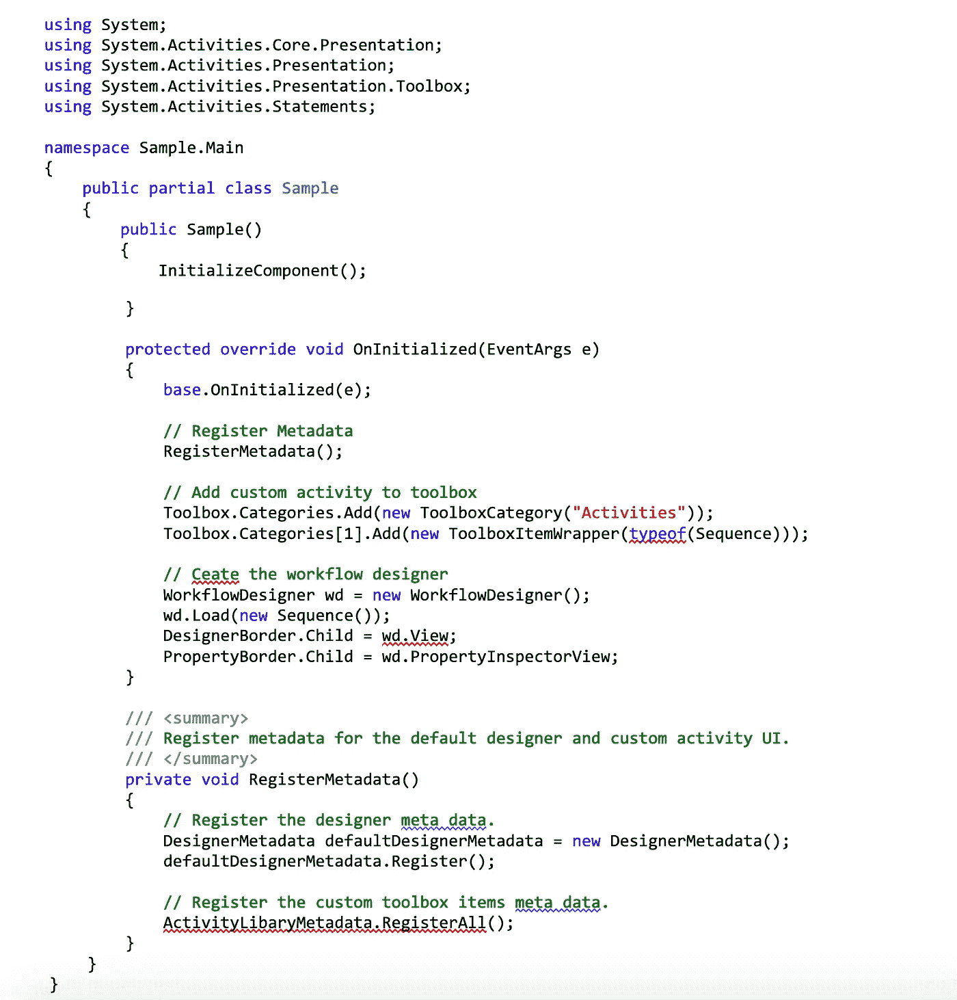
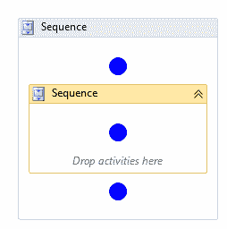

# 定制工作流内置活动的 4 个简单步骤

> 原文：<https://medium.datadriveninvestor.com/4-easy-steps-to-customize-built-in-activities-aaaae1ecb318?source=collection_archive---------6----------------------->

瓦尔迪兹公主

内置活动充当工作流基础的构建块。它们的存在使工作变得更容易，因为我们不必创建我们自己的相同活动的实现。过了一会儿，我们注意到内置的 activity 接口不能像预期的那样工作，并且在我们的应用程序中不可行。

[RAX EDITOR Automation Tool](https://www.raxsuite.com/freetrial)

解决这些问题最实用的方法是改变内置活动的设计以及属性的呈现方式。

 [## 不管准备好了没有，革命就在我们面前——数据驱动的投资者

### “对于技术如何影响我们的生活和重塑经济，我们必须形成全面的全球共识……

www.datadriveninvestor.com](https://www.datadriveninvestor.com/2019/02/12/ready-or-not-the-revolution-is-upon-us/) 

我们做了相当多的谷歌搜索，试图找出如何定制工作流活动中的构建，但是运气不太好，我们偶然发现的最佳解决方案是回到最开始的步骤，为我们想要使用的每个内置活动创建我们自己的版本。

想到一个解决方案，首先想到的就是扩展内置的 activity。但是当我查看开源代码时，我意识到它是密封的，这意味着它阻止其他类继承它。因此，这是不可能的。

但是后来，在创建了很多定制的活动之后，我了解到我也可以在内置的活动中应用它。下面看看我是如何用这四个简单的步骤解决这个问题的

**1。创建自定义活动设计器。**这是定义颜色和图标等基本细节的地方。在下面的示例中，我创建了一个继承 activity designer(活动的默认类型)的活动设计器来定制序列活动。我使用了 *WorkflowItemPresenter* 控件来将活动拖放到提供的空间中。我还为展开和折叠选项添加了样式，定制了间隔模板，并更改了图标。

**2。将活动设计器与活动类型相关联。为了做到这一点，我为设计器添加了一个 *RegisterMetadata* 方法。在 *RegisterMetadata* 方法的范围内，我创建了一个[*attribute table builder*](https://docs.microsoft.com/en-us/dotnet/api/system.activities.presentation.metadata.attributetablebuilder)对象，并调用[*AddCustomAttributes*](https://docs.microsoft.com/en-us/dotnet/api/system.activities.presentation.metadata.attributetablebuilder.addcustomattributes)方法为其添加属性。**

**3。添加元数据类。**我添加了一个实现 *IRegisterMetadata* 的类。这个类将在运行时被调用，以向 activity 类添加属性。在方法寄存器中，我调用了[*add attribute table*](https://docs.microsoft.com/en-us/dotnet/api/system.activities.presentation.metadata.metadatastore.addattributetable)方法将 [*AttributeTable*](https://docs.microsoft.com/en-us/dotnet/api/system.activities.presentation.metadata.attributetable) 添加到元数据存储中。

**4。最后，将活动添加到工具箱中。**

最终输出应该如下所示:

维奥拉。就是这样。很简单，对吧？如果您不知道如何定制内置活动，那么它可能会令人生畏且非常复杂。显然，我们可以用更多的作曲方式来完成。

 [## 带有私有实现的自定义“活动序列”(第 1 部分)

### 这里有一篇文章介绍了一些自定义的活动场景，当你知道如何做的时候应该会很容易，但是问题是…

blogs.msdn.microsoft.com](https://blogs.msdn.microsoft.com/tilovell/2010/11/16/custom-activity-sequences-with-private-implementation-part-1/) 

立即获取您的 RAX 编辑器！这是一个免费的机器人过程自动化(RPA)软件: [**下载这里**](https://www.raxsuite.com/freetrial)